# GovIQ-Main — Cross-Module Process Flow

```mermaid
flowchart LR
  n0["admin"] -->|69x| n1(["convex:governance"])
  n2["budget"] -->|29x| n3(["convex:budgetRouter"])
  n4["services"] -->|26x| n5["eval"]
  n4["services"] -->|24x| n6(["convex:sp_procurements"])
  n7["frameworks"] -->|16x| n8(["convex:framework"])
  n9["supplier"] -->|12x| n10(["convex:evidence"])
  n9["supplier"] -->|11x| n11(["convex:evidencePacks"])
  n12["works"] -->|11x| n13(["convex:works_tender"])
  n0["admin"] -->|10x| n14["portal"]
  n15["capital"] -->|10x| n16(["convex:email"])
  n17["mini-comp"] -->|10x| n18(["convex:responses"])
  n4["services"] -->|10x| n19(["convex:award_contract"])
  n12["works"] -->|10x| n20(["convex:works_packages"])
  n21["docs"] -->|9x| n22(["convex:packs"])
  n23["intelligence"] -->|9x| n6(["convex:sp_procurements"])
  n4["services"] -->|9x| n22(["convex:packs"])
  n4["services"] -->|9x| n24(["convex:tenderResponses"])
  n12["works"] -->|9x| n25(["convex:works_saq"])
  n26["buildings"] -->|8x| n27(["convex:building_admin"])
  n28["buyer"] -->|8x| n29(["convex:tp"])
  n4["services"] -->|8x| n30(["convex:sp_rft"])
  n4["services"] -->|8x| n31(["convex:sp_evaluation"])
  n9["supplier"] -->|8x| n18(["convex:responses"])
  n0["admin"] -->|7x| n32(["convex:import_admin"])
  n2["budget"] -->|7x| n33(["convex:oscar"])
  n23["intelligence"] -->|7x| n34(["convex:sp_routerDecisions"])
  n4["services"] -->|7x| n35(["convex:sp_scope"])
  n0["admin"] -->|6x| n36(["convex:policy_admin"])
  n37["dashboard"] -->|6x| n6(["convex:sp_procurements"])
  n38["procurement"] -->|6x| n39(["convex:sp_publicationWorkflow"])
  n40["router"] -->|6x| n41(["convex:phase"])
  n40["router"] -->|6x| n42(["convex:notices"])
  n4["services"] -->|6x| n43(["convex:sp_pricing"])
  n4["services"] -->|6x| n44(["convex:sp_contracts"])
  n9["supplier"] -->|6x| n29(["convex:tp"])
  n0["admin"] -->|5x| n45(["convex:campus_admin"])
  n21["docs"] -->|5x| n46(["convex:docRender"])
  n7["frameworks"] -->|5x| n47(["convex:callOffs"])
  n17["mini-comp"] -->|5x| n48(["convex:comms"])
  n38["procurement"] -->|5x| n6(["convex:sp_procurements"])
  n4["services"] -->|5x| n49(["convex:sp_governance"])
  n0["admin"] -->|4x| n27(["convex:building_admin"])
  n0["admin"] -->|4x| n26["buildings"]
  n0["admin"] -->|4x| n50(["convex:admin_actionsUi"])
  n50(["convex:admin_actionsUi"]) -->|4x| n51(["convex:admin_actions"])
  n15["capital"] -->|4x| n52(["convex:gov"])
  n21["docs"] -->|4x| n53(["convex:docJobs"])
  n5["eval"] -->|4x| n54(["convex:docCompliance"])
  n55["goods"] -->|4x| n6(["convex:sp_procurements"])
  n23["intelligence"] -->|4x| n56(["convex:analytics"])
  n38["procurement"] -->|4x| n57(["convex:pd_requests"])
  n38["procurement"] -->|4x| n58(["convex:etenders"])
  n40["router"] -->|4x| n59(["convex:router_engine"])
  n40["router"] -->|4x| n60(["convex:ogp_frameworkValidation"])
  n40["router"] -->|4x| n61(["convex:sp_aggregation"])
  n4["services"] -->|4x| n62(["convex:procurements"])
  n63["sign"] -->|4x| n64["esign"]
  n12["works"] -->|4x| n22(["convex:packs"])
  n0["admin"] -->|3x| n62(["convex:procurements"])
  n0["admin"] -->|3x| n15["capital"]
  n0["admin"] -->|3x| n65(["convex:docTemplates"])
  n15["capital"] -->|3x| n56(["convex:analytics"])
  n21["docs"] -->|3x| n65(["convex:docTemplates"])
  n46(["convex:docRender"]) -->|3x| n53(["convex:docJobs"])
  n46(["convex:docRender"]) -->|3x| n66(["convex:docArtifacts"])
  n55["goods"] -->|3x| n62(["convex:procurements"])
  n17["mini-comp"] -->|3x| n47(["convex:callOffs"])
  n38["procurement"] -->|3x| n67(["convex:sp_procurementAttachments"])
  n38["procurement"] -->|3x| n35(["convex:sp_scope"])
  n68["service-requests"] -->|3x| n69(["convex:serviceRequests"])
  n4["services"] -->|3x| n70(["convex:ai"])
  n4["services"] -->|3x| n40["router"]
  n4["services"] -->|3x| n71(["convex:sp_serviceCategories"])
  n9["supplier"] -->|3x| n72(["convex:orgs"])
  n9["supplier"] -->|3x| n73(["convex:supplierResponse"])
  n12["works"] -->|3x| n70(["convex:ai"])
  n0["admin"] -->|2x| n74(["convex:apiKeys"])
  n0["admin"] -->|2x| n75(["convex:building_compliance"])
  n0["admin"] -->|2x| n76(["convex:building_docs"])
  n0["admin"] -->|2x| n77(["convex:files"])
  n0["admin"] -->|2x| n30(["convex:sp_rft"])
  n0["admin"] -->|2x| n78(["convex:geo_proposals"])
  n0["admin"] -->|2x| n79(["convex:router_admin"])
  n0["admin"] -->|2x| n80(["convex:ogp_admin"])
  n0["admin"] -->|2x| n81(["convex:policy_templates"])
  n0["admin"] -->|2x| n82(["convex:router_sweep_admin"])
  n1(["convex:governance"]) -->|2x| n16(["convex:email"])
  n83["auth"] -->|2x| n1(["convex:governance"])
  n1(["convex:governance"]) -->|2x| n83["auth"]
  n27(["convex:building_admin"]) -->|2x| n26["buildings"]
  n26["buildings"] -->|2x| n84(["convex:building_systems"])
  n37["dashboard"] -->|2x| n20(["convex:works_packages"])
  n21["docs"] -->|2x| n54(["convex:docCompliance"])
  n85["invite"] -->|2x| n1(["convex:governance"])
  n48(["convex:comms"]) -->|2x| n14["portal"]
  n48(["convex:comms"]) -->|2x| n16(["convex:email"])
  n38["procurement"] -->|2x| n22(["convex:packs"])
  n38["procurement"] -->|2x| n46(["convex:docRender"])
  n38["procurement"] -->|2x| n86(["convex:documentEngine"])
  n38["procurement"] -->|2x| n87(["convex:pd_documentHandoffs"])
  n38["procurement"] -->|2x| n88(["convex:pricing"])
  n38["procurement"] -->|2x| n30(["convex:sp_rft"])
  n89["profile"] -->|2x| n90(["convex:userPreferences"])
  n91["route"] -->|2x| n92["assessments"]
  n40["router"] -->|2x| n93(["convex:decision_pack"])
  n40["router"] -->|2x| n7["frameworks"]
  n40["router"] -->|2x| n6(["convex:sp_procurements"])
  n4["services"] -->|2x| n94(["convex:overlays"])
  n4["services"] -->|2x| n88(["convex:pricing"])
  n4["services"] -->|2x| n95(["convex:procurementContext"])
  n9["supplier"] -->|2x| n48(["convex:comms"])
  n9["supplier"] -->|2x| n96(["convex:tenderFeed"])
  n97["supplier-profiles"] -->|2x| n98(["convex:supplierProfiles"])
  n0["admin"] -->|1x| n6(["convex:sp_procurements"])
  n0["admin"] -->|1x| n58(["convex:etenders"])
  n0["admin"] -->|1x| n59(["convex:router_engine"])
  n99["audit-report"] -->|1x| n40["router"]
  n3(["convex:budgetRouter"]) -->|1x| n33(["convex:oscar"])
  n26["buildings"] -->|1x| n100(["convex:campuses"])
  n26["buildings"] -->|1x| n45(["convex:campus_admin"])
  n28["buyer"] -->|1x| n6(["convex:sp_procurements"])
  n15["capital"] -->|1x| n77(["convex:files"])
  n101["contracts"] -->|1x| n102(["convex:seeds"])
  n37["dashboard"] -->|1x| n8(["convex:framework"])
  n37["dashboard"] -->|1x| n47(["convex:callOffs"])
  n37["dashboard"] -->|1x| n62(["convex:procurements"])
  n37["dashboard"] -->|1x| n103(["convex:audit"])
  n21["docs"] -->|1x| n70(["convex:ai"])
  n21["docs"] -->|1x| n6(["convex:sp_procurements"])
  n21["docs"] -->|1x| n58(["convex:etenders"])
  n5["eval"] -->|1x| n104(["convex:standstill"])
  n7["frameworks"] -->|1x| n6(["convex:sp_procurements"])
  n7["frameworks"] -->|1x| n98(["convex:supplierProfiles"])
  n55["goods"] -->|1x| n40["router"]
  n55["goods"] -->|1x| n30(["convex:sp_rft"])
  n55["goods"] -->|1x| n94(["convex:overlays"])
  n55["goods"] -->|1x| n29(["convex:tp"])
  n55["goods"] -->|1x| n19(["convex:award_contract"])
  n55["goods"] -->|1x| n49(["convex:sp_governance"])
  n23["intelligence"] -->|1x| n1(["convex:governance"])
  n17["mini-comp"] -->|1x| n101["contracts"]
  n17["mini-comp"] -->|1x| n105(["convex:rft"])
  n17["mini-comp"] -->|1x| n88(["convex:pricing"])
  n106["onboarding"] -->|1x| n1(["convex:governance"])
  n14["portal"] -->|1x| n30(["convex:sp_rft"])
  n38["procurement"] -->|1x| n107(["convex:pd_structures"])
  n38["procurement"] -->|1x| n108(["convex:pd_lots"])
  n38["procurement"] -->|1x| n29(["convex:tp"])
  n38["procurement"] -->|1x| n8(["convex:framework"])
  n38["procurement"] -->|1x| n109(["convex:pd_auditEvents"])
  n38["procurement"] -->|1x| n110(["convex:pd_generatedDocuments"])
  n38["procurement"] -->|1x| n62(["convex:procurements"])
  n38["procurement"] -->|1x| n77(["convex:files"])
  n38["procurement"] -->|1x| n70(["convex:ai"])
  n38["procurement"] -->|1x| n111(["convex:scopeBackground"])
  n89["profile"] -->|1x| n71(["convex:sp_serviceCategories"])
  n40["router"] -->|1x| n46(["convex:docRender"])
  n40["router"] -->|1x| n112(["convex:saq"])
  n42(["convex:notices"]) -->|1x| n22(["convex:packs"])
  n4["services"] -->|1x| n113(["convex:rftLifecycle"])
  n5["eval"] -->|1x| n16(["convex:email"])
  n4["services"] -->|1x| n111(["convex:scopeBackground"])
  n4["services"] -->|1x| n26["buildings"]
  n4["services"] -->|1x| n114(["convex:cpv"])
  n9["supplier"] -->|1x| n98(["convex:supplierProfiles"])
  n12["works"] -->|1x| n54(["convex:docCompliance"])
  n12["works"] -->|1x| n45(["convex:campus_admin"])
```

Every edge below is a real `useQuery`/`useMutation`/`useAction(api.*)` call (module -> backend subsystem) or a Convex `internal.*`/`api.*` call found inside that function's body (subsystem -> subsystem, one hop) — extracted from the same pass that built the per-module bind maps, not hand-drawn. `convex:<name>` nodes are backend subsystems with no matching `src/app/` module of their own.

Square nodes are `src/app/` modules; rounded nodes are backend-only Convex subsystems.

## Busiest cross-module edges

| From | To | Call count |
|---|---|---|
| admin | convex:governance | 69 |
| budget | convex:budgetRouter | 29 |
| services | eval | 26 |
| services | convex:sp_procurements | 24 |
| frameworks | convex:framework | 16 |
| supplier | convex:evidence | 12 |
| supplier | convex:evidencePacks | 11 |
| works | convex:works_tender | 11 |
| admin | portal | 10 |
| capital | convex:email | 10 |
| mini-comp | convex:responses | 10 |
| services | convex:award_contract | 10 |
| works | convex:works_packages | 10 |
| docs | convex:packs | 9 |
| intelligence | convex:sp_procurements | 9 |
| services | convex:packs | 9 |
| services | convex:tenderResponses | 9 |
| works | convex:works_saq | 9 |
| buildings | convex:building_admin | 8 |
| buyer | convex:tp | 8 |
| services | convex:sp_rft | 8 |
| services | convex:sp_evaluation | 8 |
| supplier | convex:responses | 8 |
| admin | convex:import_admin | 7 |
| budget | convex:oscar | 7 |
| intelligence | convex:sp_routerDecisions | 7 |
| services | convex:sp_scope | 7 |
| admin | convex:policy_admin | 6 |
| dashboard | convex:sp_procurements | 6 |
| procurement | convex:sp_publicationWorkflow | 6 |
| router | convex:phase | 6 |
| router | convex:notices | 6 |
| services | convex:sp_pricing | 6 |
| services | convex:sp_contracts | 6 |
| supplier | convex:tp | 6 |
| admin | convex:campus_admin | 5 |
| docs | convex:docRender | 5 |
| frameworks | convex:callOffs | 5 |
| mini-comp | convex:comms | 5 |
| procurement | convex:sp_procurements | 5 |

## Most-depended-on subsystems (highest fan-in)

These are the shared backbones — a change here has the widest blast radius across modules.

| Subsystem | Inbound calls from other modules/subsystems |
|---|---|
| convex:governance | 75 |
| convex:sp_procurements | 54 |
| convex:budgetRouter | 29 |
| eval | 26 |
| convex:packs | 25 |
| convex:framework | 18 |
| convex:responses | 18 |
| convex:tp | 16 |
| convex:email | 15 |
| convex:sp_rft | 14 |
