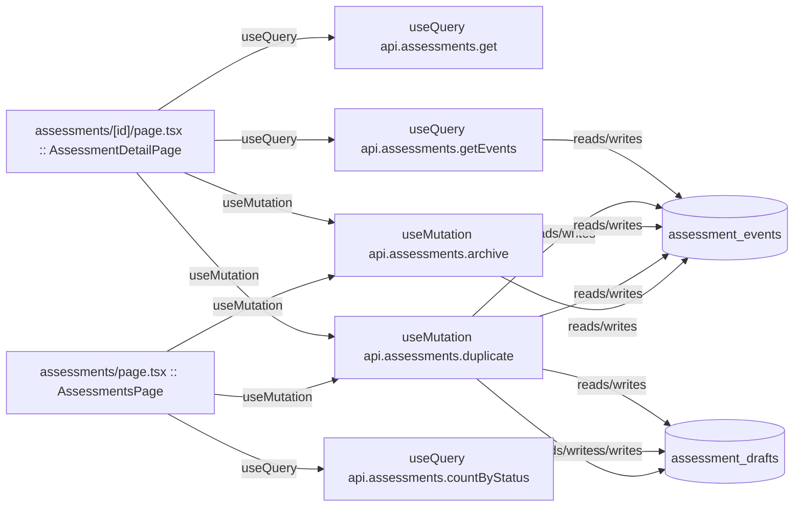

# assessments

Auto-derived module: everything under `src/app/assessments/`.

**App directory:** `src/app/assessments/` (2 `.tsx` files scanned; no matching `src/components/` subdirectory found)

## Bind map

## Convex functions referenced by this module's UI

| Function | Kind | Tables touched | Triggers |
|---|---|---|---|
| `assessments.get` | query | — | — |
| `assessments.getEvents` | query | `assessment_events` | — |
| `assessments.duplicate` | mutation | `assessment_drafts`, `assessment_events` | — |
| `assessments.archive` | mutation | `assessment_events` | — |
| `assessments.countByStatus` | query | `assessment_drafts` | — |

## UI bindings

| Page | Component | Hook | Convex function |
|---|---|---|---|
| `assessments/[id]/page.tsx` | AssessmentDetailPage | useQuery | `api.assessments.get` |
| `assessments/[id]/page.tsx` | AssessmentDetailPage | useQuery | `api.assessments.getEvents` |
| `assessments/[id]/page.tsx` | AssessmentDetailPage | useMutation | `api.assessments.duplicate` |
| `assessments/[id]/page.tsx` | AssessmentDetailPage | useMutation | `api.assessments.archive` |
| `assessments/page.tsx` | AssessmentsPage | useQuery | `api.assessments.countByStatus` |
| `assessments/page.tsx` | AssessmentsPage | useMutation | `api.assessments.duplicate` |
| `assessments/page.tsx` | AssessmentsPage | useMutation | `api.assessments.archive` |
