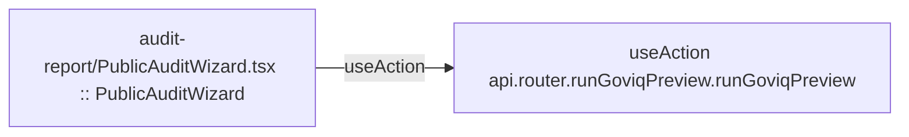

# audit-report

Auto-derived module: everything under `src/app/audit-report/` plus `src/components/audit-report/`.

**App directory:** `src/app/audit-report/` (4 `.tsx` files) + **components directory:** `src/components/audit-report/` (3 `.tsx` files)

## Bind map

## Convex functions referenced by this module's UI

| Function | Kind | Tables touched | Triggers |
|---|---|---|---|
| `router.runGoviqPreview.runGoviqPreview` | action | — | — |

## UI bindings

| Page | Component | Hook | Convex function |
|---|---|---|---|
| `audit-report/PublicAuditWizard.tsx` | PublicAuditWizard | useAction | `api.router.runGoviqPreview.runGoviqPreview` |
