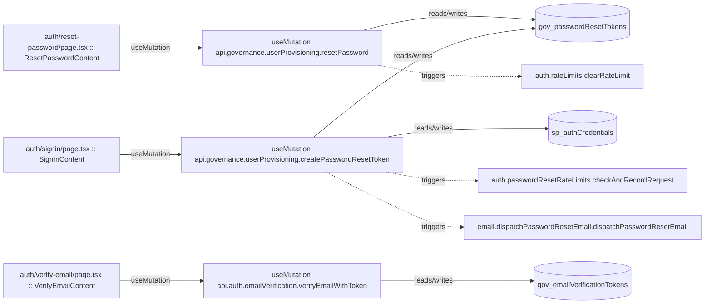

# auth

Auto-derived module: everything under `src/app/auth/` plus `src/components/auth/`.

**App directory:** `src/app/auth/` (4 `.tsx` files) + **components directory:** `src/components/auth/` (1 `.tsx` files)

## Bind map

## Convex functions referenced by this module's UI

| Function | Kind | Tables touched | Triggers |
|---|---|---|---|
| `governance.userProvisioning.resetPassword` | mutation | `gov_passwordResetTokens` | `auth.rateLimits.clearRateLimit` |
| `governance.userProvisioning.createPasswordResetToken` | mutation | `sp_authCredentials`, `gov_passwordResetTokens` | `auth.passwordResetRateLimits.checkAndRecordRequest`, `email.dispatchPasswordResetEmail.dispatchPasswordResetEmail` |
| `auth.emailVerification.verifyEmailWithToken` | mutation | `gov_emailVerificationTokens` | — |

## UI bindings

| Page | Component | Hook | Convex function |
|---|---|---|---|
| `auth/reset-password/page.tsx` | ResetPasswordContent | useMutation | `api.governance.userProvisioning.resetPassword` |
| `auth/signin/page.tsx` | SignInContent | useMutation | `api.governance.userProvisioning.createPasswordResetToken` |
| `auth/verify-email/page.tsx` | VerifyEmailContent | useMutation | `api.auth.emailVerification.verifyEmailWithToken` |
