# budget

Auto-derived module: everything under `src/app/budget/`.

**App directory:** `src/app/budget/` (14 `.tsx` files scanned; no matching `src/components/` subdirectory found)

## Bind map

```mermaid
flowchart LR
  n0["budget/ActualsCsvUpload.tsx :: ActualsCsvUpload"] -->|useMutation| n1["useMutation api.budgetRouter.actualsIngest.ingestActualsBatch"]
  n2["budget/BudgetSeedButton.tsx :: BudgetSeedButton"] -->|useMutation| n3["useMutation api.budgetRouter.seedDemo.seedDemoForCaller"]
  n3 -.->|triggers| n4["budgetRouter.devSeed.seedDemoHierarchy"]
  n3 -.->|triggers| n5["oscar.devSeed.seedVote28Demo"]
  n3 -.->|triggers| n6["budgetRouter.devSeed.linkVoteToHierarchy"]
  n7["budget/PendingActualsImports.tsx :: PendingActualsImports"] -->|useQuery| n8["useQuery api.budgetRouter.actualsIngest.listPendingActualsBatches"]
  n7["budget/PendingActualsImports.tsx :: PendingActualsImports"] -->|useQuery| n9["useQuery api.budgetRouter.erpFeeds.listErpFeeds"]
  n7["budget/PendingActualsImports.tsx :: PendingActualsImports"] -->|useMutation| n10["useMutation api.budgetRouter.mutations.validateActualsImport"]
  n11["budget/allocations/page.tsx :: BudgetAllocationsPage"] -->|useQuery| n12["useQuery api.budgetRouter.queries.listHierarchies"]
  n13["budget/allocations/page.tsx :: WorksheetPanel"] -->|useMutation| n14["useMutation api.budgetRouter.allocations.upsertWorksheetLine"]
  n13["budget/allocations/page.tsx :: WorksheetPanel"] -->|useMutation| n15["useMutation api.budgetRouter.allocations.addWorksheetLine"]
  n13["budget/allocations/page.tsx :: WorksheetPanel"] -->|useMutation| n16["useMutation api.budgetRouter.allocations.removeWorksheetLine"]
  n13["budget/allocations/page.tsx :: WorksheetPanel"] -->|useMutation| n17["useMutation api.budgetRouter.allocations.confirmWorksheet"]
  n18["budget/audit/page.tsx :: BudgetAuditPage"] -->|useQuery| n12["useQuery api.budgetRouter.queries.listHierarchies"]
  n19["budget/commitments/page.tsx :: BudgetCommitmentsPage"] -->|useQuery| n12["useQuery api.budgetRouter.queries.listHierarchies"]
  n20["budget/commitments/page.tsx :: CommitmentForm"] -->|useQuery| n21["useQuery api.budgetRouter.queries.getTreeRollup"]
  n22["budget/flags/page.tsx :: BudgetFlagsPage"] -->|useQuery| n12["useQuery api.budgetRouter.queries.listHierarchies"]
  n23["budget/flags/page.tsx :: VarianceAlertsTable"] -->|useQuery| n24["useQuery api.budgetRouter.queries.getOpenAlerts"]
  n25["budget/flags/page.tsx :: AlertRowActions"] -->|useMutation| n26["useMutation api.budgetRouter.mutations.acknowledgeAlert"]
  n27["budget/flags/page.tsx :: ProcurementFlagsTable"] -->|useQuery| n28["useQuery api.budgetRouter.queries.listOpenProcurementFlags"]
  n29["budget/flags/page.tsx :: ProcurementFlagActions"] -->|useMutation| n30["useMutation api.budgetRouter.mutations.waiveProcurementFlag"]
  n31["budget/oscar/estimate/page.tsx :: OscarEstimatePage"] -->|useQuery| n32["useQuery api.oscar.queries.listVotes"]
  n33["budget/oscar/estimate/page.tsx :: EstimatePanel"] -->|useQuery| n34["useQuery api.oscar.queries.getVoteSummary"]
  n33["budget/oscar/estimate/page.tsx :: EstimatePanel"] -->|useMutation| n35["useMutation api.oscar.mutations.submitEstimate"]
  n33["budget/oscar/estimate/page.tsx :: EstimatePanel"] -->|useMutation| n36["useMutation api.oscar.mutations.acceptEstimate"]
  n33["budget/oscar/estimate/page.tsx :: EstimatePanel"] -->|useMutation| n37["useMutation api.oscar.mutations.lockEstimate"]
  n33["budget/oscar/estimate/page.tsx :: EstimatePanel"] -->|useMutation| n38["useMutation api.oscar.mutations.rejectEstimate"]
  n33["budget/oscar/estimate/page.tsx :: EstimatePanel"] -->|useMutation| n39["useMutation api.oscar.mutations.upsertEstimateLine"]
  n40["budget/page.tsx :: BudgetTreePage"] -->|useQuery| n12["useQuery api.budgetRouter.queries.listHierarchies"]
  n41["budget/page.tsx :: TreeExplorer"] -->|useQuery| n21["useQuery api.budgetRouter.queries.getTreeRollup"]
  n41["budget/page.tsx :: TreeExplorer"] -->|useQuery| n24["useQuery api.budgetRouter.queries.getOpenAlerts"]
  n42["budget/page.tsx :: NodeDetailPanel"] -->|useQuery| n43["useQuery api.budgetRouter.queries.getNodeSummary"]
  n44["budget/reconciliation/page.tsx :: BudgetReconciliationPage"] -->|useQuery| n12["useQuery api.budgetRouter.queries.listHierarchies"]
  n45["budget/virements/page.tsx :: BudgetVirementsPage"] -->|useQuery| n12["useQuery api.budgetRouter.queries.listHierarchies"]
  n46["budget/virements/page.tsx :: VirementWorkspace"] -->|useQuery| n47["useQuery api.budgetRouter.queries.listPendingVirements"]
  n48["budget/virements/page.tsx :: PendingVirementCard"] -->|useMutation| n49["useMutation api.budgetRouter.mutations.approveVirement"]
  n49 -.->|triggers| n50["budgetRouter.notifications.notifyVirementApproved"]
  n48["budget/virements/page.tsx :: PendingVirementCard"] -->|useMutation| n51["useMutation api.budgetRouter.mutations.rejectVirement"]
  n52["budget/virements/page.tsx :: VirementForm"] -->|useQuery| n21["useQuery api.budgetRouter.queries.getTreeRollup"]
  n52["budget/virements/page.tsx :: VirementForm"] -->|useMutation| n53["useMutation api.budgetRouter.mutations.requestVirement"]
  n53 -.->|triggers| n54["budgetRouter.notifications.notifyVirementRequested"]
```

## Convex functions referenced by this module's UI

| Function | Kind | Tables touched | Triggers |
|---|---|---|---|
| `budgetRouter.actualsIngest.ingestActualsBatch` | mutation | — | — |
| `budgetRouter.seedDemo.seedDemoForCaller` | mutation | — | `budgetRouter.devSeed.seedDemoHierarchy`, `oscar.devSeed.seedVote28Demo`, `budgetRouter.devSeed.linkVoteToHierarchy` |
| `budgetRouter.actualsIngest.listPendingActualsBatches` | query | — | — |
| `budgetRouter.erpFeeds.listErpFeeds` | query | — | — |
| `budgetRouter.mutations.validateActualsImport` | mutation | — | — |
| `budgetRouter.queries.listHierarchies` | query | — | — |
| `budgetRouter.allocations.upsertWorksheetLine` | mutation | — | — |
| `budgetRouter.allocations.addWorksheetLine` | mutation | — | — |
| `budgetRouter.allocations.removeWorksheetLine` | mutation | — | — |
| `budgetRouter.allocations.confirmWorksheet` | mutation | — | — |
| `budgetRouter.queries.getTreeRollup` | query | — | — |
| `budgetRouter.queries.getOpenAlerts` | query | — | — |
| `budgetRouter.mutations.acknowledgeAlert` | mutation | — | — |
| `budgetRouter.queries.listOpenProcurementFlags` | query | — | — |
| `budgetRouter.mutations.waiveProcurementFlag` | mutation | — | — |
| `oscar.queries.listVotes` | query | — | — |
| `oscar.queries.getVoteSummary` | query | — | — |
| `oscar.mutations.submitEstimate` | mutation | — | — |
| `oscar.mutations.acceptEstimate` | mutation | — | — |
| `oscar.mutations.lockEstimate` | mutation | — | — |
| `oscar.mutations.rejectEstimate` | mutation | — | — |
| `oscar.mutations.upsertEstimateLine` | mutation | — | — |
| `budgetRouter.queries.getNodeSummary` | query | — | — |
| `budgetRouter.queries.listPendingVirements` | query | — | — |
| `budgetRouter.mutations.approveVirement` | mutation | — | `budgetRouter.notifications.notifyVirementApproved` |
| `budgetRouter.mutations.rejectVirement` | mutation | — | — |
| `budgetRouter.mutations.requestVirement` | mutation | — | `budgetRouter.notifications.notifyVirementRequested` |

## UI bindings

| Page | Component | Hook | Convex function |
|---|---|---|---|
| `budget/ActualsCsvUpload.tsx` | ActualsCsvUpload | useMutation | `api.budgetRouter.actualsIngest.ingestActualsBatch` |
| `budget/BudgetSeedButton.tsx` | BudgetSeedButton | useMutation | `api.budgetRouter.seedDemo.seedDemoForCaller` |
| `budget/PendingActualsImports.tsx` | PendingActualsImports | useQuery | `api.budgetRouter.actualsIngest.listPendingActualsBatches` |
| `budget/PendingActualsImports.tsx` | PendingActualsImports | useQuery | `api.budgetRouter.erpFeeds.listErpFeeds` |
| `budget/PendingActualsImports.tsx` | PendingActualsImports | useMutation | `api.budgetRouter.mutations.validateActualsImport` |
| `budget/allocations/page.tsx` | BudgetAllocationsPage | useQuery | `api.budgetRouter.queries.listHierarchies` |
| `budget/allocations/page.tsx` | WorksheetPanel | useMutation | `api.budgetRouter.allocations.upsertWorksheetLine` |
| `budget/allocations/page.tsx` | WorksheetPanel | useMutation | `api.budgetRouter.allocations.addWorksheetLine` |
| `budget/allocations/page.tsx` | WorksheetPanel | useMutation | `api.budgetRouter.allocations.removeWorksheetLine` |
| `budget/allocations/page.tsx` | WorksheetPanel | useMutation | `api.budgetRouter.allocations.confirmWorksheet` |
| `budget/audit/page.tsx` | BudgetAuditPage | useQuery | `api.budgetRouter.queries.listHierarchies` |
| `budget/commitments/page.tsx` | BudgetCommitmentsPage | useQuery | `api.budgetRouter.queries.listHierarchies` |
| `budget/commitments/page.tsx` | CommitmentForm | useQuery | `api.budgetRouter.queries.getTreeRollup` |
| `budget/flags/page.tsx` | BudgetFlagsPage | useQuery | `api.budgetRouter.queries.listHierarchies` |
| `budget/flags/page.tsx` | VarianceAlertsTable | useQuery | `api.budgetRouter.queries.getOpenAlerts` |
| `budget/flags/page.tsx` | AlertRowActions | useMutation | `api.budgetRouter.mutations.acknowledgeAlert` |
| `budget/flags/page.tsx` | ProcurementFlagsTable | useQuery | `api.budgetRouter.queries.listOpenProcurementFlags` |
| `budget/flags/page.tsx` | ProcurementFlagActions | useMutation | `api.budgetRouter.mutations.waiveProcurementFlag` |
| `budget/oscar/estimate/page.tsx` | OscarEstimatePage | useQuery | `api.oscar.queries.listVotes` |
| `budget/oscar/estimate/page.tsx` | EstimatePanel | useQuery | `api.oscar.queries.getVoteSummary` |
| `budget/oscar/estimate/page.tsx` | EstimatePanel | useMutation | `api.oscar.mutations.submitEstimate` |
| `budget/oscar/estimate/page.tsx` | EstimatePanel | useMutation | `api.oscar.mutations.acceptEstimate` |
| `budget/oscar/estimate/page.tsx` | EstimatePanel | useMutation | `api.oscar.mutations.lockEstimate` |
| `budget/oscar/estimate/page.tsx` | EstimatePanel | useMutation | `api.oscar.mutations.rejectEstimate` |
| `budget/oscar/estimate/page.tsx` | EstimatePanel | useMutation | `api.oscar.mutations.upsertEstimateLine` |
| `budget/page.tsx` | BudgetTreePage | useQuery | `api.budgetRouter.queries.listHierarchies` |
| `budget/page.tsx` | TreeExplorer | useQuery | `api.budgetRouter.queries.getTreeRollup` |
| `budget/page.tsx` | TreeExplorer | useQuery | `api.budgetRouter.queries.getOpenAlerts` |
| `budget/page.tsx` | NodeDetailPanel | useQuery | `api.budgetRouter.queries.getNodeSummary` |
| `budget/reconciliation/page.tsx` | BudgetReconciliationPage | useQuery | `api.budgetRouter.queries.listHierarchies` |
| `budget/virements/page.tsx` | BudgetVirementsPage | useQuery | `api.budgetRouter.queries.listHierarchies` |
| `budget/virements/page.tsx` | VirementWorkspace | useQuery | `api.budgetRouter.queries.listPendingVirements` |
| `budget/virements/page.tsx` | PendingVirementCard | useMutation | `api.budgetRouter.mutations.approveVirement` |
| `budget/virements/page.tsx` | PendingVirementCard | useMutation | `api.budgetRouter.mutations.rejectVirement` |
| `budget/virements/page.tsx` | VirementForm | useQuery | `api.budgetRouter.queries.getTreeRollup` |
| `budget/virements/page.tsx` | VirementForm | useMutation | `api.budgetRouter.mutations.requestVirement` |
