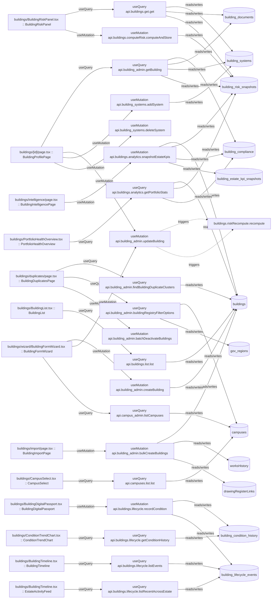

# buildings

Auto-derived module: everything under `src/app/buildings/` plus `src/components/buildings/`.

**App directory:** `src/app/buildings/` (12 `.tsx` files) + **components directory:** `src/components/buildings/` (23 `.tsx` files)

## Bind map

## Convex functions referenced by this module's UI

| Function | Kind | Tables touched | Triggers |
|---|---|---|---|
| `building_admin.getBuilding` | query | `building_compliance`, `building_documents`, `building_systems`, `building_risk_snapshots` | — |
| `building_admin.updateBuilding` | mutation | — | `buildings.riskRecompute.recompute` |
| `building_systems.addSystem` | mutation | `building_systems` | — |
| `building_systems.deleteSystem` | mutation | — | — |
| `building_admin.findBuildingDuplicateClusters` | query | `buildings` | — |
| `building_admin.buildingRegistryFilterOptions` | query | `campuses`, `gov_regions` | — |
| `building_admin.batchDeactivateBuildings` | mutation | — | — |
| `building_admin.bulkCreateBuildings` | mutation | `buildings`, `worksHistory`, `drawingRegisterLinks` | — |
| `buildings.analytics.snapshotEstateKpis` | mutation | `buildings`, `building_risk_snapshots`, `building_compliance`, `building_estate_kpi_snapshots` | — |
| `buildings.lifecycle.recordCondition` | mutation | `building_condition_history`, `building_lifecycle_events` | — |
| `buildings.list.list` | query | `buildings` | — |
| `buildings.get.get` | query | `building_systems`, `building_documents`, `building_risk_snapshots` | — |
| `buildings.computeRisk.computeAndStore` | mutation | `building_risk_snapshots` | — |
| `buildings.lifecycle.listEvents` | query | `building_lifecycle_events` | — |
| `buildings.lifecycle.listRecentAcrossEstate` | query | `building_lifecycle_events` | — |
| `campuses.list.list` | query | `campuses` | — |
| `buildings.lifecycle.getConditionHistory` | query | `building_condition_history` | — |
| `buildings.analytics.getPortfolioStats` | query | `buildings`, `building_risk_snapshots`, `building_compliance` | — |
| `building_admin.createBuilding` | mutation | `buildings` | — |
| `campus_admin.listCampuses` | query | `campuses` | — |

## UI bindings

| Page | Component | Hook | Convex function |
|---|---|---|---|
| `buildings/[id]/page.tsx` | BuildingProfilePage | useQuery | `api.building_admin.getBuilding` |
| `buildings/[id]/page.tsx` | BuildingProfilePage | useMutation | `api.building_admin.updateBuilding` |
| `buildings/[id]/page.tsx` | BuildingProfilePage | useMutation | `api.building_systems.addSystem` |
| `buildings/[id]/page.tsx` | BuildingProfilePage | useMutation | `api.building_systems.deleteSystem` |
| `buildings/duplicates/page.tsx` | BuildingDuplicatesPage | useQuery | `api.building_admin.findBuildingDuplicateClusters` |
| `buildings/duplicates/page.tsx` | BuildingDuplicatesPage | useQuery | `api.building_admin.buildingRegistryFilterOptions` |
| `buildings/duplicates/page.tsx` | BuildingDuplicatesPage | useMutation | `api.building_admin.batchDeactivateBuildings` |
| `buildings/import/page.tsx` | BuildingImportPage | useMutation | `api.building_admin.bulkCreateBuildings` |
| `buildings/intelligence/page.tsx` | BuildingIntelligencePage | useMutation | `api.buildings.analytics.snapshotEstateKpis` |
| `buildings/BuildingDigitalPassport.tsx` | BuildingDigitalPassport | useMutation | `api.buildings.lifecycle.recordCondition` |
| `buildings/BuildingList.tsx` | BuildingList | useQuery | `api.buildings.list.list` |
| `buildings/BuildingRiskPanel.tsx` | BuildingRiskPanel | useQuery | `api.buildings.get.get` |
| `buildings/BuildingRiskPanel.tsx` | BuildingRiskPanel | useMutation | `api.buildings.computeRisk.computeAndStore` |
| `buildings/BuildingTimeline.tsx` | BuildingTimeline | useQuery | `api.buildings.lifecycle.listEvents` |
| `buildings/BuildingTimeline.tsx` | EstateActivityFeed | useQuery | `api.buildings.lifecycle.listRecentAcrossEstate` |
| `buildings/CampusSelect.tsx` | CampusSelect | useQuery | `api.campuses.list.list` |
| `buildings/ConditionTrendChart.tsx` | ConditionTrendChart | useQuery | `api.buildings.lifecycle.getConditionHistory` |
| `buildings/PortfolioHealthOverview.tsx` | PortfolioHealthOverview | useQuery | `api.buildings.analytics.getPortfolioStats` |
| `buildings/wizard/BuildingFormWizard.tsx` | BuildingFormWizard | useMutation | `api.building_admin.createBuilding` |
| `buildings/wizard/BuildingFormWizard.tsx` | BuildingFormWizard | useMutation | `api.building_admin.updateBuilding` |
| `buildings/wizard/BuildingFormWizard.tsx` | BuildingFormWizard | useQuery | `api.campus_admin.listCampuses` |
