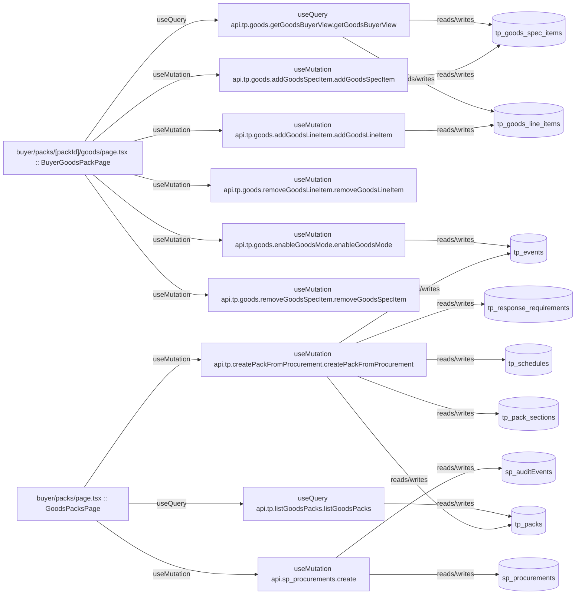

# buyer

Auto-derived module: everything under `src/app/buyer/`.

**App directory:** `src/app/buyer/` (4 `.tsx` files scanned; no matching `src/components/` subdirectory found)

## Bind map

## Convex functions referenced by this module's UI

| Function | Kind | Tables touched | Triggers |
|---|---|---|---|
| `tp.goods.getGoodsBuyerView.getGoodsBuyerView` | query | `tp_goods_line_items`, `tp_goods_spec_items` | — |
| `tp.goods.enableGoodsMode.enableGoodsMode` | mutation | `tp_events` | — |
| `tp.goods.addGoodsLineItem.addGoodsLineItem` | mutation | `tp_goods_line_items` | — |
| `tp.goods.removeGoodsLineItem.removeGoodsLineItem` | mutation | — | — |
| `tp.goods.addGoodsSpecItem.addGoodsSpecItem` | mutation | `tp_goods_spec_items` | — |
| `tp.goods.removeGoodsSpecItem.removeGoodsSpecItem` | mutation | — | — |
| `tp.listGoodsPacks.listGoodsPacks` | query | `tp_packs` | — |
| `sp_procurements.create` | mutation | `sp_procurements`, `sp_auditEvents` | — |
| `tp.createPackFromProcurement.createPackFromProcurement` | mutation | `tp_packs`, `tp_pack_sections`, `tp_schedules`, `tp_response_requirements`, `tp_events` | — |

## UI bindings

| Page | Component | Hook | Convex function |
|---|---|---|---|
| `buyer/packs/[packId]/goods/page.tsx` | BuyerGoodsPackPage | useQuery | `api.tp.goods.getGoodsBuyerView.getGoodsBuyerView` |
| `buyer/packs/[packId]/goods/page.tsx` | BuyerGoodsPackPage | useMutation | `api.tp.goods.enableGoodsMode.enableGoodsMode` |
| `buyer/packs/[packId]/goods/page.tsx` | BuyerGoodsPackPage | useMutation | `api.tp.goods.addGoodsLineItem.addGoodsLineItem` |
| `buyer/packs/[packId]/goods/page.tsx` | BuyerGoodsPackPage | useMutation | `api.tp.goods.removeGoodsLineItem.removeGoodsLineItem` |
| `buyer/packs/[packId]/goods/page.tsx` | BuyerGoodsPackPage | useMutation | `api.tp.goods.addGoodsSpecItem.addGoodsSpecItem` |
| `buyer/packs/[packId]/goods/page.tsx` | BuyerGoodsPackPage | useMutation | `api.tp.goods.removeGoodsSpecItem.removeGoodsSpecItem` |
| `buyer/packs/page.tsx` | GoodsPacksPage | useQuery | `api.tp.listGoodsPacks.listGoodsPacks` |
| `buyer/packs/page.tsx` | GoodsPacksPage | useMutation | `api.sp_procurements.create` |
| `buyer/packs/page.tsx` | GoodsPacksPage | useMutation | `api.tp.createPackFromProcurement.createPackFromProcurement` |
