# contracts

Auto-derived module: everything under `src/app/contracts/` plus `src/components/contracts/`.

**App directory:** `src/app/contracts/` (10 `.tsx` files) + **components directory:** `src/components/contracts/` (7 `.tsx` files)

## Bind map

```mermaid
flowchart LR
  n0["contracts/[id]/closeout/page.tsx :: ContractCloseoutPage"] -->|useQuery| n1["useQuery api.contracts.lifecycle.getContract"]
  n0["contracts/[id]/closeout/page.tsx :: ContractCloseoutPage"] -->|useMutation| n2["useMutation api.contracts.closeout.recordSubstantialCompletion"]
  n2 -->|reads/writes| n3[("sp_contractEvents")]
  n0["contracts/[id]/closeout/page.tsx :: ContractCloseoutPage"] -->|useMutation| n4["useMutation api.contracts.closeout.recordFinalAccount"]
  n4 -->|reads/writes| n3[("sp_contractEvents")]
  n0["contracts/[id]/closeout/page.tsx :: ContractCloseoutPage"] -->|useMutation| n5["useMutation api.contracts.closeout.recordExtensionOption"]
  n5 -->|reads/writes| n3[("sp_contractEvents")]
  n0["contracts/[id]/closeout/page.tsx :: ContractCloseoutPage"] -->|useMutation| n6["useMutation api.contracts.lifecycle.markReprocurementInitiated"]
  n6 -->|reads/writes| n3[("sp_contractEvents")]
  n7["contracts/[id]/mobilisation/page.tsx :: MobilisationPage"] -->|useQuery| n1["useQuery api.contracts.lifecycle.getContract"]
  n7["contracts/[id]/mobilisation/page.tsx :: MobilisationPage"] -->|useQuery| n8["useQuery api.contracts.mobilisation.getMobilisation"]
  n8 -->|reads/writes| n9[("sp_contractMobilisation")]
  n7["contracts/[id]/mobilisation/page.tsx :: MobilisationPage"] -->|useMutation| n10["useMutation api.contracts.mobilisation.signOffMobilisation"]
  n10 -->|reads/writes| n9[("sp_contractMobilisation")]
  n10 -->|reads/writes| n3[("sp_contractEvents")]
  n11["contracts/[id]/mobilisation/page.tsx :: PerformanceBondForm"] -->|useMutation| n12["useMutation api.contracts.mobilisation.recordPerformanceBond"]
  n13["contracts/[id]/mobilisation/page.tsx :: InsuranceForm"] -->|useMutation| n14["useMutation api.contracts.mobilisation.addInsuranceCertificate"]
  n15["contracts/[id]/mobilisation/page.tsx :: PsdpForm"] -->|useMutation| n16["useMutation api.contracts.mobilisation.recordPsdpAppointment"]
  n17["contracts/[id]/mobilisation/page.tsx :: ProgrammeForm"] -->|useMutation| n18["useMutation api.contracts.mobilisation.recordProgrammeBaseline"]
  n19["contracts/[id]/mobilisation/page.tsx :: TaxClearanceForm"] -->|useMutation| n20["useMutation api.contracts.mobilisation.recordTaxClearance"]
  n21["contracts/[id]/mobilisation/page.tsx :: SitePossessionForm"] -->|useMutation| n22["useMutation api.contracts.mobilisation.recordSitePossession"]
  n23["contracts/[id]/mobilisation/page.tsx :: CommencementForm"] -->|useMutation| n24["useMutation api.contracts.mobilisation.recordCommencementCertificate"]
  n25["contracts/[id]/page.tsx :: ContractDetailPage"] -->|useQuery| n1["useQuery api.contracts.lifecycle.getContract"]
  n25["contracts/[id]/page.tsx :: ContractDetailPage"] -->|useQuery| n26["useQuery api.contracts.lifecycle.listContractEvents"]
  n26 -->|reads/writes| n3[("sp_contractEvents")]
  n27["contracts/[id]/performance/page.tsx :: ContractPerformancePage"] -->|useQuery| n1["useQuery api.contracts.lifecycle.getContract"]
  n27["contracts/[id]/performance/page.tsx :: ContractPerformancePage"] -->|useQuery| n26["useQuery api.contracts.lifecycle.listContractEvents"]
  n26 -->|reads/writes| n3[("sp_contractEvents")]
  n27["contracts/[id]/performance/page.tsx :: ContractPerformancePage"] -->|useMutation| n28["useMutation api.contracts.lifecycle.recordPerformance"]
  n28 -->|reads/writes| n3[("sp_contractEvents")]
  n28 -->|reads/writes| n29[("sp_contractPerformanceReports")]
  n30["contracts/[id]/spend/page.tsx :: ContractSpendPage"] -->|useQuery| n1["useQuery api.contracts.lifecycle.getContract"]
  n30["contracts/[id]/spend/page.tsx :: ContractSpendPage"] -->|useQuery| n26["useQuery api.contracts.lifecycle.listContractEvents"]
  n26 -->|reads/writes| n3[("sp_contractEvents")]
  n30["contracts/[id]/spend/page.tsx :: ContractSpendPage"] -->|useMutation| n31["useMutation api.contracts.lifecycle.recordSpend"]
  n31 -->|reads/writes| n3[("sp_contractEvents")]
  n32["contracts/[id]/variations/page.tsx :: ContractVariationsPage"] -->|useQuery| n1["useQuery api.contracts.lifecycle.getContract"]
  n32["contracts/[id]/variations/page.tsx :: ContractVariationsPage"] -->|useQuery| n26["useQuery api.contracts.lifecycle.listContractEvents"]
  n26 -->|reads/writes| n3[("sp_contractEvents")]
  n32["contracts/[id]/variations/page.tsx :: ContractVariationsPage"] -->|useQuery| n26["useQuery api.contracts.lifecycle.listContractEvents"]
  n26 -->|reads/writes| n3[("sp_contractEvents")]
  n32["contracts/[id]/variations/page.tsx :: ContractVariationsPage"] -->|useQuery| n33["useQuery api.contracts.approvals.listForContract"]
  n33 -->|reads/writes| n34[("sp_contractApprovals")]
  n32["contracts/[id]/variations/page.tsx :: ContractVariationsPage"] -->|useMutation| n35["useMutation api.contracts.lifecycle.recordVariation"]
  n35 -->|reads/writes| n36[("org_policies")]
  n35 -->|reads/writes| n3[("sp_contractEvents")]
  n35 -->|reads/writes| n34[("sp_contractApprovals")]
  n32["contracts/[id]/variations/page.tsx :: ContractVariationsPage"] -->|useMutation| n37["useMutation api.contracts.approvals.approveContractVariation"]
  n37 -->|reads/writes| n3[("sp_contractEvents")]
  n32["contracts/[id]/variations/page.tsx :: ContractVariationsPage"] -->|useMutation| n38["useMutation api.contracts.approvals.rejectContractVariation"]
  n38 -->|reads/writes| n3[("sp_contractEvents")]
  n39["contracts/expiring/page.tsx :: ExpiringContractsPage"] -->|useQuery| n40["useQuery api.contracts.lifecycle.getExpiringContracts"]
  n40 -->|reads/writes| n41[("sp_contracts")]
  n39["contracts/expiring/page.tsx :: ExpiringContractsPage"] -->|useMutation| n6["useMutation api.contracts.lifecycle.markReprocurementInitiated"]
  n6 -->|reads/writes| n3[("sp_contractEvents")]
  n42["contracts/new/page.tsx :: RegisterContractInner"] -->|useQuery| n43["useQuery api.contracts.lifecycle.getMyContext"]
  n42["contracts/new/page.tsx :: RegisterContractInner"] -->|useQuery| n44["useQuery api.contracts.lifecycle.listEvaluationBackedProcurementsForDemo"]
  n44 -->|reads/writes| n45[("sp_procurements")]
  n44 -->|reads/writes| n46[("sp_awards")]
  n44 -->|reads/writes| n41[("sp_contracts")]
  n42["contracts/new/page.tsx :: RegisterContractInner"] -->|useMutation| n47["useMutation api.contracts.lifecycle.registerContract"]
  n47 -->|reads/writes| n41[("sp_contracts")]
  n47 -->|reads/writes| n3[("sp_contractEvents")]
  n48["contracts/page.tsx :: STATUS_TONE"] -->|useQuery| n49["useQuery api.contracts.lifecycle.listContracts"]
  n49 -->|reads/writes| n41[("sp_contracts")]
  n50["contracts/page.tsx :: ContractsListPage"] -->|useQuery| n43["useQuery api.contracts.lifecycle.getMyContext"]
  n51["contracts/ContractAttachmentsPanel.tsx :: ContractAttachmentsPanel"] -->|useMutation| n52["useMutation api.contracts.attachments.generateUploadUrl"]
  n51["contracts/ContractAttachmentsPanel.tsx :: ContractAttachmentsPanel"] -->|useMutation| n53["useMutation api.contracts.attachments.recordAttachment"]
  n53 -->|reads/writes| n54[("sp_contractAttachments")]
  n51["contracts/ContractAttachmentsPanel.tsx :: ContractAttachmentsPanel"] -->|useMutation| n55["useMutation api.contracts.attachments.removeAttachment"]
  n56["contracts/ContractManagementInsights.tsx :: ContractManagementInsights"] -->|useQuery| n57["useQuery api.contracts.performance.getManagementInsights"]
  n57 -->|reads/writes| n41[("sp_contracts")]
  n57 -->|reads/writes| n29[("sp_contractPerformanceReports")]
  n58["contracts/ContractsLiveDashboard.tsx :: ContractsLiveDashboard"] -->|useQuery| n43["useQuery api.contracts.lifecycle.getMyContext"]
  n58["contracts/ContractsLiveDashboard.tsx :: ContractsLiveDashboard"] -->|useQuery| n49["useQuery api.contracts.lifecycle.listContracts"]
  n49 -->|reads/writes| n41[("sp_contracts")]
  n58["contracts/ContractsLiveDashboard.tsx :: ContractsLiveDashboard"] -->|useQuery| n40["useQuery api.contracts.lifecycle.getExpiringContracts"]
  n40 -->|reads/writes| n41[("sp_contracts")]
  n59["contracts/CreateContractMenu.tsx :: CreateContractMenu"] -->|useQuery| n44["useQuery api.contracts.lifecycle.listEvaluationBackedProcurementsForDemo"]
  n44 -->|reads/writes| n45[("sp_procurements")]
  n44 -->|reads/writes| n46[("sp_awards")]
  n44 -->|reads/writes| n41[("sp_contracts")]
  n60["contracts/LoadDemoContractsButton.tsx :: LoadDemoContractsButton"] -->|useMutation| n61["useMutation api.contracts.demoSeed.seedDemoForCaller"]
  n61 -.->|triggers| n62["seeds.seedDemoContracts.seed"]
```

## Convex functions referenced by this module's UI

| Function | Kind | Tables touched | Triggers |
|---|---|---|---|
| `contracts.lifecycle.getContract` | query | — | — |
| `contracts.closeout.recordSubstantialCompletion` | mutation | `sp_contractEvents` | — |
| `contracts.closeout.recordFinalAccount` | mutation | `sp_contractEvents` | — |
| `contracts.closeout.recordExtensionOption` | mutation | `sp_contractEvents` | — |
| `contracts.lifecycle.markReprocurementInitiated` | mutation | `sp_contractEvents` | — |
| `contracts.mobilisation.getMobilisation` | query | `sp_contractMobilisation` | — |
| `contracts.mobilisation.signOffMobilisation` | mutation | `sp_contractMobilisation`, `sp_contractEvents` | — |
| `contracts.mobilisation.recordPerformanceBond` | mutation | — | — |
| `contracts.mobilisation.addInsuranceCertificate` | mutation | — | — |
| `contracts.mobilisation.recordPsdpAppointment` | mutation | — | — |
| `contracts.mobilisation.recordProgrammeBaseline` | mutation | — | — |
| `contracts.mobilisation.recordTaxClearance` | mutation | — | — |
| `contracts.mobilisation.recordSitePossession` | mutation | — | — |
| `contracts.mobilisation.recordCommencementCertificate` | mutation | — | — |
| `contracts.lifecycle.listContractEvents` | query | `sp_contractEvents` | — |
| `contracts.lifecycle.recordPerformance` | mutation | `sp_contractEvents`, `sp_contractPerformanceReports` | — |
| `contracts.lifecycle.recordSpend` | mutation | `sp_contractEvents` | — |
| `contracts.approvals.listForContract` | query | `sp_contractApprovals` | — |
| `contracts.lifecycle.recordVariation` | mutation | `org_policies`, `sp_contractEvents`, `sp_contractApprovals` | — |
| `contracts.approvals.approveContractVariation` | mutation | `sp_contractEvents` | — |
| `contracts.approvals.rejectContractVariation` | mutation | `sp_contractEvents` | — |
| `contracts.lifecycle.getExpiringContracts` | query | `sp_contracts` | — |
| `contracts.lifecycle.getMyContext` | query | — | — |
| `contracts.lifecycle.listEvaluationBackedProcurementsForDemo` | query | `sp_procurements`, `sp_awards`, `sp_contracts` | — |
| `contracts.lifecycle.registerContract` | mutation | `sp_contracts`, `sp_contractEvents` | — |
| `contracts.lifecycle.listContracts` | query | `sp_contracts` | — |
| `contracts.attachments.generateUploadUrl` | mutation | — | — |
| `contracts.attachments.recordAttachment` | mutation | `sp_contractAttachments` | — |
| `contracts.attachments.removeAttachment` | mutation | — | — |
| `contracts.performance.getManagementInsights` | query | `sp_contracts`, `sp_contractPerformanceReports` | — |
| `contracts.demoSeed.seedDemoForCaller` | mutation | — | `seeds.seedDemoContracts.seed` |

## UI bindings

| Page | Component | Hook | Convex function |
|---|---|---|---|
| `contracts/[id]/closeout/page.tsx` | ContractCloseoutPage | useQuery | `api.contracts.lifecycle.getContract` |
| `contracts/[id]/closeout/page.tsx` | ContractCloseoutPage | useMutation | `api.contracts.closeout.recordSubstantialCompletion` |
| `contracts/[id]/closeout/page.tsx` | ContractCloseoutPage | useMutation | `api.contracts.closeout.recordFinalAccount` |
| `contracts/[id]/closeout/page.tsx` | ContractCloseoutPage | useMutation | `api.contracts.closeout.recordExtensionOption` |
| `contracts/[id]/closeout/page.tsx` | ContractCloseoutPage | useMutation | `api.contracts.lifecycle.markReprocurementInitiated` |
| `contracts/[id]/mobilisation/page.tsx` | MobilisationPage | useQuery | `api.contracts.lifecycle.getContract` |
| `contracts/[id]/mobilisation/page.tsx` | MobilisationPage | useQuery | `api.contracts.mobilisation.getMobilisation` |
| `contracts/[id]/mobilisation/page.tsx` | MobilisationPage | useMutation | `api.contracts.mobilisation.signOffMobilisation` |
| `contracts/[id]/mobilisation/page.tsx` | PerformanceBondForm | useMutation | `api.contracts.mobilisation.recordPerformanceBond` |
| `contracts/[id]/mobilisation/page.tsx` | InsuranceForm | useMutation | `api.contracts.mobilisation.addInsuranceCertificate` |
| `contracts/[id]/mobilisation/page.tsx` | PsdpForm | useMutation | `api.contracts.mobilisation.recordPsdpAppointment` |
| `contracts/[id]/mobilisation/page.tsx` | ProgrammeForm | useMutation | `api.contracts.mobilisation.recordProgrammeBaseline` |
| `contracts/[id]/mobilisation/page.tsx` | TaxClearanceForm | useMutation | `api.contracts.mobilisation.recordTaxClearance` |
| `contracts/[id]/mobilisation/page.tsx` | SitePossessionForm | useMutation | `api.contracts.mobilisation.recordSitePossession` |
| `contracts/[id]/mobilisation/page.tsx` | CommencementForm | useMutation | `api.contracts.mobilisation.recordCommencementCertificate` |
| `contracts/[id]/page.tsx` | ContractDetailPage | useQuery | `api.contracts.lifecycle.getContract` |
| `contracts/[id]/page.tsx` | ContractDetailPage | useQuery | `api.contracts.lifecycle.listContractEvents` |
| `contracts/[id]/performance/page.tsx` | ContractPerformancePage | useQuery | `api.contracts.lifecycle.getContract` |
| `contracts/[id]/performance/page.tsx` | ContractPerformancePage | useQuery | `api.contracts.lifecycle.listContractEvents` |
| `contracts/[id]/performance/page.tsx` | ContractPerformancePage | useMutation | `api.contracts.lifecycle.recordPerformance` |
| `contracts/[id]/spend/page.tsx` | ContractSpendPage | useQuery | `api.contracts.lifecycle.getContract` |
| `contracts/[id]/spend/page.tsx` | ContractSpendPage | useQuery | `api.contracts.lifecycle.listContractEvents` |
| `contracts/[id]/spend/page.tsx` | ContractSpendPage | useMutation | `api.contracts.lifecycle.recordSpend` |
| `contracts/[id]/variations/page.tsx` | ContractVariationsPage | useQuery | `api.contracts.lifecycle.getContract` |
| `contracts/[id]/variations/page.tsx` | ContractVariationsPage | useQuery | `api.contracts.lifecycle.listContractEvents` |
| `contracts/[id]/variations/page.tsx` | ContractVariationsPage | useQuery | `api.contracts.lifecycle.listContractEvents` |
| `contracts/[id]/variations/page.tsx` | ContractVariationsPage | useQuery | `api.contracts.approvals.listForContract` |
| `contracts/[id]/variations/page.tsx` | ContractVariationsPage | useMutation | `api.contracts.lifecycle.recordVariation` |
| `contracts/[id]/variations/page.tsx` | ContractVariationsPage | useMutation | `api.contracts.approvals.approveContractVariation` |
| `contracts/[id]/variations/page.tsx` | ContractVariationsPage | useMutation | `api.contracts.approvals.rejectContractVariation` |
| `contracts/expiring/page.tsx` | ExpiringContractsPage | useQuery | `api.contracts.lifecycle.getExpiringContracts` |
| `contracts/expiring/page.tsx` | ExpiringContractsPage | useMutation | `api.contracts.lifecycle.markReprocurementInitiated` |
| `contracts/new/page.tsx` | RegisterContractInner | useQuery | `api.contracts.lifecycle.getMyContext` |
| `contracts/new/page.tsx` | RegisterContractInner | useQuery | `api.contracts.lifecycle.listEvaluationBackedProcurementsForDemo` |
| `contracts/new/page.tsx` | RegisterContractInner | useMutation | `api.contracts.lifecycle.registerContract` |
| `contracts/page.tsx` | STATUS_TONE | useQuery | `api.contracts.lifecycle.listContracts` |
| `contracts/page.tsx` | ContractsListPage | useQuery | `api.contracts.lifecycle.getMyContext` |
| `contracts/ContractAttachmentsPanel.tsx` | ContractAttachmentsPanel | useMutation | `api.contracts.attachments.generateUploadUrl` |
| `contracts/ContractAttachmentsPanel.tsx` | ContractAttachmentsPanel | useMutation | `api.contracts.attachments.recordAttachment` |
| `contracts/ContractAttachmentsPanel.tsx` | ContractAttachmentsPanel | useMutation | `api.contracts.attachments.removeAttachment` |
| `contracts/ContractManagementInsights.tsx` | ContractManagementInsights | useQuery | `api.contracts.performance.getManagementInsights` |
| `contracts/ContractsLiveDashboard.tsx` | ContractsLiveDashboard | useQuery | `api.contracts.lifecycle.getMyContext` |
| `contracts/ContractsLiveDashboard.tsx` | ContractsLiveDashboard | useQuery | `api.contracts.lifecycle.listContracts` |
| `contracts/ContractsLiveDashboard.tsx` | ContractsLiveDashboard | useQuery | `api.contracts.lifecycle.getExpiringContracts` |
| `contracts/CreateContractMenu.tsx` | CreateContractMenu | useQuery | `api.contracts.lifecycle.listEvaluationBackedProcurementsForDemo` |
| `contracts/LoadDemoContractsButton.tsx` | LoadDemoContractsButton | useMutation | `api.contracts.demoSeed.seedDemoForCaller` |
