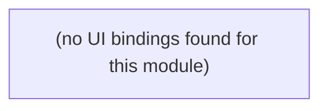

# copilot

Auto-derived module: everything under `src/app/copilot/`.

**App directory:** `src/app/copilot/` (1 `.tsx` files scanned; no matching `src/components/` subdirectory found)

## Bind map

## Convex functions referenced by this module's UI

| Function | Kind | Tables touched | Triggers |
|---|---|---|---|

## UI bindings

| Page | Component | Hook | Convex function |
|---|---|---|---|

## Notes

- 0 bindings is real, not a detection gap — confirmed by direct inspection. `src/app/copilot/page.tsx` does not use Convex hooks at all; it calls `fetch("/api/copilot", ...)`, a Next.js API route (`src/app/api/copilot/route.ts`), which presumably talks to Convex and/or an LLM server-side. This generator only traces client-side `api.*` hook calls, so a fetch-to-API-route module like this one needs its bind map drawn by hand (or a second generator pass over `src/app/api/**/route.ts`) if you want that path documented too.
