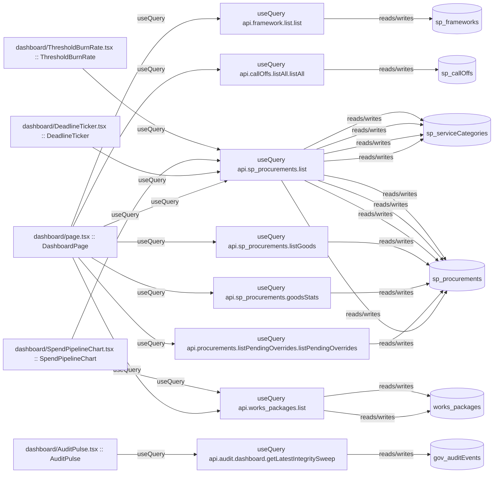

# dashboard

Auto-derived module: everything under `src/app/dashboard/` plus `src/components/dashboard/`.

**App directory:** `src/app/dashboard/` (1 `.tsx` files) + **components directory:** `src/components/dashboard/` (6 `.tsx` files)

## Bind map

## Convex functions referenced by this module's UI

| Function | Kind | Tables touched | Triggers |
|---|---|---|---|
| `sp_procurements.list` | query | `sp_procurements`, `sp_serviceCategories` | — |
| `works_packages.list` | query | `works_packages` | — |
| `framework.list.list` | query | `sp_frameworks` | — |
| `callOffs.listAll.listAll` | query | `sp_callOffs` | — |
| `procurements.listPendingOverrides.listPendingOverrides` | query | `sp_procurements` | — |
| `sp_procurements.goodsStats` | query | `sp_procurements` | — |
| `sp_procurements.listGoods` | query | `sp_procurements` | — |
| `audit.dashboard.getLatestIntegritySweep` | query | `gov_auditEvents` | — |

## UI bindings

| Page | Component | Hook | Convex function |
|---|---|---|---|
| `dashboard/page.tsx` | DashboardPage | useQuery | `api.sp_procurements.list` |
| `dashboard/page.tsx` | DashboardPage | useQuery | `api.works_packages.list` |
| `dashboard/page.tsx` | DashboardPage | useQuery | `api.framework.list.list` |
| `dashboard/page.tsx` | DashboardPage | useQuery | `api.callOffs.listAll.listAll` |
| `dashboard/page.tsx` | DashboardPage | useQuery | `api.procurements.listPendingOverrides.listPendingOverrides` |
| `dashboard/page.tsx` | DashboardPage | useQuery | `api.sp_procurements.goodsStats` |
| `dashboard/page.tsx` | DashboardPage | useQuery | `api.sp_procurements.listGoods` |
| `dashboard/AuditPulse.tsx` | AuditPulse | useQuery | `api.audit.dashboard.getLatestIntegritySweep` |
| `dashboard/DeadlineTicker.tsx` | DeadlineTicker | useQuery | `api.sp_procurements.list` |
| `dashboard/SpendPipelineChart.tsx` | SpendPipelineChart | useQuery | `api.sp_procurements.list` |
| `dashboard/SpendPipelineChart.tsx` | SpendPipelineChart | useQuery | `api.works_packages.list` |
| `dashboard/ThresholdBurnRate.tsx` | ThresholdBurnRate | useQuery | `api.sp_procurements.list` |
