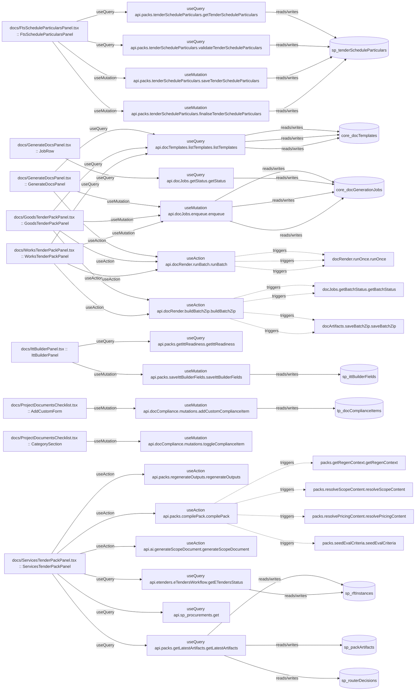

# docs

Auto-derived module: everything under `src/app/docs/` plus `src/components/docs/`.

**App directory:** `src/app/docs/` (9 `.tsx` files) + **components directory:** `src/components/docs/` (11 `.tsx` files)

## Bind map

## Convex functions referenced by this module's UI

| Function | Kind | Tables touched | Triggers |
|---|---|---|---|
| `packs.tenderScheduleParticulars.getTenderScheduleParticulars` | query | `sp_tenderScheduleParticulars` | — |
| `packs.tenderScheduleParticulars.validateTenderScheduleParticulars` | query | `sp_tenderScheduleParticulars` | — |
| `packs.tenderScheduleParticulars.saveTenderScheduleParticulars` | mutation | `sp_tenderScheduleParticulars` | — |
| `packs.tenderScheduleParticulars.finaliseTenderScheduleParticulars` | mutation | `sp_tenderScheduleParticulars` | — |
| `docTemplates.listTemplates.listTemplates` | query | `core_docTemplates` | — |
| `docJobs.enqueue.enqueue` | mutation | `core_docGenerationJobs` | — |
| `docRender.runBatch.runBatch` | action | — | `docRender.runOnce.runOnce` |
| `docJobs.getStatus.getStatus` | query | `core_docGenerationJobs` | — |
| `docRender.buildBatchZip.buildBatchZip` | action | — | `docJobs.getBatchStatus.getBatchStatus`, `docArtifacts.saveBatchZip.saveBatchZip` |
| `packs.getIttReadiness.getIttReadiness` | query | — | — |
| `packs.saveIttBuilderFields.saveIttBuilderFields` | mutation | `sp_ittBuilderFields` | — |
| `docCompliance.mutations.addCustomComplianceItem` | mutation | `tp_docComplianceItems` | — |
| `docCompliance.mutations.toggleComplianceItem` | mutation | — | — |
| `packs.regenerateOutputs.regenerateOutputs` | action | — | — |
| `packs.compilePack.compilePack` | action | — | `packs.getRegenContext.getRegenContext`, `packs.resolveScopeContent.resolveScopeContent`, `packs.resolvePricingContent.resolvePricingContent`, `packs.seedEvalCriteria.seedEvalCriteria` |
| `ai.generateScopeDocument.generateScopeDocument` | action | — | — |
| `packs.getLatestArtifacts.getLatestArtifacts` | query | `sp_rftInstances`, `sp_packArtifacts`, `sp_routerDecisions` | — |
| `sp_procurements.get` | query | — | — |
| `etenders.eTendersWorkflow.getETendersStatus` | query | `sp_rftInstances` | — |

## UI bindings

| Page | Component | Hook | Convex function |
|---|---|---|---|
| `docs/FtsScheduleParticularsPanel.tsx` | FtsScheduleParticularsPanel | useQuery | `api.packs.tenderScheduleParticulars.getTenderScheduleParticulars` |
| `docs/FtsScheduleParticularsPanel.tsx` | FtsScheduleParticularsPanel | useQuery | `api.packs.tenderScheduleParticulars.validateTenderScheduleParticulars` |
| `docs/FtsScheduleParticularsPanel.tsx` | FtsScheduleParticularsPanel | useMutation | `api.packs.tenderScheduleParticulars.saveTenderScheduleParticulars` |
| `docs/FtsScheduleParticularsPanel.tsx` | FtsScheduleParticularsPanel | useMutation | `api.packs.tenderScheduleParticulars.finaliseTenderScheduleParticulars` |
| `docs/GenerateDocsPanel.tsx` | GenerateDocsPanel | useQuery | `api.docTemplates.listTemplates.listTemplates` |
| `docs/GenerateDocsPanel.tsx` | GenerateDocsPanel | useMutation | `api.docJobs.enqueue.enqueue` |
| `docs/GenerateDocsPanel.tsx` | GenerateDocsPanel | useAction | `api.docRender.runBatch.runBatch` |
| `docs/GenerateDocsPanel.tsx` | JobRow | useQuery | `api.docJobs.getStatus.getStatus` |
| `docs/GoodsTenderPackPanel.tsx` | GoodsTenderPackPanel | useQuery | `api.docTemplates.listTemplates.listTemplates` |
| `docs/GoodsTenderPackPanel.tsx` | GoodsTenderPackPanel | useMutation | `api.docJobs.enqueue.enqueue` |
| `docs/GoodsTenderPackPanel.tsx` | GoodsTenderPackPanel | useAction | `api.docRender.runBatch.runBatch` |
| `docs/GoodsTenderPackPanel.tsx` | GoodsTenderPackPanel | useAction | `api.docRender.buildBatchZip.buildBatchZip` |
| `docs/IttBuilderPanel.tsx` | IttBuilderPanel | useQuery | `api.packs.getIttReadiness.getIttReadiness` |
| `docs/IttBuilderPanel.tsx` | IttBuilderPanel | useMutation | `api.packs.saveIttBuilderFields.saveIttBuilderFields` |
| `docs/ProjectDocumentsChecklist.tsx` | AddCustomForm | useMutation | `api.docCompliance.mutations.addCustomComplianceItem` |
| `docs/ProjectDocumentsChecklist.tsx` | CategorySection | useMutation | `api.docCompliance.mutations.toggleComplianceItem` |
| `docs/ServicesTenderPackPanel.tsx` | ServicesTenderPackPanel | useAction | `api.packs.regenerateOutputs.regenerateOutputs` |
| `docs/ServicesTenderPackPanel.tsx` | ServicesTenderPackPanel | useAction | `api.packs.compilePack.compilePack` |
| `docs/ServicesTenderPackPanel.tsx` | ServicesTenderPackPanel | useAction | `api.ai.generateScopeDocument.generateScopeDocument` |
| `docs/ServicesTenderPackPanel.tsx` | ServicesTenderPackPanel | useQuery | `api.packs.getLatestArtifacts.getLatestArtifacts` |
| `docs/ServicesTenderPackPanel.tsx` | ServicesTenderPackPanel | useQuery | `api.sp_procurements.get` |
| `docs/ServicesTenderPackPanel.tsx` | ServicesTenderPackPanel | useQuery | `api.etenders.eTendersWorkflow.getETendersStatus` |
| `docs/WorksTenderPackPanel.tsx` | WorksTenderPackPanel | useQuery | `api.docTemplates.listTemplates.listTemplates` |
| `docs/WorksTenderPackPanel.tsx` | WorksTenderPackPanel | useMutation | `api.docJobs.enqueue.enqueue` |
| `docs/WorksTenderPackPanel.tsx` | WorksTenderPackPanel | useAction | `api.docRender.runBatch.runBatch` |
| `docs/WorksTenderPackPanel.tsx` | WorksTenderPackPanel | useAction | `api.docRender.buildBatchZip.buildBatchZip` |
