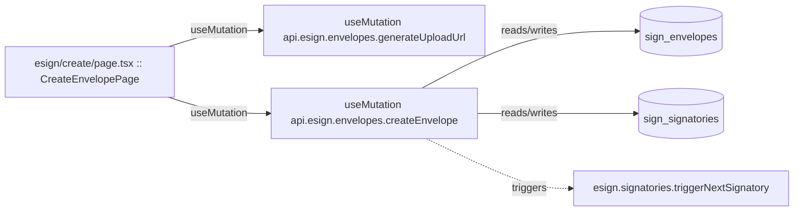

# esign

Auto-derived module: everything under `src/app/esign/`.

**App directory:** `src/app/esign/` (3 `.tsx` files scanned; no matching `src/components/` subdirectory found)

## Bind map

## Convex functions referenced by this module's UI

| Function | Kind | Tables touched | Triggers |
|---|---|---|---|
| `esign.envelopes.generateUploadUrl` | mutation | — | — |
| `esign.envelopes.createEnvelope` | mutation | `sign_envelopes`, `sign_signatories` | `esign.signatories.triggerNextSignatory` |

## UI bindings

| Page | Component | Hook | Convex function |
|---|---|---|---|
| `esign/create/page.tsx` | CreateEnvelopePage | useMutation | `api.esign.envelopes.generateUploadUrl` |
| `esign/create/page.tsx` | CreateEnvelopePage | useMutation | `api.esign.envelopes.createEnvelope` |
