# eval

Auto-derived module: everything under `src/app/eval/` plus `src/components/eval/`.

**App directory:** `src/app/eval/` (19 `.tsx` files) + **components directory:** `src/components/eval/` (42 `.tsx` files)

## Bind map

```mermaid
flowchart LR
  n0["eval/audit/[entityId]/page.tsx :: AuditTimelinePage"] -->|useQuery| n1["useQuery api.eval.governanceQueries.getAuditTimeline"]
  n1 -->|reads/writes| n2[("eval_stageTimings")]
  n1 -->|reads/writes| n3[("eval_signingDeclarations")]
  n1 -->|reads/writes| n4[("eval_overrideLogs")]
  n1 -->|reads/writes| n5[("gov_auditEvents")]
  n1 -->|reads/writes| n6[("sp_users")]
  n7["eval/disputes/page.tsx :: DisputesPage"] -->|useQuery| n8["useQuery api.eval.queries.listProjects"]
  n8 -->|reads/writes| n9[("eval_tenderProjects")]
  n8 -->|reads/writes| n10[("eval_tenderSubmissions")]
  n8 -->|reads/writes| n11[("eval_auditScores")]
  n7["eval/disputes/page.tsx :: DisputesPage"] -->|useMutation| n12["useMutation api.eval.disputeHandling.resolveStandstillChallenge"]
  n13["eval/governance/page.tsx :: GovernanceDashboardPage"] -->|useQuery| n14["useQuery api.eval.governanceQueries.getGovernanceDashboard"]
  n14 -->|reads/writes| n15[("sp_organisations")]
  n14 -->|reads/writes| n9[("eval_tenderProjects")]
  n14 -->|reads/writes| n16[("eval_saqCampaigns")]
  n14 -->|reads/writes| n11[("eval_auditScores")]
  n14 -->|reads/writes| n17[("eval_performanceMetrics")]
  n18["eval/page.tsx :: EvalDashboard"] -->|useQuery| n19["useQuery api.eval.queries.getDashboardStats"]
  n19 -->|reads/writes| n16[("eval_saqCampaigns")]
  n19 -->|reads/writes| n9[("eval_tenderProjects")]
  n19 -->|reads/writes| n11[("eval_auditScores")]
  n19 -->|reads/writes| n20[("eval_qualifiedPanels")]
  n21["eval/review/page.tsx :: ReviewQueuePage"] -->|useQuery| n22["useQuery api.eval.queries.listCampaigns"]
  n22 -->|reads/writes| n16[("eval_saqCampaigns")]
  n22 -->|reads/writes| n23[("eval_saqSubmissions")]
  n21["eval/review/page.tsx :: ReviewQueuePage"] -->|useQuery| n8["useQuery api.eval.queries.listProjects"]
  n8 -->|reads/writes| n9[("eval_tenderProjects")]
  n8 -->|reads/writes| n10[("eval_tenderSubmissions")]
  n8 -->|reads/writes| n11[("eval_auditScores")]
  n21["eval/review/page.tsx :: ReviewQueuePage"] -->|useMutation| n24["useMutation api.standstill.timers.triggerStandstillScan"]
  n24 -->|reads/writes| n9[("eval_tenderProjects")]
  n24 -->|reads/writes| n4[("eval_overrideLogs")]
  n24 -->|reads/writes| n2[("eval_stageTimings")]
  n25["eval/saq/[campaignId]/page.tsx :: SubmissionReviewCard"] -->|useMutation| n26["useMutation api.eval.saqSubmissions.submitManualReview"]
  n27["eval/saq/[campaignId]/page.tsx :: SaqCampaignPage"] -->|useQuery| n28["useQuery api.eval.queries.getCampaignWithSubmissions"]
  n28 -->|reads/writes| n23[("eval_saqSubmissions")]
  n28 -->|reads/writes| n20[("eval_qualifiedPanels")]
  n28 -->|reads/writes| n2[("eval_stageTimings")]
  n27["eval/saq/[campaignId]/page.tsx :: SaqCampaignPage"] -->|useMutation| n29["useMutation api.eval.signingDeclarations.signDeclaration"]
  n29 -->|reads/writes| n3[("eval_signingDeclarations")]
  n27["eval/saq/[campaignId]/page.tsx :: SaqCampaignPage"] -->|useMutation| n30["useMutation api.eval.saqSubmissions.formPanel"]
  n30 -->|reads/writes| n23[("eval_saqSubmissions")]
  n30 -->|reads/writes| n20[("eval_qualifiedPanels")]
  n31["eval/saq/page.tsx :: eval/saq/page.tsx"] -->|useQuery| n22["useQuery api.eval.queries.listCampaigns"]
  n22 -->|reads/writes| n16[("eval_saqCampaigns")]
  n22 -->|reads/writes| n23[("eval_saqSubmissions")]
  n32["eval/saq/page.tsx :: SaqCampaignList"] -->|useQuery| n22["useQuery api.eval.queries.listCampaigns"]
  n22 -->|reads/writes| n16[("eval_saqCampaigns")]
  n22 -->|reads/writes| n23[("eval_saqSubmissions")]
  n33["eval/suppliers/[supplierId]/page.tsx :: SupplierDetailPage"] -->|useQuery| n34["useQuery api.eval.queries.getSupplierDetail"]
  n34 -->|reads/writes| n23[("eval_saqSubmissions")]
  n34 -->|reads/writes| n10[("eval_tenderSubmissions")]
  n35["eval/suppliers/page.tsx :: TaxStatus"] -->|useQuery| n36["useQuery api.eval.queries.listSuppliers"]
  n36 -->|reads/writes| n37[("eval_supplierProfiles")]
  n36 -->|reads/writes| n23[("eval_saqSubmissions")]
  n36 -->|reads/writes| n10[("eval_tenderSubmissions")]
  n38["eval/tender/[id]/compare/page.tsx :: TenderCompareDocumentsPage"] -->|useQuery| n39["useQuery api.eval.queries.getProjectWithDetails"]
  n39 -->|reads/writes| n11[("eval_auditScores")]
  n39 -->|reads/writes| n17[("eval_performanceMetrics")]
  n39 -->|reads/writes| n10[("eval_tenderSubmissions")]
  n39 -->|reads/writes| n40[("eval_tenderScores")]
  n39 -->|reads/writes| n2[("eval_stageTimings")]
  n39 -->|reads/writes| n4[("eval_overrideLogs")]
  n39 -->|reads/writes| n3[("eval_signingDeclarations")]
  n39 -->|reads/writes| n41[("eval_letters")]
  n39 -->|reads/writes| n42[("eval_evaluationReports")]
  n39 -->|reads/writes| n43[("eval_contractExecution")]
  n38["eval/tender/[id]/compare/page.tsx :: TenderCompareDocumentsPage"] -->|useQuery| n44["useQuery api.eval.documentViewer.getProjectDocumentReviews"]
  n44 -->|reads/writes| n10[("eval_tenderSubmissions")]
  n44 -->|reads/writes| n45[("eval_documentReviews")]
  n46["eval/tender/[id]/compliance/page.tsx :: TenderCompliancePage"] -->|useQuery| n47["useQuery api.eval.queries.getViewerSpUserId"]
  n46["eval/tender/[id]/compliance/page.tsx :: TenderCompliancePage"] -->|useQuery| n39["useQuery api.eval.queries.getProjectWithDetails"]
  n39 -->|reads/writes| n11[("eval_auditScores")]
  n39 -->|reads/writes| n17[("eval_performanceMetrics")]
  n39 -->|reads/writes| n10[("eval_tenderSubmissions")]
  n39 -->|reads/writes| n40[("eval_tenderScores")]
  n39 -->|reads/writes| n2[("eval_stageTimings")]
  n39 -->|reads/writes| n4[("eval_overrideLogs")]
  n39 -->|reads/writes| n3[("eval_signingDeclarations")]
  n39 -->|reads/writes| n41[("eval_letters")]
  n39 -->|reads/writes| n42[("eval_evaluationReports")]
  n39 -->|reads/writes| n43[("eval_contractExecution")]
  n46["eval/tender/[id]/compliance/page.tsx :: TenderCompliancePage"] -->|useQuery| n48["useQuery api.docCompliance.queries.getByEvalProject"]
  n48 -->|reads/writes| n49[("tp_docCompliance")]
  n48 -->|reads/writes| n50[("tp_docComplianceItems")]
  n46["eval/tender/[id]/compliance/page.tsx :: TenderCompliancePage"] -->|useMutation| n51["useMutation api.docCompliance.mutations.create"]
  n51 -->|reads/writes| n49[("tp_docCompliance")]
  n51 -->|reads/writes| n50[("tp_docComplianceItems")]
  n46["eval/tender/[id]/compliance/page.tsx :: TenderCompliancePage"] -->|useMutation| n52["useMutation api.docCompliance.mutations.updateItemStatus"]
  n46["eval/tender/[id]/compliance/page.tsx :: TenderCompliancePage"] -->|useMutation| n53["useMutation api.docCompliance.mutations.signOff"]
  n54["eval/tender/[id]/letters/page.tsx :: LettersPage"] -->|useQuery| n55["useQuery api.eval.queries.listLetters"]
  n55 -->|reads/writes| n41[("eval_letters")]
  n54["eval/tender/[id]/letters/page.tsx :: LettersPage"] -->|useQuery| n39["useQuery api.eval.queries.getProjectWithDetails"]
  n39 -->|reads/writes| n11[("eval_auditScores")]
  n39 -->|reads/writes| n17[("eval_performanceMetrics")]
  n39 -->|reads/writes| n10[("eval_tenderSubmissions")]
  n39 -->|reads/writes| n40[("eval_tenderScores")]
  n39 -->|reads/writes| n2[("eval_stageTimings")]
  n39 -->|reads/writes| n4[("eval_overrideLogs")]
  n39 -->|reads/writes| n3[("eval_signingDeclarations")]
  n39 -->|reads/writes| n41[("eval_letters")]
  n39 -->|reads/writes| n42[("eval_evaluationReports")]
  n39 -->|reads/writes| n43[("eval_contractExecution")]
  n56["eval/tender/page.tsx :: eval/tender/page.tsx"] -->|useQuery| n8["useQuery api.eval.queries.listProjects"]
  n8 -->|reads/writes| n9[("eval_tenderProjects")]
  n8 -->|reads/writes| n10[("eval_tenderSubmissions")]
  n8 -->|reads/writes| n11[("eval_auditScores")]
  n57["eval/tender/page.tsx :: TenderProjectList"] -->|useQuery| n8["useQuery api.eval.queries.listProjects"]
  n8 -->|reads/writes| n9[("eval_tenderProjects")]
  n8 -->|reads/writes| n10[("eval_tenderSubmissions")]
  n8 -->|reads/writes| n11[("eval_auditScores")]
  n58["eval/AwardCriteriaPanel.tsx :: AwardCriteriaPanel"] -->|useQuery| n59["useQuery api.eval.queries.listCriteriaTemplates"]
  n59 -->|reads/writes| n60[("eval_criteriaTemplates")]
  n61["eval/CascadeEvalTab.tsx :: CascadeEvalTab"] -->|useMutation| n62["useMutation api.eval.cascadeLink.linkProcurementToEvalProject"]
  n61["eval/CascadeEvalTab.tsx :: CascadeEvalTab"] -->|useMutation| n63["useMutation api.eval.cascadeLink.unlinkProcurementFromEvalProject"]
  n61["eval/CascadeEvalTab.tsx :: CascadeEvalTab"] -->|useMutation| n64["useMutation api.eval.cascadeLink.linkWorksPackageToEvalProject"]
  n61["eval/CascadeEvalTab.tsx :: CascadeEvalTab"] -->|useMutation| n65["useMutation api.eval.cascadeLink.unlinkWorksPackageFromEvalProject"]
  n66["eval/DocumentReviewPane.tsx :: VaultCrossRefCard"] -->|useQuery| n34["useQuery api.eval.queries.getSupplierDetail"]
  n34 -->|reads/writes| n23[("eval_saqSubmissions")]
  n34 -->|reads/writes| n10[("eval_tenderSubmissions")]
  n67["eval/DocumentReviewPane.tsx :: ReviewForm"] -->|useMutation| n68["useMutation api.eval.documentViewer.upsertDocumentReview"]
  n68 -->|reads/writes| n45[("eval_documentReviews")]
  n69["eval/DocumentReviewPane.tsx :: DocumentReviewPane"] -->|useQuery| n70["useQuery api.eval.documentViewer.getDocumentReviews"]
  n70 -->|reads/writes| n45[("eval_documentReviews")]
  n71["eval/EvaluationFoiReport.tsx :: EvaluationFoiReport"] -->|useQuery| n72["useQuery api.eval.evaluationReports.getFoiReport"]
  n72 -->|reads/writes| n10[("eval_tenderSubmissions")]
  n72 -->|reads/writes| n40[("eval_tenderScores")]
  n72 -->|reads/writes| n45[("eval_documentReviews")]
  n72 -->|reads/writes| n4[("eval_overrideLogs")]
  n72 -->|reads/writes| n3[("eval_signingDeclarations")]
  n72 -->|reads/writes| n73[("eval_tenderPanelMembers")]
  n72 -->|reads/writes| n42[("eval_evaluationReports")]
  n74["eval/OnlineEvalMatrix.tsx :: OnlineEvalMatrix"] -->|useQuery| n75["useQuery api.eval.queries.getTenderProject"]
  n74["eval/OnlineEvalMatrix.tsx :: OnlineEvalMatrix"] -->|useQuery| n76["useQuery api.eval.queries.getProjectSubmissions"]
  n76 -->|reads/writes| n10[("eval_tenderSubmissions")]
  n74["eval/OnlineEvalMatrix.tsx :: OnlineEvalMatrix"] -->|useQuery| n77["useQuery api.eval.queries.getEvaluationReadiness"]
  n77 -->|reads/writes| n10[("eval_tenderSubmissions")]
  n77 -->|reads/writes| n40[("eval_tenderScores")]
  n78["eval/PanelHealthCard.tsx :: PanelHealthCard"] -->|useQuery| n79["useQuery api.eval.panelHealth.getPanelHealthSummary"]
  n79 -->|reads/writes| n9[("eval_tenderProjects")]
  n79 -->|reads/writes| n10[("eval_tenderSubmissions")]
  n79 -->|reads/writes| n16[("eval_saqCampaigns")]
  n80["eval/PanelHealthCard.tsx :: CrossConcentrationRiskBanner"] -->|useQuery| n81["useQuery api.eval.panelHealth.getCrossConcentrationRisk"]
  n81 -->|reads/writes| n20[("eval_qualifiedPanels")]
  n81 -->|reads/writes| n9[("eval_tenderProjects")]
  n81 -->|reads/writes| n10[("eval_tenderSubmissions")]
  n82["eval/PanelHealthCard.tsx :: ActivePanelHealthList"] -->|useQuery| n83["useQuery api.eval.panelHealth.listActivePanels"]
  n83 -->|reads/writes| n20[("eval_qualifiedPanels")]
  n83 -->|reads/writes| n9[("eval_tenderProjects")]
  n84["eval/PreAwardReadinessChecklist.tsx :: PreAwardReadinessChecklist"] -->|useQuery| n85["useQuery api.eval.preAwardReadiness.getPreAwardReadiness"]
  n85 -->|reads/writes| n10[("eval_tenderSubmissions")]
  n85 -->|reads/writes| n40[("eval_tenderScores")]
  n85 -->|reads/writes| n42[("eval_evaluationReports")]
  n85 -->|reads/writes| n11[("eval_auditScores")]
  n85 -->|reads/writes| n3[("eval_signingDeclarations")]
  n85 -->|reads/writes| n41[("eval_letters")]
  n85 -->|reads/writes| n4[("eval_overrideLogs")]
  n85 -->|reads/writes| n86[("eval_altScreenings")]
  n85 -->|reads/writes| n87[("eval_altExplanations")]
  n85 -->|reads/writes| n23[("eval_saqSubmissions")]
  n85 -->|reads/writes| n88[("eval_exclusionRecords")]
  n89["eval/ProjectVelocityDashboard.tsx :: ProjectVelocityDashboard"] -->|useQuery| n90["useQuery api.eval.queries.getProjectVelocityDashboard"]
  n90 -->|reads/writes| n9[("eval_tenderProjects")]
  n90 -->|reads/writes| n2[("eval_stageTimings")]
  n90 -->|reads/writes| n11[("eval_auditScores")]
  n90 -->|reads/writes| n10[("eval_tenderSubmissions")]
  n90 -->|reads/writes| n17[("eval_performanceMetrics")]
  n89["eval/ProjectVelocityDashboard.tsx :: ProjectVelocityDashboard"] -->|useQuery| n91["useQuery api.eval.queries.getAuditScoreLeaderboard"]
  n91 -->|reads/writes| n11[("eval_auditScores")]
  n92["eval/StatutoryDeadlineStrip.tsx :: StatutoryDeadlineStrip"] -->|useQuery| n93["useQuery api.eval.deadlines.getStatutoryDeadlines"]
  n92["eval/StatutoryDeadlineStrip.tsx :: StatutoryDeadlineStrip"] -->|useMutation| n94["useMutation api.eval.deadlines.acknowledgeDeadline"]
  n94 -->|reads/writes| n95[("eval_deadlineAcknowledgements")]
  n96["eval/SubmissionCompliancePanel.tsx :: SubmissionComplianceBadge"] -->|useQuery| n97["useQuery api.eval.queries.getSubmissionCompliance"]
  n98["eval/TenderPriceBenchmark.tsx :: TenderPriceBenchmark"] -->|useQuery| n99["useQuery api.eval.queries.getBandPriceBenchmarks"]
  n99 -->|reads/writes| n9[("eval_tenderProjects")]
  n99 -->|reads/writes| n10[("eval_tenderSubmissions")]
  n100["eval/TenderPriceBenchmark.tsx :: PostAwardIntelligenceCard"] -->|useQuery| n101["useQuery api.eval.queries.getPostAwardIntelligence"]
  n101 -->|reads/writes| n11[("eval_auditScores")]
  n101 -->|reads/writes| n17[("eval_performanceMetrics")]
  n101 -->|reads/writes| n10[("eval_tenderSubmissions")]
  n101 -->|reads/writes| n9[("eval_tenderProjects")]
  n102["eval/project-overview/ProjectOverviewPanel.tsx :: ProjectOverviewPanel"] -->|useQuery| n103["useQuery api.eval.foiExport.exportProjectFoi"]
  n103 -->|reads/writes| n10[("eval_tenderSubmissions")]
  n103 -->|reads/writes| n40[("eval_tenderScores")]
  n103 -->|reads/writes| n3[("eval_signingDeclarations")]
  n103 -->|reads/writes| n2[("eval_stageTimings")]
  n103 -->|reads/writes| n4[("eval_overrideLogs")]
  n103 -->|reads/writes| n11[("eval_auditScores")]
  n103 -->|reads/writes| n42[("eval_evaluationReports")]
  n103 -->|reads/writes| n41[("eval_letters")]
  n102["eval/project-overview/ProjectOverviewPanel.tsx :: ProjectOverviewPanel"] -->|useQuery| n39["useQuery api.eval.queries.getProjectWithDetails"]
  n39 -->|reads/writes| n11[("eval_auditScores")]
  n39 -->|reads/writes| n17[("eval_performanceMetrics")]
  n39 -->|reads/writes| n10[("eval_tenderSubmissions")]
  n39 -->|reads/writes| n40[("eval_tenderScores")]
  n39 -->|reads/writes| n2[("eval_stageTimings")]
  n39 -->|reads/writes| n4[("eval_overrideLogs")]
  n39 -->|reads/writes| n3[("eval_signingDeclarations")]
  n39 -->|reads/writes| n41[("eval_letters")]
  n39 -->|reads/writes| n42[("eval_evaluationReports")]
  n39 -->|reads/writes| n43[("eval_contractExecution")]
  n104["eval/shared/DeclarationBlock.tsx :: DeclarationBlock"] -->|useMutation| n29["useMutation api.eval.signingDeclarations.signDeclaration"]
  n29 -->|reads/writes| n3[("eval_signingDeclarations")]
  n105["eval/workflow/DeclarationBlock.tsx :: DeclarationBlock"] -->|useMutation| n29["useMutation api.eval.signingDeclarations.signDeclaration"]
  n29 -->|reads/writes| n3[("eval_signingDeclarations")]
  n106["eval/workflow/ScoreCalibrationPanel.tsx :: ScoreCalibrationPanel"] -->|useMutation| n107["useMutation api.eval.disputeHandling.raiseScoreDispute"]
```

## Convex functions referenced by this module's UI

| Function | Kind | Tables touched | Triggers |
|---|---|---|---|
| `eval.governanceQueries.getAuditTimeline` | query | `eval_stageTimings`, `eval_signingDeclarations`, `eval_overrideLogs`, `gov_auditEvents`, `sp_users` | — |
| `eval.queries.listProjects` | query | `eval_tenderProjects`, `eval_tenderSubmissions`, `eval_auditScores` | — |
| `eval.disputeHandling.resolveStandstillChallenge` | mutation | — | — |
| `eval.governanceQueries.getGovernanceDashboard` | query | `sp_organisations`, `eval_tenderProjects`, `eval_saqCampaigns`, `eval_auditScores`, `eval_performanceMetrics` | — |
| `eval.queries.getDashboardStats` | query | `eval_saqCampaigns`, `eval_tenderProjects`, `eval_auditScores`, `eval_qualifiedPanels` | — |
| `eval.queries.listCampaigns` | query | `eval_saqCampaigns`, `eval_saqSubmissions` | — |
| `standstill.timers.triggerStandstillScan` | mutation | `eval_tenderProjects`, `eval_overrideLogs`, `eval_stageTimings` | — |
| `eval.saqSubmissions.submitManualReview` | mutation | — | — |
| `eval.queries.getCampaignWithSubmissions` | query | `eval_saqSubmissions`, `eval_qualifiedPanels`, `eval_stageTimings` | — |
| `eval.signingDeclarations.signDeclaration` | mutation | `eval_signingDeclarations` | — |
| `eval.saqSubmissions.formPanel` | mutation | `eval_saqSubmissions`, `eval_qualifiedPanels` | — |
| `eval.queries.getSupplierDetail` | query | `eval_saqSubmissions`, `eval_tenderSubmissions` | — |
| `eval.queries.listSuppliers` | query | `eval_supplierProfiles`, `eval_saqSubmissions`, `eval_tenderSubmissions` | — |
| `eval.queries.getProjectWithDetails` | query | `eval_auditScores`, `eval_performanceMetrics`, `eval_tenderSubmissions`, `eval_tenderScores`, `eval_stageTimings`, `eval_overrideLogs`, `eval_signingDeclarations`, `eval_letters`, `eval_evaluationReports`, `eval_contractExecution` | — |
| `eval.documentViewer.getProjectDocumentReviews` | query | `eval_tenderSubmissions`, `eval_documentReviews` | — |
| `eval.queries.getViewerSpUserId` | query | — | — |
| `docCompliance.queries.getByEvalProject` | query | `tp_docCompliance`, `tp_docComplianceItems` | — |
| `docCompliance.mutations.create` | mutation | `tp_docCompliance`, `tp_docComplianceItems` | — |
| `docCompliance.mutations.updateItemStatus` | mutation | — | — |
| `docCompliance.mutations.signOff` | mutation | — | — |
| `eval.queries.listLetters` | query | `eval_letters` | — |
| `eval.queries.listCriteriaTemplates` | query | `eval_criteriaTemplates` | — |
| `eval.cascadeLink.linkProcurementToEvalProject` | mutation | — | — |
| `eval.cascadeLink.unlinkProcurementFromEvalProject` | mutation | — | — |
| `eval.cascadeLink.linkWorksPackageToEvalProject` | mutation | — | — |
| `eval.cascadeLink.unlinkWorksPackageFromEvalProject` | mutation | — | — |
| `eval.documentViewer.upsertDocumentReview` | mutation | `eval_documentReviews` | — |
| `eval.documentViewer.getDocumentReviews` | query | `eval_documentReviews` | — |
| `eval.evaluationReports.getFoiReport` | query | `eval_tenderSubmissions`, `eval_tenderScores`, `eval_documentReviews`, `eval_overrideLogs`, `eval_signingDeclarations`, `eval_tenderPanelMembers`, `eval_evaluationReports` | — |
| `eval.queries.getTenderProject` | query | — | — |
| `eval.queries.getProjectSubmissions` | query | `eval_tenderSubmissions` | — |
| `eval.queries.getEvaluationReadiness` | query | `eval_tenderSubmissions`, `eval_tenderScores` | — |
| `eval.panelHealth.getPanelHealthSummary` | query | `eval_tenderProjects`, `eval_tenderSubmissions`, `eval_saqCampaigns` | — |
| `eval.panelHealth.getCrossConcentrationRisk` | query | `eval_qualifiedPanels`, `eval_tenderProjects`, `eval_tenderSubmissions` | — |
| `eval.panelHealth.listActivePanels` | query | `eval_qualifiedPanels`, `eval_tenderProjects` | — |
| `eval.preAwardReadiness.getPreAwardReadiness` | query | `eval_tenderSubmissions`, `eval_tenderScores`, `eval_evaluationReports`, `eval_auditScores`, `eval_signingDeclarations`, `eval_letters`, `eval_overrideLogs`, `eval_altScreenings`, `eval_altExplanations`, `eval_saqSubmissions`, `eval_exclusionRecords` | — |
| `eval.queries.getProjectVelocityDashboard` | query | `eval_tenderProjects`, `eval_stageTimings`, `eval_auditScores`, `eval_tenderSubmissions`, `eval_performanceMetrics` | — |
| `eval.queries.getAuditScoreLeaderboard` | query | `eval_auditScores` | — |
| `eval.deadlines.getStatutoryDeadlines` | query | — | — |
| `eval.deadlines.acknowledgeDeadline` | mutation | `eval_deadlineAcknowledgements` | — |
| `eval.queries.getSubmissionCompliance` | query | — | — |
| `eval.queries.getBandPriceBenchmarks` | query | `eval_tenderProjects`, `eval_tenderSubmissions` | — |
| `eval.queries.getPostAwardIntelligence` | query | `eval_auditScores`, `eval_performanceMetrics`, `eval_tenderSubmissions`, `eval_tenderProjects` | — |
| `eval.foiExport.exportProjectFoi` | query | `eval_tenderSubmissions`, `eval_tenderScores`, `eval_signingDeclarations`, `eval_stageTimings`, `eval_overrideLogs`, `eval_auditScores`, `eval_evaluationReports`, `eval_letters` | — |
| `eval.disputeHandling.raiseScoreDispute` | mutation | — | — |

## UI bindings

| Page | Component | Hook | Convex function |
|---|---|---|---|
| `eval/audit/[entityId]/page.tsx` | AuditTimelinePage | useQuery | `api.eval.governanceQueries.getAuditTimeline` |
| `eval/disputes/page.tsx` | DisputesPage | useQuery | `api.eval.queries.listProjects` |
| `eval/disputes/page.tsx` | DisputesPage | useMutation | `api.eval.disputeHandling.resolveStandstillChallenge` |
| `eval/governance/page.tsx` | GovernanceDashboardPage | useQuery | `api.eval.governanceQueries.getGovernanceDashboard` |
| `eval/page.tsx` | EvalDashboard | useQuery | `api.eval.queries.getDashboardStats` |
| `eval/review/page.tsx` | ReviewQueuePage | useQuery | `api.eval.queries.listCampaigns` |
| `eval/review/page.tsx` | ReviewQueuePage | useQuery | `api.eval.queries.listProjects` |
| `eval/review/page.tsx` | ReviewQueuePage | useMutation | `api.standstill.timers.triggerStandstillScan` |
| `eval/saq/[campaignId]/page.tsx` | SubmissionReviewCard | useMutation | `api.eval.saqSubmissions.submitManualReview` |
| `eval/saq/[campaignId]/page.tsx` | SaqCampaignPage | useQuery | `api.eval.queries.getCampaignWithSubmissions` |
| `eval/saq/[campaignId]/page.tsx` | SaqCampaignPage | useMutation | `api.eval.signingDeclarations.signDeclaration` |
| `eval/saq/[campaignId]/page.tsx` | SaqCampaignPage | useMutation | `api.eval.saqSubmissions.formPanel` |
| `eval/saq/page.tsx` | eval/saq/page.tsx | useQuery | `api.eval.queries.listCampaigns` |
| `eval/saq/page.tsx` | SaqCampaignList | useQuery | `api.eval.queries.listCampaigns` |
| `eval/suppliers/[supplierId]/page.tsx` | SupplierDetailPage | useQuery | `api.eval.queries.getSupplierDetail` |
| `eval/suppliers/page.tsx` | TaxStatus | useQuery | `api.eval.queries.listSuppliers` |
| `eval/tender/[id]/compare/page.tsx` | TenderCompareDocumentsPage | useQuery | `api.eval.queries.getProjectWithDetails` |
| `eval/tender/[id]/compare/page.tsx` | TenderCompareDocumentsPage | useQuery | `api.eval.documentViewer.getProjectDocumentReviews` |
| `eval/tender/[id]/compliance/page.tsx` | TenderCompliancePage | useQuery | `api.eval.queries.getViewerSpUserId` |
| `eval/tender/[id]/compliance/page.tsx` | TenderCompliancePage | useQuery | `api.eval.queries.getProjectWithDetails` |
| `eval/tender/[id]/compliance/page.tsx` | TenderCompliancePage | useQuery | `api.docCompliance.queries.getByEvalProject` |
| `eval/tender/[id]/compliance/page.tsx` | TenderCompliancePage | useMutation | `api.docCompliance.mutations.create` |
| `eval/tender/[id]/compliance/page.tsx` | TenderCompliancePage | useMutation | `api.docCompliance.mutations.updateItemStatus` |
| `eval/tender/[id]/compliance/page.tsx` | TenderCompliancePage | useMutation | `api.docCompliance.mutations.signOff` |
| `eval/tender/[id]/letters/page.tsx` | LettersPage | useQuery | `api.eval.queries.listLetters` |
| `eval/tender/[id]/letters/page.tsx` | LettersPage | useQuery | `api.eval.queries.getProjectWithDetails` |
| `eval/tender/page.tsx` | eval/tender/page.tsx | useQuery | `api.eval.queries.listProjects` |
| `eval/tender/page.tsx` | TenderProjectList | useQuery | `api.eval.queries.listProjects` |
| `eval/AwardCriteriaPanel.tsx` | AwardCriteriaPanel | useQuery | `api.eval.queries.listCriteriaTemplates` |
| `eval/CascadeEvalTab.tsx` | CascadeEvalTab | useMutation | `api.eval.cascadeLink.linkProcurementToEvalProject` |
| `eval/CascadeEvalTab.tsx` | CascadeEvalTab | useMutation | `api.eval.cascadeLink.unlinkProcurementFromEvalProject` |
| `eval/CascadeEvalTab.tsx` | CascadeEvalTab | useMutation | `api.eval.cascadeLink.linkWorksPackageToEvalProject` |
| `eval/CascadeEvalTab.tsx` | CascadeEvalTab | useMutation | `api.eval.cascadeLink.unlinkWorksPackageFromEvalProject` |
| `eval/DocumentReviewPane.tsx` | VaultCrossRefCard | useQuery | `api.eval.queries.getSupplierDetail` |
| `eval/DocumentReviewPane.tsx` | ReviewForm | useMutation | `api.eval.documentViewer.upsertDocumentReview` |
| `eval/DocumentReviewPane.tsx` | DocumentReviewPane | useQuery | `api.eval.documentViewer.getDocumentReviews` |
| `eval/EvaluationFoiReport.tsx` | EvaluationFoiReport | useQuery | `api.eval.evaluationReports.getFoiReport` |
| `eval/OnlineEvalMatrix.tsx` | OnlineEvalMatrix | useQuery | `api.eval.queries.getTenderProject` |
| `eval/OnlineEvalMatrix.tsx` | OnlineEvalMatrix | useQuery | `api.eval.queries.getProjectSubmissions` |
| `eval/OnlineEvalMatrix.tsx` | OnlineEvalMatrix | useQuery | `api.eval.queries.getEvaluationReadiness` |
| `eval/PanelHealthCard.tsx` | PanelHealthCard | useQuery | `api.eval.panelHealth.getPanelHealthSummary` |
| `eval/PanelHealthCard.tsx` | CrossConcentrationRiskBanner | useQuery | `api.eval.panelHealth.getCrossConcentrationRisk` |
| `eval/PanelHealthCard.tsx` | ActivePanelHealthList | useQuery | `api.eval.panelHealth.listActivePanels` |
| `eval/PreAwardReadinessChecklist.tsx` | PreAwardReadinessChecklist | useQuery | `api.eval.preAwardReadiness.getPreAwardReadiness` |
| `eval/ProjectVelocityDashboard.tsx` | ProjectVelocityDashboard | useQuery | `api.eval.queries.getProjectVelocityDashboard` |
| `eval/ProjectVelocityDashboard.tsx` | ProjectVelocityDashboard | useQuery | `api.eval.queries.getAuditScoreLeaderboard` |
| `eval/StatutoryDeadlineStrip.tsx` | StatutoryDeadlineStrip | useQuery | `api.eval.deadlines.getStatutoryDeadlines` |
| `eval/StatutoryDeadlineStrip.tsx` | StatutoryDeadlineStrip | useMutation | `api.eval.deadlines.acknowledgeDeadline` |
| `eval/SubmissionCompliancePanel.tsx` | SubmissionComplianceBadge | useQuery | `api.eval.queries.getSubmissionCompliance` |
| `eval/TenderPriceBenchmark.tsx` | TenderPriceBenchmark | useQuery | `api.eval.queries.getBandPriceBenchmarks` |
| `eval/TenderPriceBenchmark.tsx` | PostAwardIntelligenceCard | useQuery | `api.eval.queries.getPostAwardIntelligence` |
| `eval/project-overview/ProjectOverviewPanel.tsx` | ProjectOverviewPanel | useQuery | `api.eval.foiExport.exportProjectFoi` |
| `eval/project-overview/ProjectOverviewPanel.tsx` | ProjectOverviewPanel | useQuery | `api.eval.queries.getProjectWithDetails` |
| `eval/shared/DeclarationBlock.tsx` | DeclarationBlock | useMutation | `api.eval.signingDeclarations.signDeclaration` |
| `eval/workflow/DeclarationBlock.tsx` | DeclarationBlock | useMutation | `api.eval.signingDeclarations.signDeclaration` |
| `eval/workflow/ScoreCalibrationPanel.tsx` | ScoreCalibrationPanel | useMutation | `api.eval.disputeHandling.raiseScoreDispute` |
