# frameworks

Auto-derived module: everything under `src/app/frameworks/` plus `src/components/frameworks/`.

**App directory:** `src/app/frameworks/` (3 `.tsx` files) + **components directory:** `src/components/frameworks/` (10 `.tsx` files)

## Bind map

```mermaid
flowchart LR
  n0["frameworks/[frameworkId]/page.tsx :: FrameworkDetailPage"] -->|useQuery| n1["useQuery api.framework.get.get"]
  n0["frameworks/[frameworkId]/page.tsx :: FrameworkDetailPage"] -->|useQuery| n2["useQuery api.framework.stats.stats"]
  n2 -->|reads/writes| n3[("sp_frameworkLots")]
  n2 -->|reads/writes| n4[("sp_frameworkSuppliers")]
  n2 -->|reads/writes| n5[("sp_callOffs")]
  n2 -->|reads/writes| n6[("sp_frameworkLotAwards")]
  n7["frameworks/new/page.tsx :: FrameworkCreatePage"] -->|useMutation| n8["useMutation api.framework.create.create"]
  n8 -->|reads/writes| n9[("sp_frameworks")]
  n7["frameworks/new/page.tsx :: FrameworkCreatePage"] -->|useQuery| n10["useQuery api.sp_procurements.list"]
  n10 -->|reads/writes| n11[("sp_procurements")]
  n10 -->|reads/writes| n12[("sp_serviceCategories")]
  n13["frameworks/page.tsx :: STATUS_FILTERS"] -->|useQuery| n14["useQuery api.framework.list.list"]
  n14 -->|reads/writes| n9[("sp_frameworks")]
  n15["frameworks/CallOffWizardModal.tsx :: CallOffWizardModal"] -->|useQuery| n16["useQuery api.framework.listLots.listLots"]
  n16 -->|reads/writes| n3[("sp_frameworkLots")]
  n15["frameworks/CallOffWizardModal.tsx :: CallOffWizardModal"] -->|useMutation| n17["useMutation api.callOffs.createDirectAward.createDirectAward"]
  n17 -->|reads/writes| n5[("sp_callOffs")]
  n15["frameworks/CallOffWizardModal.tsx :: CallOffWizardModal"] -->|useMutation| n18["useMutation api.callOffs.issueDirectAward.issueDirectAward"]
  n18 -->|reads/writes| n19[("sp_contracts")]
  n18 -->|reads/writes| n20[("sp_contractLots")]
  n18 -->|reads/writes| n21[("sp_contractEvents")]
  n15["frameworks/CallOffWizardModal.tsx :: CallOffWizardModal"] -->|useMutation| n22["useMutation api.callOffs.createMiniComp.createMiniComp"]
  n22 -->|reads/writes| n5[("sp_callOffs")]
  n15["frameworks/CallOffWizardModal.tsx :: CallOffWizardModal"] -->|useMutation| n23["useMutation api.callOffs.issueMiniComp.issueMiniComp"]
  n23 -->|reads/writes| n24[("sp_rftInstances")]
  n23 -->|reads/writes| n25[("sp_rftQuestions")]
  n23 -->|reads/writes| n26[("sp_rftPricingTemplate")]
  n27["frameworks/FrameworkHeader.tsx :: FrameworkHeader"] -->|useMutation| n28["useMutation api.framework.setStatus.setStatus"]
  n28 -->|reads/writes| n3[("sp_frameworkLots")]
  n29["frameworks/tabs/CallOffsTab.tsx :: CallOffsTab"] -->|useQuery| n30["useQuery api.callOffs.listByFramework.listByFramework"]
  n30 -->|reads/writes| n5[("sp_callOffs")]
  n31["frameworks/tabs/LotsTab.tsx :: LotsTab"] -->|useQuery| n16["useQuery api.framework.listLots.listLots"]
  n16 -->|reads/writes| n3[("sp_frameworkLots")]
  n31["frameworks/tabs/LotsTab.tsx :: LotsTab"] -->|useMutation| n32["useMutation api.framework.lotUpsert.lotUpsert"]
  n32 -->|reads/writes| n3[("sp_frameworkLots")]
  n33["frameworks/tabs/OverviewTab.tsx :: OverviewTab"] -->|useQuery| n2["useQuery api.framework.stats.stats"]
  n2 -->|reads/writes| n3[("sp_frameworkLots")]
  n2 -->|reads/writes| n4[("sp_frameworkSuppliers")]
  n2 -->|reads/writes| n5[("sp_callOffs")]
  n2 -->|reads/writes| n6[("sp_frameworkLotAwards")]
  n33["frameworks/tabs/OverviewTab.tsx :: OverviewTab"] -->|useQuery| n16["useQuery api.framework.listLots.listLots"]
  n16 -->|reads/writes| n3[("sp_frameworkLots")]
  n33["frameworks/tabs/OverviewTab.tsx :: OverviewTab"] -->|useQuery| n34["useQuery api.framework.listSuppliers.listSuppliers"]
  n34 -->|reads/writes| n4[("sp_frameworkSuppliers")]
  n35["frameworks/tabs/PanelTab.tsx :: PanelTab"] -->|useQuery| n16["useQuery api.framework.listLots.listLots"]
  n16 -->|reads/writes| n3[("sp_frameworkLots")]
  n35["frameworks/tabs/PanelTab.tsx :: PanelTab"] -->|useQuery| n34["useQuery api.framework.listSuppliers.listSuppliers"]
  n34 -->|reads/writes| n4[("sp_frameworkSuppliers")]
  n35["frameworks/tabs/PanelTab.tsx :: PanelTab"] -->|useMutation| n36["useMutation api.framework.lotPanelBulkUpsert.lotPanelBulkUpsert"]
  n36 -->|reads/writes| n6[("sp_frameworkLotAwards")]
  n37["frameworks/tabs/SuppliersTab.tsx :: SuppliersTab"] -->|useQuery| n38["useQuery api.supplierProfiles.search.search"]
  n38 -->|reads/writes| n39[("sp_supplierProfiles")]
  n37["frameworks/tabs/SuppliersTab.tsx :: SuppliersTab"] -->|useQuery| n34["useQuery api.framework.listSuppliers.listSuppliers"]
  n34 -->|reads/writes| n4[("sp_frameworkSuppliers")]
  n37["frameworks/tabs/SuppliersTab.tsx :: SuppliersTab"] -->|useMutation| n40["useMutation api.framework.supplierUpsert.supplierUpsert"]
  n40 -->|reads/writes| n4[("sp_frameworkSuppliers")]
```

## Convex functions referenced by this module's UI

| Function | Kind | Tables touched | Triggers |
|---|---|---|---|
| `framework.get.get` | query | — | — |
| `framework.stats.stats` | query | `sp_frameworkLots`, `sp_frameworkSuppliers`, `sp_callOffs`, `sp_frameworkLotAwards` | — |
| `framework.create.create` | mutation | `sp_frameworks` | — |
| `sp_procurements.list` | query | `sp_procurements`, `sp_serviceCategories` | — |
| `framework.list.list` | query | `sp_frameworks` | — |
| `framework.listLots.listLots` | query | `sp_frameworkLots` | — |
| `callOffs.createDirectAward.createDirectAward` | mutation | `sp_callOffs` | — |
| `callOffs.issueDirectAward.issueDirectAward` | mutation | `sp_contracts`, `sp_contractLots`, `sp_contractEvents` | — |
| `callOffs.createMiniComp.createMiniComp` | mutation | `sp_callOffs` | — |
| `callOffs.issueMiniComp.issueMiniComp` | mutation | `sp_rftInstances`, `sp_rftQuestions`, `sp_rftPricingTemplate` | — |
| `framework.setStatus.setStatus` | mutation | `sp_frameworkLots` | — |
| `callOffs.listByFramework.listByFramework` | query | `sp_callOffs` | — |
| `framework.lotUpsert.lotUpsert` | mutation | `sp_frameworkLots` | — |
| `framework.listSuppliers.listSuppliers` | query | `sp_frameworkSuppliers` | — |
| `framework.lotPanelBulkUpsert.lotPanelBulkUpsert` | mutation | `sp_frameworkLotAwards` | — |
| `supplierProfiles.search.search` | query | `sp_supplierProfiles` | — |
| `framework.supplierUpsert.supplierUpsert` | mutation | `sp_frameworkSuppliers` | — |

## UI bindings

| Page | Component | Hook | Convex function |
|---|---|---|---|
| `frameworks/[frameworkId]/page.tsx` | FrameworkDetailPage | useQuery | `api.framework.get.get` |
| `frameworks/[frameworkId]/page.tsx` | FrameworkDetailPage | useQuery | `api.framework.stats.stats` |
| `frameworks/new/page.tsx` | FrameworkCreatePage | useMutation | `api.framework.create.create` |
| `frameworks/new/page.tsx` | FrameworkCreatePage | useQuery | `api.sp_procurements.list` |
| `frameworks/page.tsx` | STATUS_FILTERS | useQuery | `api.framework.list.list` |
| `frameworks/CallOffWizardModal.tsx` | CallOffWizardModal | useQuery | `api.framework.listLots.listLots` |
| `frameworks/CallOffWizardModal.tsx` | CallOffWizardModal | useMutation | `api.callOffs.createDirectAward.createDirectAward` |
| `frameworks/CallOffWizardModal.tsx` | CallOffWizardModal | useMutation | `api.callOffs.issueDirectAward.issueDirectAward` |
| `frameworks/CallOffWizardModal.tsx` | CallOffWizardModal | useMutation | `api.callOffs.createMiniComp.createMiniComp` |
| `frameworks/CallOffWizardModal.tsx` | CallOffWizardModal | useMutation | `api.callOffs.issueMiniComp.issueMiniComp` |
| `frameworks/FrameworkHeader.tsx` | FrameworkHeader | useMutation | `api.framework.setStatus.setStatus` |
| `frameworks/tabs/CallOffsTab.tsx` | CallOffsTab | useQuery | `api.callOffs.listByFramework.listByFramework` |
| `frameworks/tabs/LotsTab.tsx` | LotsTab | useQuery | `api.framework.listLots.listLots` |
| `frameworks/tabs/LotsTab.tsx` | LotsTab | useMutation | `api.framework.lotUpsert.lotUpsert` |
| `frameworks/tabs/OverviewTab.tsx` | OverviewTab | useQuery | `api.framework.stats.stats` |
| `frameworks/tabs/OverviewTab.tsx` | OverviewTab | useQuery | `api.framework.listLots.listLots` |
| `frameworks/tabs/OverviewTab.tsx` | OverviewTab | useQuery | `api.framework.listSuppliers.listSuppliers` |
| `frameworks/tabs/PanelTab.tsx` | PanelTab | useQuery | `api.framework.listLots.listLots` |
| `frameworks/tabs/PanelTab.tsx` | PanelTab | useQuery | `api.framework.listSuppliers.listSuppliers` |
| `frameworks/tabs/PanelTab.tsx` | PanelTab | useMutation | `api.framework.lotPanelBulkUpsert.lotPanelBulkUpsert` |
| `frameworks/tabs/SuppliersTab.tsx` | SuppliersTab | useQuery | `api.supplierProfiles.search.search` |
| `frameworks/tabs/SuppliersTab.tsx` | SuppliersTab | useQuery | `api.framework.listSuppliers.listSuppliers` |
| `frameworks/tabs/SuppliersTab.tsx` | SuppliersTab | useMutation | `api.framework.supplierUpsert.supplierUpsert` |
