# goods

Auto-derived module: everything under `src/app/goods/` plus `src/components/goods/`.

**App directory:** `src/app/goods/` (3 `.tsx` files) + **components directory:** `src/components/goods/` (9 `.tsx` files)

## Bind map

```mermaid
flowchart LR
  n0["goods/[id]/page.tsx :: GoodsProcurementDetailPage"] -->|useQuery| n1["useQuery api.sp_procurements.get"]
  n0["goods/[id]/page.tsx :: GoodsProcurementDetailPage"] -->|useQuery| n2["useQuery api.router.legacyReexports.getDecision"]
  n2 -->|reads/writes| n3[("sp_routerDecisions")]
  n0["goods/[id]/page.tsx :: GoodsProcurementDetailPage"] -->|useQuery| n4["useQuery api.sp_rft.getRft"]
  n4 -->|reads/writes| n5[("sp_rftInstances")]
  n0["goods/[id]/page.tsx :: GoodsProcurementDetailPage"] -->|useMutation| n6["useMutation api.procurements.applyCategoryDefaults.applyCategoryDefaults"]
  n6 -->|reads/writes| n7[("sp_serviceCategories")]
  n6 -->|reads/writes| n8[("sp_taxonomyRegistry")]
  n6 -->|reads/writes| n9[("sp_policyDefaults")]
  n6 -->|reads/writes| n10[("sp_cpvMaps")]
  n0["goods/[id]/page.tsx :: GoodsProcurementDetailPage"] -->|useMutation| n11["useMutation api.overlays.applyToProcurement.applyToProcurement"]
  n11 -->|reads/writes| n12[("sp_serviceOverlays")]
  n11 -->|reads/writes| n5[("sp_rftInstances")]
  n11 -->|reads/writes| n13[("sp_kpiLibrary")]
  n11 -->|reads/writes| n14[("sp_selectionCriteriaLibrary")]
  n11 -->|reads/writes| n15[("sp_rftKPIs")]
  n11 -->|reads/writes| n16[("sp_rftSelectionCriteria")]
  n11 -->|reads/writes| n17[("sp_awardModelLibrary")]
  n11 -->|reads/writes| n18[("sp_rftAwardModel")]
  n11 -->|reads/writes| n19[("sp_rftAwardCriteria")]
  n11 -->|reads/writes| n20[("sp_pricingModelLibrary")]
  n11 -->|reads/writes| n21[("sp_rftPricingSchedules")]
  n11 -->|reads/writes| n22[("sp_rftPricingItems")]
  n11 -->|reads/writes| n23[("sp_procurementOverlaySnapshots")]
  n0["goods/[id]/page.tsx :: GoodsProcurementDetailPage"] -->|useMutation| n24["useMutation api.procurements.publish.publish"]
  n24 -->|reads/writes| n23[("sp_procurementOverlaySnapshots")]
  n24 -->|reads/writes| n5[("sp_rftInstances")]
  n24 -->|reads/writes| n15[("sp_rftKPIs")]
  n24 -->|reads/writes| n16[("sp_rftSelectionCriteria")]
  n24 -->|reads/writes| n21[("sp_rftPricingSchedules")]
  n24 -->|reads/writes| n25[("tp_packs")]
  n24 -->|reads/writes| n26[("tp_goods_line_items")]
  n24 -->|reads/writes| n27[("sp_spendAggregation")]
  n24 -->|reads/writes| n28[("sp_auditEvents")]
  n0["goods/[id]/page.tsx :: GoodsProcurementDetailPage"] -->|useMutation| n29["useMutation api.procurements.requestOverride.requestOverride"]
  n29 -->|reads/writes| n28[("sp_auditEvents")]
  n0["goods/[id]/page.tsx :: GoodsProcurementDetailPage"] -->|useMutation| n30["useMutation api.tp.goods.seedGoodsEvalTemplateUi.seedGoodsEvalTemplateFromUi"]
  n30 -.->|triggers| n31["tp.goods.seedGoodsEvalTemplate.seedGoodsEvalTemplate"]
  n0["goods/[id]/page.tsx :: GoodsProcurementDetailPage"] -->|useMutation| n32["useMutation api.award_contract.debriefGenerate.debriefGenerate"]
  n32 -->|reads/writes| n33[("sp_evaluationAggregates")]
  n32 -->|reads/writes| n34[("sp_debriefs")]
  n32 -->|reads/writes| n35[("sp_supplierProfiles")]
  n32 -->|reads/writes| n36[("sp_evaluationScores")]
  n0["goods/[id]/page.tsx :: GoodsProcurementDetailPage"] -->|useMutation| n37["useMutation api.sp_governance.generatePack"]
  n37 -->|reads/writes| n3[("sp_routerDecisions")]
  n37 -->|reads/writes| n38[("sp_routerAnswers")]
  n37 -->|reads/writes| n5[("sp_rftInstances")]
  n37 -->|reads/writes| n39[("sp_rftSpecSections")]
  n37 -->|reads/writes| n15[("sp_rftKPIs")]
  n37 -->|reads/writes| n16[("sp_rftSelectionCriteria")]
  n37 -->|reads/writes| n19[("sp_rftAwardCriteria")]
  n37 -->|reads/writes| n18[("sp_rftAwardModel")]
  n37 -->|reads/writes| n21[("sp_rftPricingSchedules")]
  n37 -->|reads/writes| n22[("sp_rftPricingItems")]
  n37 -->|reads/writes| n40[("sp_evaluationPlans")]
  n37 -->|reads/writes| n41[("sp_procurementSnapshots")]
  n37 -->|reads/writes| n42[("sp_validationRuns")]
  n37 -->|reads/writes| n28[("sp_auditEvents")]
  n37 -->|reads/writes| n43[("sp_governancePacks")]
  n44["goods/page.tsx :: goods/page.tsx"] -->|useQuery| n45["useQuery api.sp_procurements.listGoods"]
  n45 -->|reads/writes| n46[("sp_procurements")]
  n47["goods/page.tsx :: GoodsDashboard"] -->|useQuery| n45["useQuery api.sp_procurements.listGoods"]
  n45 -->|reads/writes| n46[("sp_procurements")]
  n47["goods/page.tsx :: GoodsDashboard"] -->|useQuery| n48["useQuery api.sp_procurements.goodsStats"]
  n48 -->|reads/writes| n46[("sp_procurements")]
  n49["goods/GoodsDeliveryTracker.tsx :: GoodsDeliveryTracker"] -->|useQuery| n50["useQuery api.goods.deliveryTracking.listDeliveries"]
  n50 -->|reads/writes| n51[("sp_goodsDeliveryRecords")]
  n49["goods/GoodsDeliveryTracker.tsx :: GoodsDeliveryTracker"] -->|useQuery| n52["useQuery api.goods.deliveryTracking.deliverySummary"]
  n52 -->|reads/writes| n51[("sp_goodsDeliveryRecords")]
  n49["goods/GoodsDeliveryTracker.tsx :: GoodsDeliveryTracker"] -->|useMutation| n53["useMutation api.goods.deliveryTracking.addDelivery"]
  n53 -->|reads/writes| n51[("sp_goodsDeliveryRecords")]
  n49["goods/GoodsDeliveryTracker.tsx :: GoodsDeliveryTracker"] -->|useMutation| n54["useMutation api.goods.deliveryTracking.deleteDelivery"]
  n55["goods/TcoComparisonPanel.tsx :: TcoComparisonPanel"] -->|useQuery| n56["useQuery api.goods.tcoEngine.getTcoAnalysis"]
  n56 -->|reads/writes| n57[("goods_tco_analyses")]
  n55["goods/TcoComparisonPanel.tsx :: TcoComparisonPanel"] -->|useQuery| n58["useQuery api.goods.tcoEngine.getComparisonMatrix"]
  n58 -->|reads/writes| n59[("goods_comparison_matrices")]
  n55["goods/TcoComparisonPanel.tsx :: TcoComparisonPanel"] -->|useQuery| n60["useQuery api.goods.tcoEngine.getSpecCompliance"]
  n60 -->|reads/writes| n61[("goods_spec_compliance")]
```

## Convex functions referenced by this module's UI

| Function | Kind | Tables touched | Triggers |
|---|---|---|---|
| `sp_procurements.get` | query | — | — |
| `router.legacyReexports.getDecision` | query | `sp_routerDecisions` | — |
| `sp_rft.getRft` | query | `sp_rftInstances` | — |
| `procurements.applyCategoryDefaults.applyCategoryDefaults` | mutation | `sp_serviceCategories`, `sp_taxonomyRegistry`, `sp_policyDefaults`, `sp_cpvMaps` | — |
| `overlays.applyToProcurement.applyToProcurement` | mutation | `sp_serviceOverlays`, `sp_rftInstances`, `sp_kpiLibrary`, `sp_selectionCriteriaLibrary`, `sp_rftKPIs`, `sp_rftSelectionCriteria`, `sp_awardModelLibrary`, `sp_rftAwardModel`, `sp_rftAwardCriteria`, `sp_pricingModelLibrary`, `sp_rftPricingSchedules`, `sp_rftPricingItems`, `sp_procurementOverlaySnapshots` | — |
| `procurements.publish.publish` | mutation | `sp_procurementOverlaySnapshots`, `sp_rftInstances`, `sp_rftKPIs`, `sp_rftSelectionCriteria`, `sp_rftPricingSchedules`, `tp_packs`, `tp_goods_line_items`, `sp_spendAggregation`, `sp_auditEvents` | — |
| `procurements.requestOverride.requestOverride` | mutation | `sp_auditEvents` | — |
| `tp.goods.seedGoodsEvalTemplateUi.seedGoodsEvalTemplateFromUi` | mutation | — | `tp.goods.seedGoodsEvalTemplate.seedGoodsEvalTemplate` |
| `award_contract.debriefGenerate.debriefGenerate` | mutation | `sp_evaluationAggregates`, `sp_debriefs`, `sp_supplierProfiles`, `sp_evaluationScores` | — |
| `sp_governance.generatePack` | mutation | `sp_routerDecisions`, `sp_routerAnswers`, `sp_rftInstances`, `sp_rftSpecSections`, `sp_rftKPIs`, `sp_rftSelectionCriteria`, `sp_rftAwardCriteria`, `sp_rftAwardModel`, `sp_rftPricingSchedules`, `sp_rftPricingItems`, `sp_evaluationPlans`, `sp_procurementSnapshots`, `sp_validationRuns`, `sp_auditEvents`, `sp_governancePacks` | — |
| `sp_procurements.listGoods` | query | `sp_procurements` | — |
| `sp_procurements.goodsStats` | query | `sp_procurements` | — |
| `goods.deliveryTracking.listDeliveries` | query | `sp_goodsDeliveryRecords` | — |
| `goods.deliveryTracking.deliverySummary` | query | `sp_goodsDeliveryRecords` | — |
| `goods.deliveryTracking.addDelivery` | mutation | `sp_goodsDeliveryRecords` | — |
| `goods.deliveryTracking.deleteDelivery` | mutation | — | — |
| `goods.tcoEngine.getTcoAnalysis` | query | `goods_tco_analyses` | — |
| `goods.tcoEngine.getComparisonMatrix` | query | `goods_comparison_matrices` | — |
| `goods.tcoEngine.getSpecCompliance` | query | `goods_spec_compliance` | — |

## UI bindings

| Page | Component | Hook | Convex function |
|---|---|---|---|
| `goods/[id]/page.tsx` | GoodsProcurementDetailPage | useQuery | `api.sp_procurements.get` |
| `goods/[id]/page.tsx` | GoodsProcurementDetailPage | useQuery | `api.router.legacyReexports.getDecision` |
| `goods/[id]/page.tsx` | GoodsProcurementDetailPage | useQuery | `api.sp_rft.getRft` |
| `goods/[id]/page.tsx` | GoodsProcurementDetailPage | useMutation | `api.procurements.applyCategoryDefaults.applyCategoryDefaults` |
| `goods/[id]/page.tsx` | GoodsProcurementDetailPage | useMutation | `api.overlays.applyToProcurement.applyToProcurement` |
| `goods/[id]/page.tsx` | GoodsProcurementDetailPage | useMutation | `api.procurements.publish.publish` |
| `goods/[id]/page.tsx` | GoodsProcurementDetailPage | useMutation | `api.procurements.requestOverride.requestOverride` |
| `goods/[id]/page.tsx` | GoodsProcurementDetailPage | useMutation | `api.tp.goods.seedGoodsEvalTemplateUi.seedGoodsEvalTemplateFromUi` |
| `goods/[id]/page.tsx` | GoodsProcurementDetailPage | useMutation | `api.award_contract.debriefGenerate.debriefGenerate` |
| `goods/[id]/page.tsx` | GoodsProcurementDetailPage | useMutation | `api.sp_governance.generatePack` |
| `goods/page.tsx` | goods/page.tsx | useQuery | `api.sp_procurements.listGoods` |
| `goods/page.tsx` | GoodsDashboard | useQuery | `api.sp_procurements.listGoods` |
| `goods/page.tsx` | GoodsDashboard | useQuery | `api.sp_procurements.goodsStats` |
| `goods/GoodsDeliveryTracker.tsx` | GoodsDeliveryTracker | useQuery | `api.goods.deliveryTracking.listDeliveries` |
| `goods/GoodsDeliveryTracker.tsx` | GoodsDeliveryTracker | useQuery | `api.goods.deliveryTracking.deliverySummary` |
| `goods/GoodsDeliveryTracker.tsx` | GoodsDeliveryTracker | useMutation | `api.goods.deliveryTracking.addDelivery` |
| `goods/GoodsDeliveryTracker.tsx` | GoodsDeliveryTracker | useMutation | `api.goods.deliveryTracking.deleteDelivery` |
| `goods/TcoComparisonPanel.tsx` | TcoComparisonPanel | useQuery | `api.goods.tcoEngine.getTcoAnalysis` |
| `goods/TcoComparisonPanel.tsx` | TcoComparisonPanel | useQuery | `api.goods.tcoEngine.getComparisonMatrix` |
| `goods/TcoComparisonPanel.tsx` | TcoComparisonPanel | useQuery | `api.goods.tcoEngine.getSpecCompliance` |
