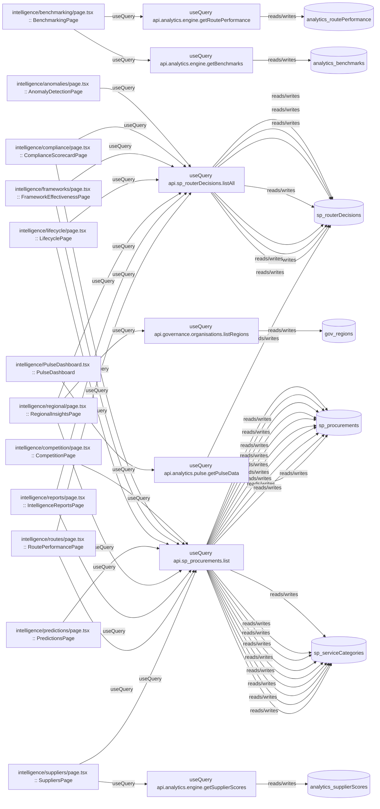

# intelligence

Auto-derived module: everything under `src/app/intelligence/` plus `src/components/intelligence/`.

**App directory:** `src/app/intelligence/` (13 `.tsx` files) + **components directory:** `src/components/intelligence/` (2 `.tsx` files)

## Bind map

## Convex functions referenced by this module's UI

| Function | Kind | Tables touched | Triggers |
|---|---|---|---|
| `sp_routerDecisions.listAll` | query | `sp_routerDecisions` | — |
| `analytics.engine.getBenchmarks` | query | `analytics_benchmarks` | — |
| `analytics.engine.getRoutePerformance` | query | `analytics_routePerformance` | — |
| `sp_procurements.list` | query | `sp_procurements`, `sp_serviceCategories` | — |
| `governance.organisations.listRegions` | query | `gov_regions` | — |
| `analytics.engine.getSupplierScores` | query | `analytics_supplierScores` | — |
| `analytics.pulse.getPulseData` | query | `sp_procurements`, `sp_routerDecisions` | — |

## UI bindings

| Page | Component | Hook | Convex function |
|---|---|---|---|
| `intelligence/anomalies/page.tsx` | AnomalyDetectionPage | useQuery | `api.sp_routerDecisions.listAll` |
| `intelligence/benchmarking/page.tsx` | BenchmarkingPage | useQuery | `api.analytics.engine.getBenchmarks` |
| `intelligence/benchmarking/page.tsx` | BenchmarkingPage | useQuery | `api.analytics.engine.getRoutePerformance` |
| `intelligence/competition/page.tsx` | CompetitionPage | useQuery | `api.sp_procurements.list` |
| `intelligence/compliance/page.tsx` | ComplianceScorecardPage | useQuery | `api.sp_procurements.list` |
| `intelligence/compliance/page.tsx` | ComplianceScorecardPage | useQuery | `api.sp_routerDecisions.listAll` |
| `intelligence/frameworks/page.tsx` | FrameworkEffectivenessPage | useQuery | `api.sp_routerDecisions.listAll` |
| `intelligence/frameworks/page.tsx` | FrameworkEffectivenessPage | useQuery | `api.sp_procurements.list` |
| `intelligence/lifecycle/page.tsx` | LifecyclePage | useQuery | `api.sp_procurements.list` |
| `intelligence/lifecycle/page.tsx` | LifecyclePage | useQuery | `api.sp_routerDecisions.listAll` |
| `intelligence/predictions/page.tsx` | PredictionsPage | useQuery | `api.sp_procurements.list` |
| `intelligence/regional/page.tsx` | RegionalInsightsPage | useQuery | `api.sp_procurements.list` |
| `intelligence/regional/page.tsx` | RegionalInsightsPage | useQuery | `api.sp_routerDecisions.listAll` |
| `intelligence/regional/page.tsx` | RegionalInsightsPage | useQuery | `api.governance.organisations.listRegions` |
| `intelligence/reports/page.tsx` | IntelligenceReportsPage | useQuery | `api.sp_procurements.list` |
| `intelligence/reports/page.tsx` | IntelligenceReportsPage | useQuery | `api.sp_routerDecisions.listAll` |
| `intelligence/routes/page.tsx` | RoutePerformancePage | useQuery | `api.sp_routerDecisions.listAll` |
| `intelligence/routes/page.tsx` | RoutePerformancePage | useQuery | `api.sp_procurements.list` |
| `intelligence/suppliers/page.tsx` | SuppliersPage | useQuery | `api.analytics.engine.getSupplierScores` |
| `intelligence/suppliers/page.tsx` | SuppliersPage | useQuery | `api.sp_procurements.list` |
| `intelligence/PulseDashboard.tsx` | PulseDashboard | useQuery | `api.analytics.pulse.getPulseData` |
