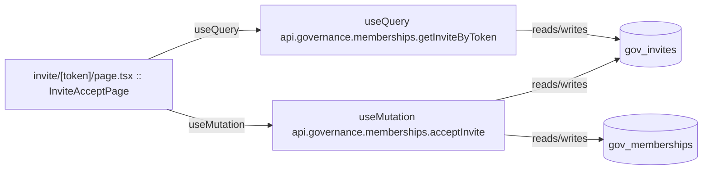

# invite

Auto-derived module: everything under `src/app/invite/`.

**App directory:** `src/app/invite/` (1 `.tsx` files scanned; no matching `src/components/` subdirectory found)

## Bind map

## Convex functions referenced by this module's UI

| Function | Kind | Tables touched | Triggers |
|---|---|---|---|
| `governance.memberships.getInviteByToken` | query | `gov_invites` | — |
| `governance.memberships.acceptInvite` | mutation | `gov_invites`, `gov_memberships` | — |

## UI bindings

| Page | Component | Hook | Convex function |
|---|---|---|---|
| `invite/[token]/page.tsx` | InviteAcceptPage | useQuery | `api.governance.memberships.getInviteByToken` |
| `invite/[token]/page.tsx` | InviteAcceptPage | useMutation | `api.governance.memberships.acceptInvite` |
