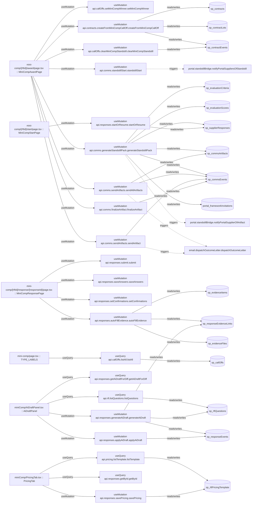

# mini-comp

Auto-derived module: everything under `src/app/mini-comp/` plus `src/components/miniComp/`.

**App directory:** `src/app/mini-comp/` (4 `.tsx` files) + **components directory:** `src/components/miniComp/` (2 `.tsx` files)

## Bind map

## Convex functions referenced by this module's UI

| Function | Kind | Tables touched | Triggers |
|---|---|---|---|
| `callOffs.setMiniCompWinner.setMiniCompWinner` | mutation | — | — |
| `contracts.createFromMiniCompCallOff.createFromMiniCompCallOff` | mutation | `sp_contracts`, `sp_contractLots`, `sp_contractEvents` | — |
| `comms.standstillStart.standstillStart` | mutation | — | `portal.standstillBridge.notifyPortalSuppliersOfStandstill` |
| `comms.generateStandstillPack.generateStandstillPack` | mutation | `sp_evaluationCriteria`, `sp_evaluationScores`, `sp_supplierResponses`, `sp_commsArtifacts`, `sp_commsEvents`, `portal_frameworkInvitations` | `portal.standstillBridge.notifyPortalSupplierOfArtifact` |
| `comms.sendArtifacts.sendAllArtifacts` | mutation | `sp_commsArtifacts`, `sp_commsEvents` | `email.dispatchOutcomeLetter.dispatchOutcomeLetter` |
| `comms.sendArtifacts.sendArtifact` | mutation | `sp_commsEvents` | `email.dispatchOutcomeLetter.dispatchOutcomeLetter` |
| `comms.finalizeArtifact.finalizeArtifact` | mutation | `sp_commsEvents` | — |
| `callOffs.clearMiniCompStandstill.clearMiniCompStandstill` | mutation | `sp_contractEvents` | — |
| `responses.autoFillEvidence.autoFillEvidence` | mutation | `sp_evidenceItems`, `sp_responseEvidenceLinks`, `sp_evidenceFiles` | — |
| `responses.submit.submit` | mutation | — | — |
| `responses.saveAnswers.saveAnswers` | mutation | — | — |
| `responses.setConfirmations.setConfirmations` | mutation | — | — |
| `responses.startOrResume.startOrResume` | mutation | `sp_supplierResponses` | — |
| `callOffs.listAll.listAll` | query | `sp_callOffs` | — |
| `responses.getAiDraftForDiff.getAiDraftForDiff` | query | — | — |
| `rft.listQuestions.listQuestions` | query | `sp_rftQuestions` | — |
| `responses.generateAiDraft.generateAiDraft` | mutation | `sp_rftQuestions`, `sp_responseEvidenceLinks`, `sp_responseEvents` | — |
| `responses.applyAiDraft.applyAiDraft` | mutation | `sp_responseEvents` | — |
| `pricing.listTemplate.listTemplate` | query | `sp_rftPricingTemplate` | — |
| `responses.getById.getById` | query | — | — |
| `responses.savePricing.savePricing` | mutation | `sp_rftPricingTemplate` | — |

## UI bindings

| Page | Component | Hook | Convex function |
|---|---|---|---|
| `mini-comp/[rftId]/award/page.tsx` | MiniCompAwardPage | useMutation | `api.callOffs.setMiniCompWinner.setMiniCompWinner` |
| `mini-comp/[rftId]/award/page.tsx` | MiniCompAwardPage | useMutation | `api.contracts.createFromMiniCompCallOff.createFromMiniCompCallOff` |
| `mini-comp/[rftId]/award/page.tsx` | MiniCompAwardPage | useMutation | `api.comms.standstillStart.standstillStart` |
| `mini-comp/[rftId]/award/page.tsx` | MiniCompAwardPage | useMutation | `api.comms.generateStandstillPack.generateStandstillPack` |
| `mini-comp/[rftId]/award/page.tsx` | MiniCompAwardPage | useMutation | `api.comms.sendArtifacts.sendAllArtifacts` |
| `mini-comp/[rftId]/award/page.tsx` | MiniCompAwardPage | useMutation | `api.comms.sendArtifacts.sendArtifact` |
| `mini-comp/[rftId]/award/page.tsx` | MiniCompAwardPage | useMutation | `api.comms.finalizeArtifact.finalizeArtifact` |
| `mini-comp/[rftId]/award/page.tsx` | MiniCompAwardPage | useMutation | `api.callOffs.clearMiniCompStandstill.clearMiniCompStandstill` |
| `mini-comp/[rftId]/response/[responseId]/page.tsx` | MiniCompResponsePage | useMutation | `api.responses.autoFillEvidence.autoFillEvidence` |
| `mini-comp/[rftId]/response/[responseId]/page.tsx` | MiniCompResponsePage | useMutation | `api.responses.submit.submit` |
| `mini-comp/[rftId]/response/[responseId]/page.tsx` | MiniCompResponsePage | useMutation | `api.responses.saveAnswers.saveAnswers` |
| `mini-comp/[rftId]/response/[responseId]/page.tsx` | MiniCompResponsePage | useMutation | `api.responses.setConfirmations.setConfirmations` |
| `mini-comp/[rftId]/start/page.tsx` | MiniCompStartPage | useMutation | `api.responses.startOrResume.startOrResume` |
| `mini-comp/page.tsx` | TYPE_LABELS | useQuery | `api.callOffs.listAll.listAll` |
| `miniComp/AiDraftPanel.tsx` | AiDraftPanel | useQuery | `api.responses.getAiDraftForDiff.getAiDraftForDiff` |
| `miniComp/AiDraftPanel.tsx` | AiDraftPanel | useQuery | `api.rft.listQuestions.listQuestions` |
| `miniComp/AiDraftPanel.tsx` | AiDraftPanel | useMutation | `api.responses.generateAiDraft.generateAiDraft` |
| `miniComp/AiDraftPanel.tsx` | AiDraftPanel | useMutation | `api.responses.applyAiDraft.applyAiDraft` |
| `miniComp/PricingTab.tsx` | PricingTab | useQuery | `api.pricing.listTemplate.listTemplate` |
| `miniComp/PricingTab.tsx` | PricingTab | useQuery | `api.responses.getById.getById` |
| `miniComp/PricingTab.tsx` | PricingTab | useMutation | `api.responses.savePricing.savePricing` |
