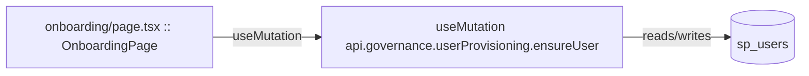

# onboarding

Auto-derived module: everything under `src/app/onboarding/`.

**App directory:** `src/app/onboarding/` (4 `.tsx` files scanned; no matching `src/components/` subdirectory found)

## Bind map

## Convex functions referenced by this module's UI

| Function | Kind | Tables touched | Triggers |
|---|---|---|---|
| `governance.userProvisioning.ensureUser` | mutation | `sp_users` | — |

## UI bindings

| Page | Component | Hook | Convex function |
|---|---|---|---|
| `onboarding/page.tsx` | OnboardingPage | useMutation | `api.governance.userProvisioning.ensureUser` |
