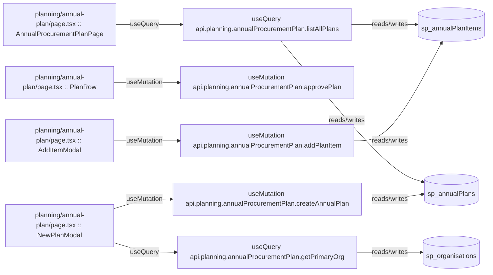

# planning

Auto-derived module: everything under `src/app/planning/`.

**App directory:** `src/app/planning/` (1 `.tsx` files scanned; no matching `src/components/` subdirectory found)

## Bind map

## Convex functions referenced by this module's UI

| Function | Kind | Tables touched | Triggers |
|---|---|---|---|
| `planning.annualProcurementPlan.addPlanItem` | mutation | `sp_annualPlanItems` | — |
| `planning.annualProcurementPlan.approvePlan` | mutation | — | — |
| `planning.annualProcurementPlan.createAnnualPlan` | mutation | `sp_annualPlans` | — |
| `planning.annualProcurementPlan.getPrimaryOrg` | query | `sp_organisations` | — |
| `planning.annualProcurementPlan.listAllPlans` | query | `sp_annualPlans`, `sp_annualPlanItems` | — |

## UI bindings

| Page | Component | Hook | Convex function |
|---|---|---|---|
| `planning/annual-plan/page.tsx` | AddItemModal | useMutation | `api.planning.annualProcurementPlan.addPlanItem` |
| `planning/annual-plan/page.tsx` | PlanRow | useMutation | `api.planning.annualProcurementPlan.approvePlan` |
| `planning/annual-plan/page.tsx` | NewPlanModal | useMutation | `api.planning.annualProcurementPlan.createAnnualPlan` |
| `planning/annual-plan/page.tsx` | NewPlanModal | useQuery | `api.planning.annualProcurementPlan.getPrimaryOrg` |
| `planning/annual-plan/page.tsx` | AnnualProcurementPlanPage | useQuery | `api.planning.annualProcurementPlan.listAllPlans` |
