# portal

Auto-derived module: everything under `src/app/portal/` plus `src/components/portal/`.

**App directory:** `src/app/portal/` (24 `.tsx` files) + **components directory:** `src/components/portal/` (6 `.tsx` files)

## Bind map

```mermaid
flowchart LR
  n0["portal/analytics/page.tsx :: AnalyticsPage"] -->|useQuery| n1["useQuery api.portal.accounts.getMyAccount"]
  n1 -->|reads/writes| n2[("sp_users")]
  n1 -->|reads/writes| n3[("portal_supplierAccounts")]
  n1 -->|reads/writes| n4[("portal_notifications")]
  n1 -->|reads/writes| n5[("portal_subscriptions")]
  n6["portal/comms/page.tsx :: CommsPage"] -->|useQuery| n1["useQuery api.portal.accounts.getMyAccount"]
  n1 -->|reads/writes| n2[("sp_users")]
  n1 -->|reads/writes| n3[("portal_supplierAccounts")]
  n1 -->|reads/writes| n4[("portal_notifications")]
  n1 -->|reads/writes| n5[("portal_subscriptions")]
  n6["portal/comms/page.tsx :: CommsPage"] -->|useMutation| n7["useMutation api.portal.comms.askQuestion"]
  n7 -->|reads/writes| n2[("sp_users")]
  n7 -->|reads/writes| n3[("portal_supplierAccounts")]
  n7 -->|reads/writes| n8[("portal_commsThreads")]
  n7 -->|reads/writes| n9[("portal_commsMessages")]
  n10["portal/layout.tsx :: PortalLayout"] -->|useMutation| n11["useMutation api.portal.accounts.updatePortalMode"]
  n12["portal/notifications/page.tsx :: NotificationsPage"] -->|useMutation| n13["useMutation api.portal.accounts.markNotificationsRead"]
  n13 -->|reads/writes| n4[("portal_notifications")]
  n14["portal/onboarding/page.tsx :: OnboardingPage"] -->|useMutation| n15["useMutation api.portal.accounts.register"]
  n15 -->|reads/writes| n3[("portal_supplierAccounts")]
  n15 -->|reads/writes| n16[("portal_notificationPrefs")]
  n14["portal/onboarding/page.tsx :: OnboardingPage"] -->|useMutation| n17["useMutation api.portal.accounts.completeOnboarding"]
  n18["portal/performance/page.tsx :: PerformancePage"] -->|useQuery| n1["useQuery api.portal.accounts.getMyAccount"]
  n1 -->|reads/writes| n2[("sp_users")]
  n1 -->|reads/writes| n3[("portal_supplierAccounts")]
  n1 -->|reads/writes| n4[("portal_notifications")]
  n1 -->|reads/writes| n5[("portal_subscriptions")]
  n19["portal/portfolio/financials/page.tsx :: FinancialsPage"] -->|useMutation| n20["useMutation api.portal.portfolio.upsertFinancialRecord"]
  n20 -->|reads/writes| n21[("portal_financialRecords")]
  n19["portal/portfolio/financials/page.tsx :: FinancialsPage"] -->|useMutation| n22["useMutation api.portal.portfolio.deleteFinancialRecord"]
  n19["portal/portfolio/financials/page.tsx :: FinancialsPage"] -->|useMutation| n23["useMutation api.portal.portfolio.markFinancialRecordVerified"]
  n24["portal/portfolio/personnel/page.tsx :: PersonnelPage"] -->|useMutation| n25["useMutation api.portal.portfolio.upsertPersonnelRecord"]
  n25 -->|reads/writes| n26[("portal_personnelRecords")]
  n24["portal/portfolio/personnel/page.tsx :: PersonnelPage"] -->|useMutation| n27["useMutation api.portal.portfolio.deletePersonnelRecord"]
  n24["portal/portfolio/personnel/page.tsx :: PersonnelPage"] -->|useMutation| n28["useMutation api.portal.portfolio.markPersonnelVerified"]
  n29["portal/portfolio/projects/page.tsx :: ProjectsPage"] -->|useMutation| n30["useMutation api.portal.portfolio.upsertProjectPortfolio"]
  n30 -->|reads/writes| n31[("portal_projectPortfolio")]
  n29["portal/portfolio/projects/page.tsx :: ProjectsPage"] -->|useMutation| n32["useMutation api.portal.portfolio.deleteProjectPortfolio"]
  n29["portal/portfolio/projects/page.tsx :: ProjectsPage"] -->|useMutation| n33["useMutation api.portal.portfolio.markProjectVerified"]
  n34["portal/settings/page.tsx :: NotificationSettings"] -->|useMutation| n35["useMutation api.portal.accounts.updateNotificationPrefs"]
  n35 -->|reads/writes| n16[("portal_notificationPrefs")]
  n36["portal/settings/page.tsx :: WebhookSettings"] -->|useMutation| n37["useMutation api.portal.webhooks.registerWebhook"]
  n37 -->|reads/writes| n38[("portal_webhookTargets")]
  n36["portal/settings/page.tsx :: WebhookSettings"] -->|useMutation| n39["useMutation api.portal.webhooks.deleteWebhook"]
  n36["portal/settings/page.tsx :: WebhookSettings"] -->|useMutation| n40["useMutation api.portal.webhooks.toggleWebhook"]
  n41["portal/tender/[rftRef]/page.tsx :: TenderScopePage"] -->|useQuery| n42["useQuery api.sp_rft.getFullRftById"]
  n42 -->|reads/writes| n43[("sp_rftSpecSections")]
  n42 -->|reads/writes| n44[("sp_rftKPIs")]
  n42 -->|reads/writes| n45[("sp_rftSelectionCriteria")]
  n42 -->|reads/writes| n46[("sp_rftAwardCriteria")]
  n42 -->|reads/writes| n47[("sp_rftAwardModel")]
  n42 -->|reads/writes| n48[("sp_rftPricingSchedules")]
  n42 -->|reads/writes| n49[("sp_rftPricingItems")]
  n42 -->|reads/writes| n50[("sp_rftSubmissionRules")]
  n42 -->|reads/writes| n51[("sp_rftClarifications")]
  n52["portal/tenders/[id]/page.tsx :: TenderDetailPage"] -->|useMutation| n53["useMutation api.portal.invitations.acceptInvitation"]
  n53 -->|reads/writes| n54[("portal_responses")]
  n52["portal/tenders/[id]/page.tsx :: TenderDetailPage"] -->|useMutation| n55["useMutation api.portal.invitations.declineInvitation"]
  n55 -.->|triggers| n56["portal.invitations.cascadeToNext"]
  n57["portal/tenders/[id]/page.tsx :: DocFirstUploadPanel"] -->|useMutation| n58["useMutation api.portal.responses.generateUploadUrl"]
  n57["portal/tenders/[id]/page.tsx :: DocFirstUploadPanel"] -->|useMutation| n59["useMutation api.portal.responses.addDocumentToResponse"]
  n57["portal/tenders/[id]/page.tsx :: DocFirstUploadPanel"] -->|useMutation| n60["useMutation api.portal.responses.removeDocumentFromResponse"]
  n57["portal/tenders/[id]/page.tsx :: DocFirstUploadPanel"] -->|useMutation| n61["useMutation api.portal.responses.submitDocFirstResponse"]
  n61 -->|reads/writes| n4[("portal_notifications")]
  n61 -.->|triggers| n62["portal.webhooks.broadcastToWebhooksInternal"]
  n61 -.->|triggers| n63["portal.generateSubmissionReceipt.generateSubmissionReceipt"]
  n61 -.->|triggers| n64["portal.syncSubmission.syncPortalSubmission"]
  n65["portal/tenders/[id]/respond/page.tsx :: RespondPage"] -->|useMutation| n66["useMutation api.portal.responses.autosaveSection"]
  n66 -->|reads/writes| n67[("portal_responseAutosave")]
  n65["portal/tenders/[id]/respond/page.tsx :: RespondPage"] -->|useMutation| n68["useMutation api.portal.responses.updateSection"]
  n65["portal/tenders/[id]/respond/page.tsx :: RespondPage"] -->|useMutation| n69["useMutation api.portal.responses.submitOnlineResponse"]
  n69 -->|reads/writes| n4[("portal_notifications")]
  n69 -.->|triggers| n62["portal.webhooks.broadcastToWebhooksInternal"]
  n69 -.->|triggers| n63["portal.generateSubmissionReceipt.generateSubmissionReceipt"]
  n69 -.->|triggers| n70["portal.generatePortalResponseDocx.generatePortalResponseDocx"]
  n69 -.->|triggers| n64["portal.syncSubmission.syncPortalSubmission"]
  n71["portal/upload/page.tsx :: PortalUploadPage"] -->|useMutation| n72["useMutation api.files"]
  n72 -.->|"? not resolved"| n73["unresolved — see Notes"]
  n74["portal/vault/page.tsx :: VaultPage"] -->|useQuery| n1["useQuery api.portal.accounts.getMyAccount"]
  n1 -->|reads/writes| n2[("sp_users")]
  n1 -->|reads/writes| n3[("portal_supplierAccounts")]
  n1 -->|reads/writes| n4[("portal_notifications")]
  n1 -->|reads/writes| n5[("portal_subscriptions")]
  n74["portal/vault/page.tsx :: VaultPage"] -->|useMutation| n75["useMutation api.portal.docExpiry.addDocument"]
  n75 -->|reads/writes| n76[("portal_docExpiry")]
  n74["portal/vault/page.tsx :: VaultPage"] -->|useMutation| n77["useMutation api.portal.docExpiry.deleteDocument"]
  n74["portal/vault/page.tsx :: VaultPage"] -->|useMutation| n78["useMutation api.files.generateUploadUrl"]
  n78 -.->|"? not resolved"| n79["unresolved — see Notes"]
  n74["portal/vault/page.tsx :: VaultPage"] -->|useMutation| n80["useMutation api.portal.portfolio.batchCreatePersonnelStubs"]
  n80 -->|reads/writes| n26[("portal_personnelRecords")]
  n74["portal/vault/page.tsx :: VaultPage"] -->|useMutation| n81["useMutation api.portal.portfolio.batchCreateProjectStubs"]
  n81 -->|reads/writes| n31[("portal_projectPortfolio")]
  n82["portal/verify/[hash]/page.tsx :: VerifyPage"] -->|useQuery| n83["useQuery api.portal.responses.verifySubmissionHash"]
  n83 -->|reads/writes| n54[("portal_responses")]
  n84["portal/CaCommsPanel.tsx :: ThreadItem"] -->|useMutation| n85["useMutation api.portal.comms.publishAnswer"]
  n85 -->|reads/writes| n2[("sp_users")]
  n85 -->|reads/writes| n9[("portal_commsMessages")]
  n85 -->|reads/writes| n86[("portal_frameworkInvitations")]
  n85 -->|reads/writes| n4[("portal_notifications")]
  n85 -.->|triggers| n62["portal.webhooks.broadcastToWebhooksInternal"]
  n87["portal/ContractRatingPanel.tsx :: ContractRatingPanel"] -->|useMutation| n88["useMutation api.portal.insights.recordContractPerformance"]
  n88 -->|reads/writes| n3[("portal_supplierAccounts")]
  n88 -->|reads/writes| n4[("portal_notifications")]
  n89["portal/InvitationDispatchPanel.tsx :: InvitationDispatchPanel"] -->|useMutation| n90["useMutation api.portal.invitations.createFrameworkInvitation"]
  n90 -->|reads/writes| n3[("portal_supplierAccounts")]
  n90 -->|reads/writes| n86[("portal_frameworkInvitations")]
  n90 -->|reads/writes| n4[("portal_notifications")]
  n90 -.->|triggers| n62["portal.webhooks.broadcastToWebhooksInternal"]
  n91["portal/PredictiveScorePanel.tsx :: AltWarningContent"] -->|useMutation| n92["useMutation api.portal.insights.checkAltRisk"]
  n92 -->|reads/writes| n93[("portal_bidInsights")]
  n94["portal/PredictiveScorePanel.tsx :: AiDraftContent"] -->|useMutation| n95["useMutation api.portal.insights.generateAiDraft"]
  n95 -.->|triggers| n96["portal.insights.storeAiDraft"]
```

## Convex functions referenced by this module's UI

| Function | Kind | Tables touched | Triggers |
|---|---|---|---|
| `portal.accounts.getMyAccount` | query | `sp_users`, `portal_supplierAccounts`, `portal_notifications`, `portal_subscriptions` | — |
| `portal.comms.askQuestion` | mutation | `sp_users`, `portal_supplierAccounts`, `portal_commsThreads`, `portal_commsMessages` | — |
| `portal.accounts.updatePortalMode` | mutation | — | — |
| `portal.accounts.markNotificationsRead` | mutation | `portal_notifications` | — |
| `portal.accounts.register` | mutation | `portal_supplierAccounts`, `portal_notificationPrefs` | — |
| `portal.accounts.completeOnboarding` | mutation | — | — |
| `portal.portfolio.upsertFinancialRecord` | mutation | `portal_financialRecords` | — |
| `portal.portfolio.deleteFinancialRecord` | mutation | — | — |
| `portal.portfolio.markFinancialRecordVerified` | mutation | — | — |
| `portal.portfolio.upsertPersonnelRecord` | mutation | `portal_personnelRecords` | — |
| `portal.portfolio.deletePersonnelRecord` | mutation | — | — |
| `portal.portfolio.markPersonnelVerified` | mutation | — | — |
| `portal.portfolio.upsertProjectPortfolio` | mutation | `portal_projectPortfolio` | — |
| `portal.portfolio.deleteProjectPortfolio` | mutation | — | — |
| `portal.portfolio.markProjectVerified` | mutation | — | — |
| `portal.accounts.updateNotificationPrefs` | mutation | `portal_notificationPrefs` | — |
| `portal.webhooks.registerWebhook` | mutation | `portal_webhookTargets` | — |
| `portal.webhooks.deleteWebhook` | mutation | — | — |
| `portal.webhooks.toggleWebhook` | mutation | — | — |
| `sp_rft.getFullRftById` | query | `sp_rftSpecSections`, `sp_rftKPIs`, `sp_rftSelectionCriteria`, `sp_rftAwardCriteria`, `sp_rftAwardModel`, `sp_rftPricingSchedules`, `sp_rftPricingItems`, `sp_rftSubmissionRules`, `sp_rftClarifications` | — |
| `portal.invitations.acceptInvitation` | mutation | `portal_responses` | — |
| `portal.invitations.declineInvitation` | mutation | — | `portal.invitations.cascadeToNext` |
| `portal.responses.generateUploadUrl` | mutation | — | — |
| `portal.responses.addDocumentToResponse` | mutation | — | — |
| `portal.responses.removeDocumentFromResponse` | mutation | — | — |
| `portal.responses.submitDocFirstResponse` | mutation | `portal_notifications` | `portal.webhooks.broadcastToWebhooksInternal`, `portal.generateSubmissionReceipt.generateSubmissionReceipt`, `portal.syncSubmission.syncPortalSubmission` |
| `portal.responses.autosaveSection` | mutation | `portal_responseAutosave` | — |
| `portal.responses.updateSection` | mutation | — | — |
| `portal.responses.submitOnlineResponse` | mutation | `portal_notifications` | `portal.webhooks.broadcastToWebhooksInternal`, `portal.generateSubmissionReceipt.generateSubmissionReceipt`, `portal.generatePortalResponseDocx.generatePortalResponseDocx`, `portal.syncSubmission.syncPortalSubmission` |
| `files` | *unresolved* | — | — |
| `portal.docExpiry.addDocument` | mutation | `portal_docExpiry` | — |
| `portal.docExpiry.deleteDocument` | mutation | — | — |
| `files.generateUploadUrl` | *unresolved* | — | — |
| `portal.portfolio.batchCreatePersonnelStubs` | mutation | `portal_personnelRecords` | — |
| `portal.portfolio.batchCreateProjectStubs` | mutation | `portal_projectPortfolio` | — |
| `portal.responses.verifySubmissionHash` | query | `portal_responses` | — |
| `portal.comms.publishAnswer` | mutation | `sp_users`, `portal_commsMessages`, `portal_frameworkInvitations`, `portal_notifications` | `portal.webhooks.broadcastToWebhooksInternal` |
| `portal.insights.recordContractPerformance` | mutation | `portal_supplierAccounts`, `portal_notifications` | — |
| `portal.invitations.createFrameworkInvitation` | mutation | `portal_supplierAccounts`, `portal_frameworkInvitations`, `portal_notifications` | `portal.webhooks.broadcastToWebhooksInternal` |
| `portal.insights.checkAltRisk` | mutation | `portal_bidInsights` | — |
| `portal.insights.generateAiDraft` | action | — | `portal.insights.storeAiDraft` |

## UI bindings

| Page | Component | Hook | Convex function |
|---|---|---|---|
| `portal/analytics/page.tsx` | AnalyticsPage | useQuery | `api.portal.accounts.getMyAccount` |
| `portal/comms/page.tsx` | CommsPage | useQuery | `api.portal.accounts.getMyAccount` |
| `portal/comms/page.tsx` | CommsPage | useMutation | `api.portal.comms.askQuestion` |
| `portal/layout.tsx` | PortalLayout | useMutation | `api.portal.accounts.updatePortalMode` |
| `portal/notifications/page.tsx` | NotificationsPage | useMutation | `api.portal.accounts.markNotificationsRead` |
| `portal/onboarding/page.tsx` | OnboardingPage | useMutation | `api.portal.accounts.register` |
| `portal/onboarding/page.tsx` | OnboardingPage | useMutation | `api.portal.accounts.completeOnboarding` |
| `portal/performance/page.tsx` | PerformancePage | useQuery | `api.portal.accounts.getMyAccount` |
| `portal/portfolio/financials/page.tsx` | FinancialsPage | useMutation | `api.portal.portfolio.upsertFinancialRecord` |
| `portal/portfolio/financials/page.tsx` | FinancialsPage | useMutation | `api.portal.portfolio.deleteFinancialRecord` |
| `portal/portfolio/financials/page.tsx` | FinancialsPage | useMutation | `api.portal.portfolio.markFinancialRecordVerified` |
| `portal/portfolio/personnel/page.tsx` | PersonnelPage | useMutation | `api.portal.portfolio.upsertPersonnelRecord` |
| `portal/portfolio/personnel/page.tsx` | PersonnelPage | useMutation | `api.portal.portfolio.deletePersonnelRecord` |
| `portal/portfolio/personnel/page.tsx` | PersonnelPage | useMutation | `api.portal.portfolio.markPersonnelVerified` |
| `portal/portfolio/projects/page.tsx` | ProjectsPage | useMutation | `api.portal.portfolio.upsertProjectPortfolio` |
| `portal/portfolio/projects/page.tsx` | ProjectsPage | useMutation | `api.portal.portfolio.deleteProjectPortfolio` |
| `portal/portfolio/projects/page.tsx` | ProjectsPage | useMutation | `api.portal.portfolio.markProjectVerified` |
| `portal/settings/page.tsx` | NotificationSettings | useMutation | `api.portal.accounts.updateNotificationPrefs` |
| `portal/settings/page.tsx` | WebhookSettings | useMutation | `api.portal.webhooks.registerWebhook` |
| `portal/settings/page.tsx` | WebhookSettings | useMutation | `api.portal.webhooks.deleteWebhook` |
| `portal/settings/page.tsx` | WebhookSettings | useMutation | `api.portal.webhooks.toggleWebhook` |
| `portal/tender/[rftRef]/page.tsx` | TenderScopePage | useQuery | `api.sp_rft.getFullRftById` |
| `portal/tenders/[id]/page.tsx` | TenderDetailPage | useMutation | `api.portal.invitations.acceptInvitation` |
| `portal/tenders/[id]/page.tsx` | TenderDetailPage | useMutation | `api.portal.invitations.declineInvitation` |
| `portal/tenders/[id]/page.tsx` | DocFirstUploadPanel | useMutation | `api.portal.responses.generateUploadUrl` |
| `portal/tenders/[id]/page.tsx` | DocFirstUploadPanel | useMutation | `api.portal.responses.addDocumentToResponse` |
| `portal/tenders/[id]/page.tsx` | DocFirstUploadPanel | useMutation | `api.portal.responses.removeDocumentFromResponse` |
| `portal/tenders/[id]/page.tsx` | DocFirstUploadPanel | useMutation | `api.portal.responses.submitDocFirstResponse` |
| `portal/tenders/[id]/respond/page.tsx` | RespondPage | useMutation | `api.portal.responses.autosaveSection` |
| `portal/tenders/[id]/respond/page.tsx` | RespondPage | useMutation | `api.portal.responses.updateSection` |
| `portal/tenders/[id]/respond/page.tsx` | RespondPage | useMutation | `api.portal.responses.submitOnlineResponse` |
| `portal/upload/page.tsx` | PortalUploadPage | useMutation | `api.files` |
| `portal/vault/page.tsx` | VaultPage | useQuery | `api.portal.accounts.getMyAccount` |
| `portal/vault/page.tsx` | VaultPage | useMutation | `api.portal.docExpiry.addDocument` |
| `portal/vault/page.tsx` | VaultPage | useMutation | `api.portal.docExpiry.deleteDocument` |
| `portal/vault/page.tsx` | VaultPage | useMutation | `api.files.generateUploadUrl` |
| `portal/vault/page.tsx` | VaultPage | useMutation | `api.portal.portfolio.batchCreatePersonnelStubs` |
| `portal/vault/page.tsx` | VaultPage | useMutation | `api.portal.portfolio.batchCreateProjectStubs` |
| `portal/verify/[hash]/page.tsx` | VerifyPage | useQuery | `api.portal.responses.verifySubmissionHash` |
| `portal/CaCommsPanel.tsx` | ThreadItem | useMutation | `api.portal.comms.publishAnswer` |
| `portal/ContractRatingPanel.tsx` | ContractRatingPanel | useMutation | `api.portal.insights.recordContractPerformance` |
| `portal/InvitationDispatchPanel.tsx` | InvitationDispatchPanel | useMutation | `api.portal.invitations.createFrameworkInvitation` |
| `portal/PredictiveScorePanel.tsx` | AltWarningContent | useMutation | `api.portal.insights.checkAltRisk` |
| `portal/PredictiveScorePanel.tsx` | AiDraftContent | useMutation | `api.portal.insights.generateAiDraft` |
