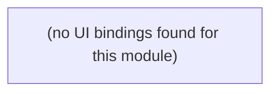

# premises-assurance

Auto-derived module: everything under `src/app/premises-assurance/`.

**App directory:** `src/app/premises-assurance/` (9 `.tsx` files scanned; no matching `src/components/` subdirectory found)

## Bind map

## Convex functions referenced by this module's UI

| Function | Kind | Tables touched | Triggers |
|---|---|---|---|

## UI bindings

| Page | Component | Hook | Convex function |
|---|---|---|---|
