# procurement

Auto-derived module: everything under `src/app/procurement/` plus `src/components/procurement/`.

**App directory:** `src/app/procurement/` (7 `.tsx` files) + **components directory:** `src/components/procurement/` (29 `.tsx` files)

## Bind map

```mermaid
flowchart LR
  n0["procurement/[id]/contract/page.tsx :: PostAwardContractPage"] -->|useMutation| n1["useMutation api.packs.saveIttBuilderFields.saveIttBuilderFields"]
  n1 -->|reads/writes| n2[("sp_ittBuilderFields")]
  n3["procurement/[id]/design/page.tsx :: DesignPage"] -->|useQuery| n4["useQuery api.pd_requests.getById"]
  n3["procurement/[id]/design/page.tsx :: DesignPage"] -->|useMutation| n5["useMutation api.pd_structures.freezeDesign"]
  n5 -->|reads/writes| n6[("pd_lots")]
  n3["procurement/[id]/design/page.tsx :: DesignPage"] -->|useMutation| n7["useMutation api.pd_lots.softDelete"]
  n8["procurement/[id]/etenders/page.tsx :: CorrigendumPanel"] -->|useQuery| n9["useQuery api.etenders.corrigendum.listCorrigenda"]
  n9 -->|reads/writes| n10[("sp_eTendersCorrigenda")]
  n8["procurement/[id]/etenders/page.tsx :: CorrigendumPanel"] -->|useMutation| n11["useMutation api.etenders.corrigendum.recordCorrigendum"]
  n11 -->|reads/writes| n12[("sp_rftInstances")]
  n11 -->|reads/writes| n13[("sp_users")]
  n11 -->|reads/writes| n10[("sp_eTendersCorrigenda")]
  n11 -.->|triggers| n14["etenders.corrigendum.notifyClosingDateExtension"]
  n15["procurement/[id]/etenders/page.tsx :: PublicationPackageExport"] -->|useQuery| n16["useQuery api.etenders.publicationDataBuilder.buildPublicationPackage"]
  n16 -->|reads/writes| n12[("sp_rftInstances")]
  n16 -->|reads/writes| n17[("sp_routerDecisions")]
  n18["procurement/[id]/etenders/page.tsx :: RecordRefForm"] -->|useMutation| n19["useMutation api.etenders.eTendersWorkflow.recordETendersPublication"]
  n19 -->|reads/writes| n12[("sp_rftInstances")]
  n20["procurement/[id]/itt-builder/page.tsx :: IttBuilderPage"] -->|useQuery| n21["useQuery api.sp_procurements.get"]
  n22["procurement/[id]/strategy/page.tsx :: StrategyPage"] -->|useQuery| n4["useQuery api.pd_requests.getById"]
  n23["procurement/designs/page.tsx :: ProcurementDesignsPage"] -->|useQuery| n24["useQuery api.pd_requests.list"]
  n24 -->|reads/writes| n25[("pd_requests")]
  n26["procurement/new/page.tsx :: GoodsQuickCreateForm"] -->|useMutation| n27["useMutation api.sp_procurements.create"]
  n27 -->|reads/writes| n28[("sp_procurements")]
  n27 -->|reads/writes| n29[("sp_auditEvents")]
  n26["procurement/new/page.tsx :: GoodsQuickCreateForm"] -->|useMutation| n30["useMutation api.tp.createPackFromProcurement.createPackFromProcurement"]
  n30 -->|reads/writes| n31[("tp_packs")]
  n30 -->|reads/writes| n32[("tp_pack_sections")]
  n30 -->|reads/writes| n33[("tp_schedules")]
  n30 -->|reads/writes| n34[("tp_response_requirements")]
  n30 -->|reads/writes| n35[("tp_events")]
  n36["procurement/new/page.tsx :: CallOffQuickCreateForm"] -->|useMutation| n27["useMutation api.sp_procurements.create"]
  n27 -->|reads/writes| n28[("sp_procurements")]
  n27 -->|reads/writes| n29[("sp_auditEvents")]
  n36["procurement/new/page.tsx :: CallOffQuickCreateForm"] -->|useQuery| n37["useQuery api.framework.list.list"]
  n37 -->|reads/writes| n38[("sp_frameworks")]
  n39["procurement/AuditTrailPanel.tsx :: AuditTrailPanel"] -->|useQuery| n40["useQuery api.pd_auditEvents.listByEntity"]
  n40 -->|reads/writes| n41[("pd_auditEvents")]
  n42["procurement/DocumentGenerationPanel.tsx :: DocumentGenerationPanel"] -->|useAction| n43["useAction api.docRender.runBatch.runBatch"]
  n43 -.->|triggers| n44["docRender.runOnce.runOnce"]
  n42["procurement/DocumentGenerationPanel.tsx :: DocumentGenerationPanel"] -->|useQuery| n45["useQuery api.documentEngine.listVersions.listRuns"]
  n45 -->|reads/writes| n46[("document_generation_runs")]
  n47["procurement/DocumentHandoffCard.tsx :: DocumentHandoffCard"] -->|useMutation| n48["useMutation api.pd_documentHandoffs.generate"]
  n48 -->|reads/writes| n6[("pd_lots")]
  n48 -->|reads/writes| n49[("pd_documentHandoffs")]
  n50["procurement/GenerateDocumentPackButton.tsx :: GenerateDocumentPackButton"] -->|useMutation| n51["useMutation api.pd_generatedDocuments.generatePack"]
  n51 -->|reads/writes| n49[("pd_documentHandoffs")]
  n51 -->|reads/writes| n52[("pd_generatedDocuments")]
  n53["procurement/PackVerificationBadge.tsx :: PackVerificationBadge"] -->|useQuery| n54["useQuery api.packs.verifyPackArtifacts.verifyPackArtifacts"]
  n54 -->|reads/writes| n12[("sp_rftInstances")]
  n54 -->|reads/writes| n17[("sp_routerDecisions")]
  n54 -->|reads/writes| n55[("sp_packArtifacts")]
  n56["procurement/PreflightChecklist.tsx :: PreflightChecklist"] -->|useQuery| n57["useQuery api.procurements.runPreflightCheck.runPreflightCheck"]
  n57 -->|reads/writes| n12[("sp_rftInstances")]
  n57 -->|reads/writes| n17[("sp_routerDecisions")]
  n57 -->|reads/writes| n58[("sp_rftSpecSections")]
  n57 -->|reads/writes| n59[("sp_rftPricingSchedules")]
  n57 -->|reads/writes| n60[("sp_rftPricingItems")]
  n57 -->|reads/writes| n61[("sp_rftAwardCriteria")]
  n57 -->|reads/writes| n62[("sp_rftAwardModel")]
  n57 -->|reads/writes| n63[("sp_rftSelectionCriteria")]
  n57 -->|reads/writes| n31[("tp_packs")]
  n57 -->|reads/writes| n64[("tp_goods_line_items")]
  n57 -->|reads/writes| n65[("works_saqConfig")]
  n57 -->|reads/writes| n2[("sp_ittBuilderFields")]
  n66["procurement/ProcurementAttachmentsPanel.tsx :: ProcurementAttachmentsPanel"] -->|useMutation| n67["useMutation api.files.generateUploadUrl.generateUploadUrl"]
  n66["procurement/ProcurementAttachmentsPanel.tsx :: ProcurementAttachmentsPanel"] -->|useMutation| n68["useMutation api.sp_procurementAttachments.addAttachment"]
  n68 -->|reads/writes| n69[("sp_procurementAttachments")]
  n66["procurement/ProcurementAttachmentsPanel.tsx :: ProcurementAttachmentsPanel"] -->|useMutation| n70["useMutation api.sp_procurementAttachments.deleteAttachment"]
  n66["procurement/ProcurementAttachmentsPanel.tsx :: ProcurementAttachmentsPanel"] -->|useQuery| n71["useQuery api.sp_procurementAttachments.listAttachments"]
  n71 -->|reads/writes| n69[("sp_procurementAttachments")]
  n72["procurement/ProcurementRequestForm.tsx :: ProcurementRequestForm"] -->|useMutation| n73["useMutation api.pd_requests.create"]
  n73 -->|reads/writes| n25[("pd_requests")]
  n74["procurement/PublicationCompliancePanel.tsx :: PublicationCompliancePanel"] -->|useMutation| n75["useMutation api.sp_publicationWorkflow.createAltNoticeDraft"]
  n75 -->|reads/writes| n76[("sp_noticeDrafts")]
  n74["procurement/PublicationCompliancePanel.tsx :: PublicationCompliancePanel"] -->|useMutation| n77["useMutation api.sp_publicationWorkflow.markAltNoticeSent"]
  n74["procurement/PublicationCompliancePanel.tsx :: PublicationCompliancePanel"] -->|useMutation| n78["useMutation api.sp_publicationWorkflow.createCanNoticeDraft"]
  n78 -->|reads/writes| n76[("sp_noticeDrafts")]
  n74["procurement/PublicationCompliancePanel.tsx :: PublicationCompliancePanel"] -->|useMutation| n79["useMutation api.sp_publicationWorkflow.markCanPublished"]
  n74["procurement/PublicationCompliancePanel.tsx :: PublicationCompliancePanel"] -->|useMutation| n80["useMutation api.sp_publicationWorkflow.createDebriefRequest"]
  n80 -->|reads/writes| n81[("sp_supplierProfiles")]
  n80 -->|reads/writes| n82[("sp_debriefRequests")]
  n74["procurement/PublicationCompliancePanel.tsx :: PublicationCompliancePanel"] -->|useMutation| n83["useMutation api.sp_publicationWorkflow.completeDebriefRequest"]
  n84["procurement/PublishPackButton.tsx :: PublishPackButton"] -->|useMutation| n85["useMutation api.pd_documentHandoffs.publish"]
  n86["procurement/WorksGovernancePanel.tsx :: WorksGovernancePanel"] -->|useQuery| n45["useQuery api.documentEngine.listVersions.listRuns"]
  n45 -->|reads/writes| n46[("document_generation_runs")]
  n86["procurement/WorksGovernancePanel.tsx :: WorksGovernancePanel"] -->|useAction| n43["useAction api.docRender.runBatch.runBatch"]
  n43 -.->|triggers| n44["docRender.runOnce.runOnce"]
  n87["procurement/wizard/PricingEnhancementsPanel.tsx :: PricingEnhancementsPanel"] -->|useAction| n88["useAction api.ai.enhanceServicePricing.enhanceServicePricing"]
  n87["procurement/wizard/PricingEnhancementsPanel.tsx :: PricingEnhancementsPanel"] -->|useMutation| n89["useMutation api.pricing.applyPricingSuggestions.applyPricingSuggestions"]
  n89 -->|reads/writes| n59[("sp_rftPricingSchedules")]
  n90["procurement/wizard/WizardPricingStep.tsx :: WizardPricingStep"] -->|useQuery| n91["useQuery api.sp_rft.getRft"]
  n91 -->|reads/writes| n12[("sp_rftInstances")]
  n90["procurement/wizard/WizardPricingStep.tsx :: WizardPricingStep"] -->|useQuery| n92["useQuery api.sp_scope.getScope"]
  n92 -->|reads/writes| n12[("sp_rftInstances")]
  n92 -->|reads/writes| n58[("sp_rftSpecSections")]
  n90["procurement/wizard/WizardPricingStep.tsx :: WizardPricingStep"] -->|useQuery| n21["useQuery api.sp_procurements.get"]
  n93["procurement/wizard/WizardScopeStep.tsx :: WizardScopeStep"] -->|useQuery| n92["useQuery api.sp_scope.getScope"]
  n92 -->|reads/writes| n12[("sp_rftInstances")]
  n92 -->|reads/writes| n58[("sp_rftSpecSections")]
  n93["procurement/wizard/WizardScopeStep.tsx :: WizardScopeStep"] -->|useQuery| n91["useQuery api.sp_rft.getRft"]
  n91 -->|reads/writes| n12[("sp_rftInstances")]
  n93["procurement/wizard/WizardScopeStep.tsx :: WizardScopeStep"] -->|useQuery| n21["useQuery api.sp_procurements.get"]
  n93["procurement/wizard/WizardScopeStep.tsx :: WizardScopeStep"] -->|useMutation| n94["useMutation api.sp_scope.writeCompiledScopeFromItems"]
  n94 -->|reads/writes| n12[("sp_rftInstances")]
  n94 -->|reads/writes| n58[("sp_rftSpecSections")]
  n94 -->|reads/writes| n29[("sp_auditEvents")]
  n93["procurement/wizard/WizardScopeStep.tsx :: WizardScopeStep"] -->|useMutation| n95["useMutation api.pricing.generateServicePricing.generateServicePricing"]
  n95 -->|reads/writes| n58[("sp_rftSpecSections")]
  n95 -->|reads/writes| n59[("sp_rftPricingSchedules")]
  n93["procurement/wizard/WizardScopeStep.tsx :: WizardScopeStep"] -->|useMutation| n96["useMutation api.scopeBackground.generateBackgroundSection"]
  n96 -->|reads/writes| n12[("sp_rftInstances")]
  n96 -->|reads/writes| n97[("sp_procurementContext")]
  n96 -->|reads/writes| n58[("sp_rftSpecSections")]
```

## Convex functions referenced by this module's UI

| Function | Kind | Tables touched | Triggers |
|---|---|---|---|
| `packs.saveIttBuilderFields.saveIttBuilderFields` | mutation | `sp_ittBuilderFields` | — |
| `pd_requests.getById` | query | — | — |
| `pd_structures.freezeDesign` | mutation | `pd_lots` | — |
| `pd_lots.softDelete` | mutation | — | — |
| `etenders.corrigendum.listCorrigenda` | query | `sp_eTendersCorrigenda` | — |
| `etenders.corrigendum.recordCorrigendum` | mutation | `sp_rftInstances`, `sp_users`, `sp_eTendersCorrigenda` | `etenders.corrigendum.notifyClosingDateExtension` |
| `etenders.publicationDataBuilder.buildPublicationPackage` | query | `sp_rftInstances`, `sp_routerDecisions` | — |
| `etenders.eTendersWorkflow.recordETendersPublication` | mutation | `sp_rftInstances` | — |
| `sp_procurements.get` | query | — | — |
| `pd_requests.list` | query | `pd_requests` | — |
| `sp_procurements.create` | mutation | `sp_procurements`, `sp_auditEvents` | — |
| `tp.createPackFromProcurement.createPackFromProcurement` | mutation | `tp_packs`, `tp_pack_sections`, `tp_schedules`, `tp_response_requirements`, `tp_events` | — |
| `framework.list.list` | query | `sp_frameworks` | — |
| `pd_auditEvents.listByEntity` | query | `pd_auditEvents` | — |
| `docRender.runBatch.runBatch` | action | — | `docRender.runOnce.runOnce` |
| `documentEngine.listVersions.listRuns` | query | `document_generation_runs` | — |
| `pd_documentHandoffs.generate` | mutation | `pd_lots`, `pd_documentHandoffs` | — |
| `pd_generatedDocuments.generatePack` | mutation | `pd_documentHandoffs`, `pd_generatedDocuments` | — |
| `packs.verifyPackArtifacts.verifyPackArtifacts` | query | `sp_rftInstances`, `sp_routerDecisions`, `sp_packArtifacts` | — |
| `procurements.runPreflightCheck.runPreflightCheck` | query | `sp_rftInstances`, `sp_routerDecisions`, `sp_rftSpecSections`, `sp_rftPricingSchedules`, `sp_rftPricingItems`, `sp_rftAwardCriteria`, `sp_rftAwardModel`, `sp_rftSelectionCriteria`, `tp_packs`, `tp_goods_line_items`, `works_saqConfig`, `sp_ittBuilderFields` | — |
| `files.generateUploadUrl.generateUploadUrl` | mutation | — | — |
| `sp_procurementAttachments.addAttachment` | mutation | `sp_procurementAttachments` | — |
| `sp_procurementAttachments.deleteAttachment` | mutation | — | — |
| `sp_procurementAttachments.listAttachments` | query | `sp_procurementAttachments` | — |
| `pd_requests.create` | mutation | `pd_requests` | — |
| `sp_publicationWorkflow.createAltNoticeDraft` | mutation | `sp_noticeDrafts` | — |
| `sp_publicationWorkflow.markAltNoticeSent` | mutation | — | — |
| `sp_publicationWorkflow.createCanNoticeDraft` | mutation | `sp_noticeDrafts` | — |
| `sp_publicationWorkflow.markCanPublished` | mutation | — | — |
| `sp_publicationWorkflow.createDebriefRequest` | mutation | `sp_supplierProfiles`, `sp_debriefRequests` | — |
| `sp_publicationWorkflow.completeDebriefRequest` | mutation | — | — |
| `pd_documentHandoffs.publish` | mutation | — | — |
| `ai.enhanceServicePricing.enhanceServicePricing` | action | — | — |
| `pricing.applyPricingSuggestions.applyPricingSuggestions` | mutation | `sp_rftPricingSchedules` | — |
| `sp_rft.getRft` | query | `sp_rftInstances` | — |
| `sp_scope.getScope` | query | `sp_rftInstances`, `sp_rftSpecSections` | — |
| `sp_scope.writeCompiledScopeFromItems` | mutation | `sp_rftInstances`, `sp_rftSpecSections`, `sp_auditEvents` | — |
| `pricing.generateServicePricing.generateServicePricing` | mutation | `sp_rftSpecSections`, `sp_rftPricingSchedules` | — |
| `scopeBackground.generateBackgroundSection` | mutation | `sp_rftInstances`, `sp_procurementContext`, `sp_rftSpecSections` | — |

## UI bindings

| Page | Component | Hook | Convex function |
|---|---|---|---|
| `procurement/[id]/contract/page.tsx` | PostAwardContractPage | useMutation | `api.packs.saveIttBuilderFields.saveIttBuilderFields` |
| `procurement/[id]/design/page.tsx` | DesignPage | useQuery | `api.pd_requests.getById` |
| `procurement/[id]/design/page.tsx` | DesignPage | useMutation | `api.pd_structures.freezeDesign` |
| `procurement/[id]/design/page.tsx` | DesignPage | useMutation | `api.pd_lots.softDelete` |
| `procurement/[id]/etenders/page.tsx` | CorrigendumPanel | useQuery | `api.etenders.corrigendum.listCorrigenda` |
| `procurement/[id]/etenders/page.tsx` | CorrigendumPanel | useMutation | `api.etenders.corrigendum.recordCorrigendum` |
| `procurement/[id]/etenders/page.tsx` | PublicationPackageExport | useQuery | `api.etenders.publicationDataBuilder.buildPublicationPackage` |
| `procurement/[id]/etenders/page.tsx` | RecordRefForm | useMutation | `api.etenders.eTendersWorkflow.recordETendersPublication` |
| `procurement/[id]/itt-builder/page.tsx` | IttBuilderPage | useQuery | `api.sp_procurements.get` |
| `procurement/[id]/strategy/page.tsx` | StrategyPage | useQuery | `api.pd_requests.getById` |
| `procurement/designs/page.tsx` | ProcurementDesignsPage | useQuery | `api.pd_requests.list` |
| `procurement/new/page.tsx` | GoodsQuickCreateForm | useMutation | `api.sp_procurements.create` |
| `procurement/new/page.tsx` | GoodsQuickCreateForm | useMutation | `api.tp.createPackFromProcurement.createPackFromProcurement` |
| `procurement/new/page.tsx` | CallOffQuickCreateForm | useMutation | `api.sp_procurements.create` |
| `procurement/new/page.tsx` | CallOffQuickCreateForm | useQuery | `api.framework.list.list` |
| `procurement/AuditTrailPanel.tsx` | AuditTrailPanel | useQuery | `api.pd_auditEvents.listByEntity` |
| `procurement/DocumentGenerationPanel.tsx` | DocumentGenerationPanel | useAction | `api.docRender.runBatch.runBatch` |
| `procurement/DocumentGenerationPanel.tsx` | DocumentGenerationPanel | useQuery | `api.documentEngine.listVersions.listRuns` |
| `procurement/DocumentHandoffCard.tsx` | DocumentHandoffCard | useMutation | `api.pd_documentHandoffs.generate` |
| `procurement/GenerateDocumentPackButton.tsx` | GenerateDocumentPackButton | useMutation | `api.pd_generatedDocuments.generatePack` |
| `procurement/PackVerificationBadge.tsx` | PackVerificationBadge | useQuery | `api.packs.verifyPackArtifacts.verifyPackArtifacts` |
| `procurement/PreflightChecklist.tsx` | PreflightChecklist | useQuery | `api.procurements.runPreflightCheck.runPreflightCheck` |
| `procurement/ProcurementAttachmentsPanel.tsx` | ProcurementAttachmentsPanel | useMutation | `api.files.generateUploadUrl.generateUploadUrl` |
| `procurement/ProcurementAttachmentsPanel.tsx` | ProcurementAttachmentsPanel | useMutation | `api.sp_procurementAttachments.addAttachment` |
| `procurement/ProcurementAttachmentsPanel.tsx` | ProcurementAttachmentsPanel | useMutation | `api.sp_procurementAttachments.deleteAttachment` |
| `procurement/ProcurementAttachmentsPanel.tsx` | ProcurementAttachmentsPanel | useQuery | `api.sp_procurementAttachments.listAttachments` |
| `procurement/ProcurementRequestForm.tsx` | ProcurementRequestForm | useMutation | `api.pd_requests.create` |
| `procurement/PublicationCompliancePanel.tsx` | PublicationCompliancePanel | useMutation | `api.sp_publicationWorkflow.createAltNoticeDraft` |
| `procurement/PublicationCompliancePanel.tsx` | PublicationCompliancePanel | useMutation | `api.sp_publicationWorkflow.markAltNoticeSent` |
| `procurement/PublicationCompliancePanel.tsx` | PublicationCompliancePanel | useMutation | `api.sp_publicationWorkflow.createCanNoticeDraft` |
| `procurement/PublicationCompliancePanel.tsx` | PublicationCompliancePanel | useMutation | `api.sp_publicationWorkflow.markCanPublished` |
| `procurement/PublicationCompliancePanel.tsx` | PublicationCompliancePanel | useMutation | `api.sp_publicationWorkflow.createDebriefRequest` |
| `procurement/PublicationCompliancePanel.tsx` | PublicationCompliancePanel | useMutation | `api.sp_publicationWorkflow.completeDebriefRequest` |
| `procurement/PublishPackButton.tsx` | PublishPackButton | useMutation | `api.pd_documentHandoffs.publish` |
| `procurement/WorksGovernancePanel.tsx` | WorksGovernancePanel | useQuery | `api.documentEngine.listVersions.listRuns` |
| `procurement/WorksGovernancePanel.tsx` | WorksGovernancePanel | useAction | `api.docRender.runBatch.runBatch` |
| `procurement/wizard/PricingEnhancementsPanel.tsx` | PricingEnhancementsPanel | useAction | `api.ai.enhanceServicePricing.enhanceServicePricing` |
| `procurement/wizard/PricingEnhancementsPanel.tsx` | PricingEnhancementsPanel | useMutation | `api.pricing.applyPricingSuggestions.applyPricingSuggestions` |
| `procurement/wizard/WizardPricingStep.tsx` | WizardPricingStep | useQuery | `api.sp_rft.getRft` |
| `procurement/wizard/WizardPricingStep.tsx` | WizardPricingStep | useQuery | `api.sp_scope.getScope` |
| `procurement/wizard/WizardPricingStep.tsx` | WizardPricingStep | useQuery | `api.sp_procurements.get` |
| `procurement/wizard/WizardScopeStep.tsx` | WizardScopeStep | useQuery | `api.sp_scope.getScope` |
| `procurement/wizard/WizardScopeStep.tsx` | WizardScopeStep | useQuery | `api.sp_rft.getRft` |
| `procurement/wizard/WizardScopeStep.tsx` | WizardScopeStep | useQuery | `api.sp_procurements.get` |
| `procurement/wizard/WizardScopeStep.tsx` | WizardScopeStep | useMutation | `api.sp_scope.writeCompiledScopeFromItems` |
| `procurement/wizard/WizardScopeStep.tsx` | WizardScopeStep | useMutation | `api.pricing.generateServicePricing.generateServicePricing` |
| `procurement/wizard/WizardScopeStep.tsx` | WizardScopeStep | useMutation | `api.scopeBackground.generateBackgroundSection` |
