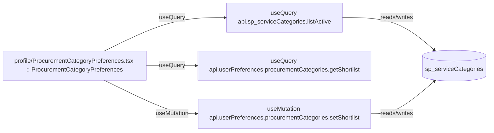

# profile

Auto-derived module: everything under `src/app/profile/` plus `src/components/profile/`.

**App directory:** `src/app/profile/` (1 `.tsx` files) + **components directory:** `src/components/profile/` (1 `.tsx` files)

## Bind map

## Convex functions referenced by this module's UI

| Function | Kind | Tables touched | Triggers |
|---|---|---|---|
| `sp_serviceCategories.listActive` | query | `sp_serviceCategories` | — |
| `userPreferences.procurementCategories.getShortlist` | query | — | — |
| `userPreferences.procurementCategories.setShortlist` | mutation | `sp_serviceCategories` | — |

## UI bindings

| Page | Component | Hook | Convex function |
|---|---|---|---|
| `profile/ProcurementCategoryPreferences.tsx` | ProcurementCategoryPreferences | useQuery | `api.sp_serviceCategories.listActive` |
| `profile/ProcurementCategoryPreferences.tsx` | ProcurementCategoryPreferences | useQuery | `api.userPreferences.procurementCategories.getShortlist` |
| `profile/ProcurementCategoryPreferences.tsx` | ProcurementCategoryPreferences | useMutation | `api.userPreferences.procurementCategories.setShortlist` |
