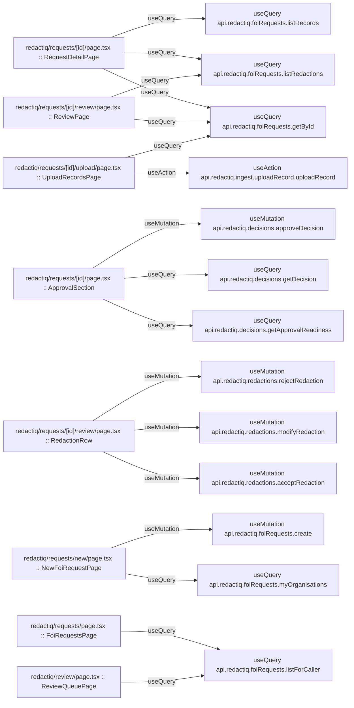

# redactiq

Auto-derived module: everything under `src/app/redactiq/`.

**App directory:** `src/app/redactiq/` (10 `.tsx` files scanned; no matching `src/components/` subdirectory found)

## Bind map

## Convex functions referenced by this module's UI

| Function | Kind | Tables touched | Triggers |
|---|---|---|---|
| `redactiq.foiRequests.getById` | query | — | — |
| `redactiq.foiRequests.listRecords` | query | — | — |
| `redactiq.foiRequests.listRedactions` | query | — | — |
| `redactiq.decisions.getApprovalReadiness` | query | — | — |
| `redactiq.decisions.getDecision` | query | — | — |
| `redactiq.decisions.approveDecision` | mutation | — | — |
| `redactiq.redactions.acceptRedaction` | mutation | — | — |
| `redactiq.redactions.modifyRedaction` | mutation | — | — |
| `redactiq.redactions.rejectRedaction` | mutation | — | — |
| `redactiq.ingest.uploadRecord.uploadRecord` | action | — | — |
| `redactiq.foiRequests.myOrganisations` | query | — | — |
| `redactiq.foiRequests.create` | mutation | — | — |
| `redactiq.foiRequests.listForCaller` | query | — | — |

## UI bindings

| Page | Component | Hook | Convex function |
|---|---|---|---|
| `redactiq/requests/[id]/page.tsx` | RequestDetailPage | useQuery | `api.redactiq.foiRequests.getById` |
| `redactiq/requests/[id]/page.tsx` | RequestDetailPage | useQuery | `api.redactiq.foiRequests.listRecords` |
| `redactiq/requests/[id]/page.tsx` | RequestDetailPage | useQuery | `api.redactiq.foiRequests.listRedactions` |
| `redactiq/requests/[id]/page.tsx` | ApprovalSection | useQuery | `api.redactiq.decisions.getApprovalReadiness` |
| `redactiq/requests/[id]/page.tsx` | ApprovalSection | useQuery | `api.redactiq.decisions.getDecision` |
| `redactiq/requests/[id]/page.tsx` | ApprovalSection | useMutation | `api.redactiq.decisions.approveDecision` |
| `redactiq/requests/[id]/review/page.tsx` | ReviewPage | useQuery | `api.redactiq.foiRequests.getById` |
| `redactiq/requests/[id]/review/page.tsx` | ReviewPage | useQuery | `api.redactiq.foiRequests.listRedactions` |
| `redactiq/requests/[id]/review/page.tsx` | RedactionRow | useMutation | `api.redactiq.redactions.acceptRedaction` |
| `redactiq/requests/[id]/review/page.tsx` | RedactionRow | useMutation | `api.redactiq.redactions.modifyRedaction` |
| `redactiq/requests/[id]/review/page.tsx` | RedactionRow | useMutation | `api.redactiq.redactions.rejectRedaction` |
| `redactiq/requests/[id]/upload/page.tsx` | UploadRecordsPage | useQuery | `api.redactiq.foiRequests.getById` |
| `redactiq/requests/[id]/upload/page.tsx` | UploadRecordsPage | useAction | `api.redactiq.ingest.uploadRecord.uploadRecord` |
| `redactiq/requests/new/page.tsx` | NewFoiRequestPage | useQuery | `api.redactiq.foiRequests.myOrganisations` |
| `redactiq/requests/new/page.tsx` | NewFoiRequestPage | useMutation | `api.redactiq.foiRequests.create` |
| `redactiq/requests/page.tsx` | FoiRequestsPage | useQuery | `api.redactiq.foiRequests.listForCaller` |
| `redactiq/review/page.tsx` | ReviewQueuePage | useQuery | `api.redactiq.foiRequests.listForCaller` |
