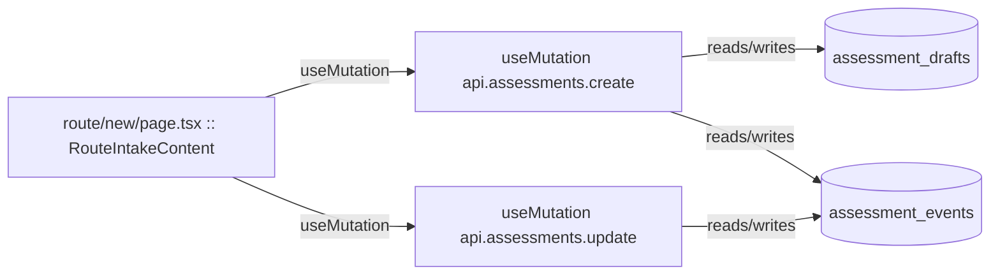

# route

Auto-derived module: everything under `src/app/route/`.

**App directory:** `src/app/route/` (1 `.tsx` files scanned; no matching `src/components/` subdirectory found)

## Bind map

## Convex functions referenced by this module's UI

| Function | Kind | Tables touched | Triggers |
|---|---|---|---|
| `assessments.create` | mutation | `assessment_drafts`, `assessment_events` | — |
| `assessments.update` | mutation | `assessment_events` | — |

## UI bindings

| Page | Component | Hook | Convex function |
|---|---|---|---|
| `route/new/page.tsx` | RouteIntakeContent | useMutation | `api.assessments.create` |
| `route/new/page.tsx` | RouteIntakeContent | useMutation | `api.assessments.update` |
