# router

Auto-derived module: everything under `src/app/router/` plus `src/components/router/`.

**App directory:** `src/app/router/` (7 `.tsx` files) + **components directory:** `src/components/router/` (25 `.tsx` files)

## Bind map

```mermaid
flowchart LR
  n0["router/decision/[id]/pack/page.tsx :: DecisionPackPage"] -->|useQuery| n1["useQuery api.router_engine.getDecision"]
  n0["router/decision/[id]/pack/page.tsx :: DecisionPackPage"] -->|useQuery| n2["useQuery api.decision_pack.getPacksForDecision"]
  n2 -->|reads/writes| n3[("decision_packs")]
  n0["router/decision/[id]/pack/page.tsx :: DecisionPackPage"] -->|useMutation| n4["useMutation api.decision_pack.generateDecisionPack"]
  n4 -->|reads/writes| n3[("decision_packs")]
  n5["router/decision/[id]/page.tsx :: DecisionDetailPage"] -->|useQuery| n1["useQuery api.router_engine.getDecision"]
  n5["router/decision/[id]/page.tsx :: DecisionDetailPage"] -->|useMutation| n6["useMutation api.router_engine.replayDecision"]
  n6 -->|reads/writes| n7[("router_rulesets")]
  n8["router/decisions/page.tsx :: DecisionsListPage"] -->|useQuery| n9["useQuery api.router_engine.listDecisions"]
  n9 -->|reads/writes| n10[("router_decisions")]
  n11["router/new/wizard/page.tsx :: WizardPage"] -->|useMutation| n12["useMutation api.router.routeAndPersist.routeAndPersist"]
  n12 -->|reads/writes| n13[("sp_routerAnswers")]
  n12 -->|reads/writes| n14[("sp_serviceCategories")]
  n12 -->|reads/writes| n15[("procurement_modifications")]
  n12 -->|reads/writes| n16[("sp_routerDecisions")]
  n12 -->|reads/writes| n17[("sp_auditEvents")]
  n12 -.->|triggers| n18["ogp_frameworkValidation.checkFramework"]
  n12 -.->|triggers| n19["ogp_frameworkValidation.recordFrameworkValidation"]
  n12 -.->|triggers| n20["sp_aggregation.computeAggregation"]
  n12 -.->|triggers| n21["sp_aggregation.recordAggregationCheck"]
  n22["router/DecisionResult.tsx :: DecisionResult"] -->|useMutation| n23["useMutation api.router.confirmPack.confirmAndEnqueuePack"]
  n23 -->|reads/writes| n24[("sp_procurementPhase")]
  n23 -->|reads/writes| n25[("core_docTemplates")]
  n23 -->|reads/writes| n26[("core_docGenerationJobs")]
  n23 -.->|triggers| n27["phase.transitions.ensurePhase"]
  n23 -.->|triggers| n28["phase.transitions.issueSaqPack"]
  n23 -.->|triggers| n29["phase.transitions.closeSaqResponses"]
  n23 -.->|triggers| n30["phase.transitions.lockShortlist"]
  n23 -.->|triggers| n31["phase.transitions.startIttDrafting"]
  n22["router/DecisionResult.tsx :: DecisionResult"] -->|useAction| n32["useAction api.docRender.buildBatchZip.buildBatchZip"]
  n32 -.->|triggers| n33["docJobs.getBatchStatus.getBatchStatus"]
  n32 -.->|triggers| n34["docArtifacts.saveBatchZip.saveBatchZip"]
  n35["router/FrameworksAtDecisionPanel.tsx :: FrameworksAtDecisionPanel"] -->|useQuery| n36["useQuery api.frameworks.matchForRouting.listMatching"]
  n36 -->|reads/writes| n37[("sp_frameworks")]
  n35["router/FrameworksAtDecisionPanel.tsx :: FrameworksAtDecisionPanel"] -->|useQuery| n38["useQuery api.frameworks.matchForRouting.getChoiceForDecision"]
  n38 -->|reads/writes| n39[("router_frameworkChoices")]
  n35["router/FrameworksAtDecisionPanel.tsx :: FrameworksAtDecisionPanel"] -->|useMutation| n40["useMutation api.frameworks.recordChoice.recordChoice"]
  n40 -.->|"? not resolved"| n41["unresolved — see Notes"]
  n42["router/LiveDecisionPreview.tsx :: LiveDecisionPreview"] -->|useAction| n43["useAction api.router.runGoviqPreview.runGoviqPreview"]
  n44["router/PhaseProgress.tsx :: PhaseProgress"] -->|useQuery| n45["useQuery api.phase.transitions.getPhase"]
  n45 -->|reads/writes| n24[("sp_procurementPhase")]
  n46["router/QuestionnaireWizard.tsx :: QuestionnaireWizard"] -->|useQuery| n47["useQuery api.router.legacyReexports.getAnswers"]
  n47 -->|reads/writes| n13[("sp_routerAnswers")]
  n46["router/QuestionnaireWizard.tsx :: QuestionnaireWizard"] -->|useQuery| n48["useQuery api.sp_procurements.get"]
  n46["router/QuestionnaireWizard.tsx :: QuestionnaireWizard"] -->|useMutation| n49["useMutation api.router.saveAnswers.saveRouterAnswers"]
  n49 -.->|"? not resolved"| n50["unresolved — see Notes"]
  n46["router/QuestionnaireWizard.tsx :: QuestionnaireWizard"] -->|useMutation| n51["useMutation api.router.runGoviqRouter.runGoviqRouter"]
  n51 -->|reads/writes| n13[("sp_routerAnswers")]
  n51 -->|reads/writes| n7[("router_rulesets")]
  n51 -->|reads/writes| n52[("org_policies")]
  n51 -->|reads/writes| n16[("sp_routerDecisions")]
  n51 -->|reads/writes| n10[("router_decisions")]
  n51 -->|reads/writes| n53[("tender_pack_profiles")]
  n51 -->|reads/writes| n54[("tender_pack_profile_items")]
  n51 -->|reads/writes| n3[("decision_packs")]
  n55["router/SaqRequiredCallout.tsx :: SaqRequiredCallout"] -->|useQuery| n56["useQuery api.saq.lockSaqSelection.getSaqSelection"]
  n57["router/SaqRequiredCallout.tsx :: ActionBar"] -->|useMutation| n58["useMutation api.saq.lockSaqSelection.lockSaqSelection"]
  n58 -.->|"? not resolved"| n59["unresolved — see Notes"]
  n60["router/TypeformWizard.tsx :: TypeformWizard"] -->|useQuery| n47["useQuery api.router.legacyReexports.getAnswers"]
  n47 -->|reads/writes| n13[("sp_routerAnswers")]
  n60["router/TypeformWizard.tsx :: TypeformWizard"] -->|useQuery| n48["useQuery api.sp_procurements.get"]
  n60["router/TypeformWizard.tsx :: TypeformWizard"] -->|useMutation| n49["useMutation api.router.saveAnswers.saveRouterAnswers"]
  n49 -.->|"? not resolved"| n50["unresolved — see Notes"]
  n60["router/TypeformWizard.tsx :: TypeformWizard"] -->|useMutation| n51["useMutation api.router.runGoviqRouter.runGoviqRouter"]
  n51 -->|reads/writes| n13[("sp_routerAnswers")]
  n51 -->|reads/writes| n7[("router_rulesets")]
  n51 -->|reads/writes| n52[("org_policies")]
  n51 -->|reads/writes| n16[("sp_routerDecisions")]
  n51 -->|reads/writes| n10[("router_decisions")]
  n51 -->|reads/writes| n53[("tender_pack_profiles")]
  n51 -->|reads/writes| n54[("tender_pack_profile_items")]
  n51 -->|reads/writes| n3[("decision_packs")]
  n61["router/VeatGuidedForm.tsx :: VeatGuidedForm"] -->|useMutation| n62["useMutation api.notices.veatNotice.createVeatDraft"]
  n62 -->|reads/writes| n63[("sp_noticeDrafts")]
  n64["router/VeatLifecyclePanel.tsx :: VeatLifecyclePanel"] -->|useQuery| n65["useQuery api.notices.eformsXml.getEFormsReadinessCheck"]
  n64["router/VeatLifecyclePanel.tsx :: VeatLifecyclePanel"] -->|useMutation| n66["useMutation api.notices.veatNotice.markVeatReady"]
  n64["router/VeatLifecyclePanel.tsx :: VeatLifecyclePanel"] -->|useMutation| n67["useMutation api.notices.veatNotice.recordVeatPublished"]
  n64["router/VeatLifecyclePanel.tsx :: VeatLifecyclePanel"] -->|useAction| n68["useAction api.notices.eformsXmlActions.generateEFormsXml"]
  n68 -.->|triggers| n69["notices.eformsXml.getNoticeDraftById"]
  n68 -.->|triggers| n70["packs.storeArtifactFile.storeArtifactFile"]
  n68 -.->|triggers| n71["notices.eformsXml.recordEFormsXmlGenerated"]
  n64["router/VeatLifecyclePanel.tsx :: VeatLifecyclePanel"] -->|useAction| n72["useAction api.notices.eformsXmlActions.submitToTed"]
  n72 -.->|triggers| n69["notices.eformsXml.getNoticeDraftById"]
  n72 -.->|triggers| n73["notices.eformsXml.getEFormsXmlFileRecord"]
  n72 -.->|triggers| n74["notices.eformsXml.recordTedSubmissionFailed"]
  n72 -.->|triggers| n75["notices.eformsXml.recordTedSubmissionSucceeded"]
```

## Convex functions referenced by this module's UI

| Function | Kind | Tables touched | Triggers |
|---|---|---|---|
| `router_engine.getDecision` | query | — | — |
| `decision_pack.getPacksForDecision` | query | `decision_packs` | — |
| `decision_pack.generateDecisionPack` | mutation | `decision_packs` | — |
| `router_engine.replayDecision` | mutation | `router_rulesets` | — |
| `router_engine.listDecisions` | query | `router_decisions` | — |
| `router.routeAndPersist.routeAndPersist` | mutation | `sp_routerAnswers`, `sp_serviceCategories`, `procurement_modifications`, `sp_routerDecisions`, `sp_auditEvents` | `ogp_frameworkValidation.checkFramework`, `ogp_frameworkValidation.recordFrameworkValidation`, `sp_aggregation.computeAggregation`, `sp_aggregation.recordAggregationCheck` |
| `router.confirmPack.confirmAndEnqueuePack` | mutation | `sp_procurementPhase`, `core_docTemplates`, `core_docGenerationJobs` | `phase.transitions.ensurePhase`, `phase.transitions.issueSaqPack`, `phase.transitions.closeSaqResponses`, `phase.transitions.lockShortlist`, `phase.transitions.startIttDrafting` |
| `docRender.buildBatchZip.buildBatchZip` | action | — | `docJobs.getBatchStatus.getBatchStatus`, `docArtifacts.saveBatchZip.saveBatchZip` |
| `frameworks.matchForRouting.listMatching` | query | `sp_frameworks` | — |
| `frameworks.matchForRouting.getChoiceForDecision` | query | `router_frameworkChoices` | — |
| `frameworks.recordChoice.recordChoice` | *unresolved* | — | — |
| `router.runGoviqPreview.runGoviqPreview` | action | — | — |
| `phase.transitions.getPhase` | query | `sp_procurementPhase` | — |
| `router.legacyReexports.getAnswers` | query | `sp_routerAnswers` | — |
| `sp_procurements.get` | query | — | — |
| `router.saveAnswers.saveRouterAnswers` | *unresolved* | — | — |
| `router.runGoviqRouter.runGoviqRouter` | mutation | `sp_routerAnswers`, `router_rulesets`, `org_policies`, `sp_routerDecisions`, `router_decisions`, `tender_pack_profiles`, `tender_pack_profile_items`, `decision_packs` | — |
| `saq.lockSaqSelection.getSaqSelection` | query | — | — |
| `saq.lockSaqSelection.lockSaqSelection` | *unresolved* | — | — |
| `notices.veatNotice.createVeatDraft` | mutation | `sp_noticeDrafts` | — |
| `notices.eformsXml.getEFormsReadinessCheck` | query | — | — |
| `notices.veatNotice.markVeatReady` | mutation | — | — |
| `notices.veatNotice.recordVeatPublished` | mutation | — | — |
| `notices.eformsXmlActions.generateEFormsXml` | action | — | `notices.eformsXml.getNoticeDraftById`, `packs.storeArtifactFile.storeArtifactFile`, `notices.eformsXml.recordEFormsXmlGenerated` |
| `notices.eformsXmlActions.submitToTed` | action | — | `notices.eformsXml.getNoticeDraftById`, `notices.eformsXml.getEFormsXmlFileRecord`, `notices.eformsXml.recordTedSubmissionFailed`, `notices.eformsXml.recordTedSubmissionSucceeded` |

## UI bindings

| Page | Component | Hook | Convex function |
|---|---|---|---|
| `router/decision/[id]/pack/page.tsx` | DecisionPackPage | useQuery | `api.router_engine.getDecision` |
| `router/decision/[id]/pack/page.tsx` | DecisionPackPage | useQuery | `api.decision_pack.getPacksForDecision` |
| `router/decision/[id]/pack/page.tsx` | DecisionPackPage | useMutation | `api.decision_pack.generateDecisionPack` |
| `router/decision/[id]/page.tsx` | DecisionDetailPage | useQuery | `api.router_engine.getDecision` |
| `router/decision/[id]/page.tsx` | DecisionDetailPage | useMutation | `api.router_engine.replayDecision` |
| `router/decisions/page.tsx` | DecisionsListPage | useQuery | `api.router_engine.listDecisions` |
| `router/new/wizard/page.tsx` | WizardPage | useMutation | `api.router.routeAndPersist.routeAndPersist` |
| `router/DecisionResult.tsx` | DecisionResult | useMutation | `api.router.confirmPack.confirmAndEnqueuePack` |
| `router/DecisionResult.tsx` | DecisionResult | useAction | `api.docRender.buildBatchZip.buildBatchZip` |
| `router/FrameworksAtDecisionPanel.tsx` | FrameworksAtDecisionPanel | useQuery | `api.frameworks.matchForRouting.listMatching` |
| `router/FrameworksAtDecisionPanel.tsx` | FrameworksAtDecisionPanel | useQuery | `api.frameworks.matchForRouting.getChoiceForDecision` |
| `router/FrameworksAtDecisionPanel.tsx` | FrameworksAtDecisionPanel | useMutation | `api.frameworks.recordChoice.recordChoice` |
| `router/LiveDecisionPreview.tsx` | LiveDecisionPreview | useAction | `api.router.runGoviqPreview.runGoviqPreview` |
| `router/PhaseProgress.tsx` | PhaseProgress | useQuery | `api.phase.transitions.getPhase` |
| `router/QuestionnaireWizard.tsx` | QuestionnaireWizard | useQuery | `api.router.legacyReexports.getAnswers` |
| `router/QuestionnaireWizard.tsx` | QuestionnaireWizard | useQuery | `api.sp_procurements.get` |
| `router/QuestionnaireWizard.tsx` | QuestionnaireWizard | useMutation | `api.router.saveAnswers.saveRouterAnswers` |
| `router/QuestionnaireWizard.tsx` | QuestionnaireWizard | useMutation | `api.router.runGoviqRouter.runGoviqRouter` |
| `router/SaqRequiredCallout.tsx` | SaqRequiredCallout | useQuery | `api.saq.lockSaqSelection.getSaqSelection` |
| `router/SaqRequiredCallout.tsx` | ActionBar | useMutation | `api.saq.lockSaqSelection.lockSaqSelection` |
| `router/TypeformWizard.tsx` | TypeformWizard | useQuery | `api.router.legacyReexports.getAnswers` |
| `router/TypeformWizard.tsx` | TypeformWizard | useQuery | `api.sp_procurements.get` |
| `router/TypeformWizard.tsx` | TypeformWizard | useMutation | `api.router.saveAnswers.saveRouterAnswers` |
| `router/TypeformWizard.tsx` | TypeformWizard | useMutation | `api.router.runGoviqRouter.runGoviqRouter` |
| `router/VeatGuidedForm.tsx` | VeatGuidedForm | useMutation | `api.notices.veatNotice.createVeatDraft` |
| `router/VeatLifecyclePanel.tsx` | VeatLifecyclePanel | useQuery | `api.notices.eformsXml.getEFormsReadinessCheck` |
| `router/VeatLifecyclePanel.tsx` | VeatLifecyclePanel | useMutation | `api.notices.veatNotice.markVeatReady` |
| `router/VeatLifecyclePanel.tsx` | VeatLifecyclePanel | useMutation | `api.notices.veatNotice.recordVeatPublished` |
| `router/VeatLifecyclePanel.tsx` | VeatLifecyclePanel | useAction | `api.notices.eformsXmlActions.generateEFormsXml` |
| `router/VeatLifecyclePanel.tsx` | VeatLifecyclePanel | useAction | `api.notices.eformsXmlActions.submitToTed` |
