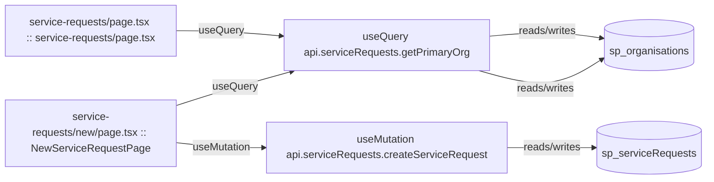

# service-requests

Auto-derived module: everything under `src/app/service-requests/`.

**App directory:** `src/app/service-requests/` (2 `.tsx` files scanned; no matching `src/components/` subdirectory found)

## Bind map

## Convex functions referenced by this module's UI

| Function | Kind | Tables touched | Triggers |
|---|---|---|---|
| `serviceRequests.getPrimaryOrg` | query | `sp_organisations` | — |
| `serviceRequests.createServiceRequest` | mutation | `sp_serviceRequests` | — |

## UI bindings

| Page | Component | Hook | Convex function |
|---|---|---|---|
| `service-requests/new/page.tsx` | NewServiceRequestPage | useQuery | `api.serviceRequests.getPrimaryOrg` |
| `service-requests/new/page.tsx` | NewServiceRequestPage | useMutation | `api.serviceRequests.createServiceRequest` |
| `service-requests/page.tsx` | service-requests/page.tsx | useQuery | `api.serviceRequests.getPrimaryOrg` |
