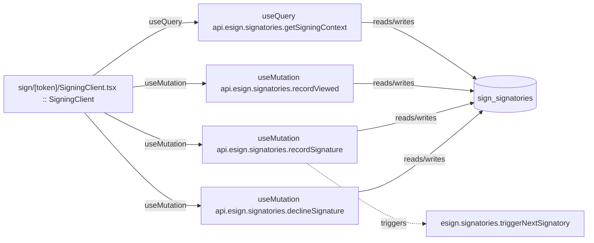

# sign

Auto-derived module: everything under `src/app/sign/`.

**App directory:** `src/app/sign/` (2 `.tsx` files scanned; no matching `src/components/` subdirectory found)

## Bind map

## Convex functions referenced by this module's UI

| Function | Kind | Tables touched | Triggers |
|---|---|---|---|
| `esign.signatories.getSigningContext` | query | `sign_signatories` | — |
| `esign.signatories.recordViewed` | mutation | `sign_signatories` | — |
| `esign.signatories.recordSignature` | mutation | `sign_signatories` | `esign.signatories.triggerNextSignatory` |
| `esign.signatories.declineSignature` | mutation | `sign_signatories` | — |

## UI bindings

| Page | Component | Hook | Convex function |
|---|---|---|---|
| `sign/[token]/SigningClient.tsx` | SigningClient | useQuery | `api.esign.signatories.getSigningContext` |
| `sign/[token]/SigningClient.tsx` | SigningClient | useMutation | `api.esign.signatories.recordViewed` |
| `sign/[token]/SigningClient.tsx` | SigningClient | useMutation | `api.esign.signatories.recordSignature` |
| `sign/[token]/SigningClient.tsx` | SigningClient | useMutation | `api.esign.signatories.declineSignature` |
