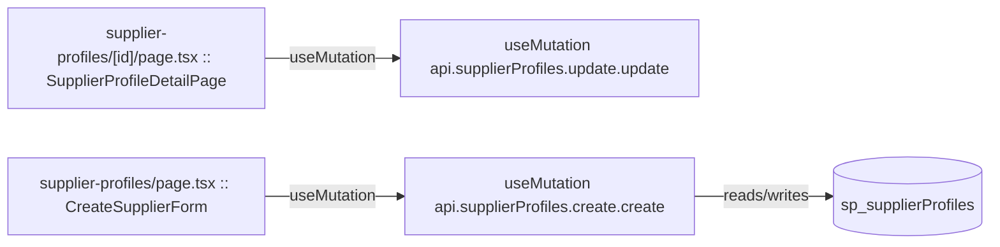

# supplier-profiles

Auto-derived module: everything under `src/app/supplier-profiles/`.

**App directory:** `src/app/supplier-profiles/` (2 `.tsx` files scanned; no matching `src/components/` subdirectory found)

## Bind map

## Convex functions referenced by this module's UI

| Function | Kind | Tables touched | Triggers |
|---|---|---|---|
| `supplierProfiles.update.update` | mutation | — | — |
| `supplierProfiles.create.create` | mutation | `sp_supplierProfiles` | — |

## UI bindings

| Page | Component | Hook | Convex function |
|---|---|---|---|
| `supplier-profiles/[id]/page.tsx` | SupplierProfileDetailPage | useMutation | `api.supplierProfiles.update.update` |
| `supplier-profiles/page.tsx` | CreateSupplierForm | useMutation | `api.supplierProfiles.create.create` |
