# supplier

Auto-derived module: everything under `src/app/supplier/` plus `src/components/supplier/`.

**App directory:** `src/app/supplier/` (9 `.tsx` files) + **components directory:** `src/components/supplier/` (21 `.tsx` files)

## Bind map

```mermaid
flowchart LR
  n0["supplier/[supplierId]/packs/[packId]/responses/[responseId]/goods/page.tsx :: SupplierGoodsResponsePage"] -->|useQuery| n1["useQuery api.tp.goods.getGoodsSupplierView.getGoodsSupplierView"]
  n1 -->|reads/writes| n2[("tp_goods_line_items")]
  n1 -->|reads/writes| n3[("tp_goods_pricing_responses")]
  n1 -->|reads/writes| n4[("tp_goods_spec_items")]
  n1 -->|reads/writes| n5[("tp_goods_spec_responses")]
  n0["supplier/[supplierId]/packs/[packId]/responses/[responseId]/goods/page.tsx :: SupplierGoodsResponsePage"] -->|useQuery| n6["useQuery api.tp.goods.computeGoodsCompliance.getGoodsComplianceCached"]
  n6 -->|reads/writes| n7[("tp_goods_compliance_results")]
  n0["supplier/[supplierId]/packs/[packId]/responses/[responseId]/goods/page.tsx :: SupplierGoodsResponsePage"] -->|useMutation| n8["useMutation api.tp.goods.submitGoodsPricingBulk.submitGoodsPricingBulk"]
  n8 -->|reads/writes| n2[("tp_goods_line_items")]
  n8 -->|reads/writes| n3[("tp_goods_pricing_responses")]
  n0["supplier/[supplierId]/packs/[packId]/responses/[responseId]/goods/page.tsx :: SupplierGoodsResponsePage"] -->|useMutation| n9["useMutation api.tp.goods.upsertGoodsSpecResponse.upsertGoodsSpecResponse"]
  n9 -->|reads/writes| n5[("tp_goods_spec_responses")]
  n0["supplier/[supplierId]/packs/[packId]/responses/[responseId]/goods/page.tsx :: SupplierGoodsResponsePage"] -->|useMutation| n10["useMutation api.tp.goods.computeGoodsCompliance.computeGoodsCompliance"]
  n10 -->|reads/writes| n4[("tp_goods_spec_items")]
  n10 -->|reads/writes| n5[("tp_goods_spec_responses")]
  n10 -->|reads/writes| n2[("tp_goods_line_items")]
  n10 -->|reads/writes| n3[("tp_goods_pricing_responses")]
  n10 -->|reads/writes| n7[("tp_goods_compliance_results")]
  n0["supplier/[supplierId]/packs/[packId]/responses/[responseId]/goods/page.tsx :: SupplierGoodsResponsePage"] -->|useMutation| n11["useMutation api.tp.goods.submitGoodsResponse.submitGoodsResponse"]
  n11 -->|reads/writes| n4[("tp_goods_spec_items")]
  n11 -->|reads/writes| n5[("tp_goods_spec_responses")]
  n11 -->|reads/writes| n2[("tp_goods_line_items")]
  n11 -->|reads/writes| n3[("tp_goods_pricing_responses")]
  n11 -->|reads/writes| n7[("tp_goods_compliance_results")]
  n11 -->|reads/writes| n12[("tp_events")]
  n13["supplier/[supplierId]/tenders/[procurementId]/respond/page.tsx :: SupplierRespondPage"] -->|useMutation| n14["useMutation api.responses.addEvidenceToResponse.addEvidenceToResponse"]
  n14 -->|reads/writes| n15[("sp_tenderResponseFiles")]
  n13["supplier/[supplierId]/tenders/[procurementId]/respond/page.tsx :: SupplierRespondPage"] -->|useMutation| n16["useMutation api.responses.addProjectToResponse.addProjectToResponse"]
  n16 -->|reads/writes| n17[("sp_responseSections")]
  n13["supplier/[supplierId]/tenders/[procurementId]/respond/page.tsx :: SupplierRespondPage"] -->|useMutation| n18["useMutation api.responses.submitResponse.submitResponse"]
  n18 -->|reads/writes| n19[("sp_tenderRequirements")]
  n18 -->|reads/writes| n15[("sp_tenderResponseFiles")]
  n18 -->|reads/writes| n20[("sp_supplierEvidence")]
  n18 -->|reads/writes| n17[("sp_responseSections")]
  n18 -->|reads/writes| n21[("sp_responseStaffLinks")]
  n13["supplier/[supplierId]/tenders/[procurementId]/respond/page.tsx :: SupplierRespondPage"] -->|useMutation| n22["useMutation api.responses.applySuggestedStaffLinks.applySuggestedStaffLinks"]
  n22 -->|reads/writes| n19[("sp_tenderRequirements")]
  n22 -->|reads/writes| n21[("sp_responseStaffLinks")]
  n22 -->|reads/writes| n23[("sp_supplierStaff")]
  n22 -->|reads/writes| n24[("sp_supplierCVs")]
  n22 -->|reads/writes| n15[("sp_tenderResponseFiles")]
  n13["supplier/[supplierId]/tenders/[procurementId]/respond/page.tsx :: SupplierRespondPage"] -->|useMutation| n25["useMutation api.responses.buildMyResponse.buildMyResponse"]
  n25 -->|reads/writes| n19[("sp_tenderRequirements")]
  n25 -->|reads/writes| n15[("sp_tenderResponseFiles")]
  n13["supplier/[supplierId]/tenders/[procurementId]/respond/page.tsx :: SupplierRespondPage"] -->|useMutation| n26["useMutation api.responses.markOpened.markOpened"]
  n27["supplier/comms/[token]/page.tsx :: SupplierCommsTokenPage"] -->|useQuery| n28["useQuery api.comms.getByToken.getByToken"]
  n28 -->|reads/writes| n29[("sp_commsArtifacts")]
  n27["supplier/comms/[token]/page.tsx :: SupplierCommsTokenPage"] -->|useMutation| n30["useMutation api.comms.markOpened.markOpened"]
  n30 -->|reads/writes| n29[("sp_commsArtifacts")]
  n30 -->|reads/writes| n31[("sp_commsEvents")]
  n32["supplier/vault/page.tsx :: SupplierProfilePicker"] -->|useQuery| n33["useQuery api.supplierProfiles.search.search"]
  n33 -->|reads/writes| n34[("sp_supplierProfiles")]
  n35["supplier/AddToPackButton.tsx :: AddToPackButton"] -->|useQuery| n36["useQuery api.evidencePacks.listPacksForProfile.listPacksForProfile"]
  n36 -->|reads/writes| n37[("sp_supplierOrgMemberships")]
  n36 -->|reads/writes| n38[("sp_evidencePacks")]
  n35["supplier/AddToPackButton.tsx :: AddToPackButton"] -->|useMutation| n39["useMutation api.evidencePacks.addEvidenceToPack.addEvidenceToPack"]
  n39 -->|reads/writes| n37[("sp_supplierOrgMemberships")]
  n39 -->|reads/writes| n40[("sp_evidencePackItems")]
  n41["supplier/AlertsPanel.tsx :: AlertsPanel"] -->|useQuery| n42["useQuery api.evidence.listAlertsForProfile.listAlertsForProfile"]
  n42 -->|reads/writes| n37[("sp_supplierOrgMemberships")]
  n42 -->|reads/writes| n43[("sp_evidenceExpiryAlerts")]
  n41["supplier/AlertsPanel.tsx :: AlertsPanel"] -->|useMutation| n44["useMutation api.evidence.acknowledgeAlert.acknowledgeAlert"]
  n45["supplier/CreatePackModal.tsx :: CreatePackModal"] -->|useQuery| n46["useQuery api.orgs.getOrgIdsForProfile.getOrgIdsForProfile"]
  n46 -->|reads/writes| n37[("sp_supplierOrgMemberships")]
  n45["supplier/CreatePackModal.tsx :: CreatePackModal"] -->|useMutation| n47["useMutation api.evidencePacks.createPack.createPack"]
  n47 -->|reads/writes| n37[("sp_supplierOrgMemberships")]
  n47 -->|reads/writes| n38[("sp_evidencePacks")]
  n48["supplier/EvidenceVaultList.tsx :: EvidenceVaultList"] -->|useQuery| n49["useQuery api.evidence.listForProfile.listForProfile"]
  n49 -->|reads/writes| n37[("sp_supplierOrgMemberships")]
  n49 -->|reads/writes| n50[("sp_evidenceItems")]
  n48["supplier/EvidenceVaultList.tsx :: EvidenceVaultList"] -->|useMutation| n51["useMutation api.evidence.verify.verify"]
  n51 -->|reads/writes| n52[("sp_evidenceEvents")]
  n48["supplier/EvidenceVaultList.tsx :: EvidenceVaultList"] -->|useMutation| n53["useMutation api.evidence.markExpired.markExpired"]
  n53 -->|reads/writes| n52[("sp_evidenceEvents")]
  n54["supplier/PackDetailModal.tsx :: PackDetailModal"] -->|useQuery| n55["useQuery api.evidencePacks.getPackDetail.getPackDetail"]
  n55 -->|reads/writes| n37[("sp_supplierOrgMemberships")]
  n55 -->|reads/writes| n40[("sp_evidencePackItems")]
  n54["supplier/PackDetailModal.tsx :: PackDetailModal"] -->|useMutation| n56["useMutation api.evidencePacks.removeEvidenceFromPack.removeEvidenceFromPack"]
  n56 -->|reads/writes| n37[("sp_supplierOrgMemberships")]
  n56 -->|reads/writes| n40[("sp_evidencePackItems")]
  n57["supplier/PackSelector.tsx :: PackSelector"] -->|useQuery| n36["useQuery api.evidencePacks.listPacksForProfile.listPacksForProfile"]
  n36 -->|reads/writes| n37[("sp_supplierOrgMemberships")]
  n36 -->|reads/writes| n38[("sp_evidencePacks")]
  n57["supplier/PackSelector.tsx :: PackSelector"] -->|useQuery| n58["useQuery api.evidencePacks.getPacksForResponse.getPacksForResponse"]
  n58 -->|reads/writes| n59[("sp_responsePackLinks")]
  n57["supplier/PackSelector.tsx :: PackSelector"] -->|useMutation| n60["useMutation api.evidencePacks.setPacksForResponse.setPacksForResponse"]
  n60 -->|reads/writes| n37[("sp_supplierOrgMemberships")]
  n60 -->|reads/writes| n59[("sp_responsePackLinks")]
  n61["supplier/PacksPanel.tsx :: PacksPanel"] -->|useQuery| n36["useQuery api.evidencePacks.listPacksForProfile.listPacksForProfile"]
  n36 -->|reads/writes| n37[("sp_supplierOrgMemberships")]
  n36 -->|reads/writes| n38[("sp_evidencePacks")]
  n62["supplier/ReadinessDashboard.tsx :: ReadinessDashboard"] -->|useQuery| n63["useQuery api.evidence.getCoverageForRft.getCoverageForRft"]
  n63 -->|reads/writes| n37[("sp_supplierOrgMemberships")]
  n63 -->|reads/writes| n50[("sp_evidenceItems")]
  n62["supplier/ReadinessDashboard.tsx :: ReadinessDashboard"] -->|useMutation| n64["useMutation api.responses.autoAttachEvidence.autoAttachEvidence"]
  n64 -->|reads/writes| n37[("sp_supplierOrgMemberships")]
  n64 -->|reads/writes| n65[("sp_responseEvidenceLinks")]
  n64 -->|reads/writes| n50[("sp_evidenceItems")]
  n64 -->|reads/writes| n59[("sp_responsePackLinks")]
  n64 -->|reads/writes| n40[("sp_evidencePackItems")]
  n64 -->|reads/writes| n66[("sp_evidenceFiles")]
  n67["supplier/RenewEvidenceFlow.tsx :: RenewEvidenceFlow"] -->|useQuery| n68["useQuery api.evidence.getById.getById"]
  n67["supplier/RenewEvidenceFlow.tsx :: RenewEvidenceFlow"] -->|useMutation| n69["useMutation api.evidence.createEvidenceItem.createEvidenceItem"]
  n69 -->|reads/writes| n50[("sp_evidenceItems")]
  n69 -->|reads/writes| n52[("sp_evidenceEvents")]
  n67["supplier/RenewEvidenceFlow.tsx :: RenewEvidenceFlow"] -->|useMutation| n70["useMutation api.evidence.supersede.supersede"]
  n70 -->|reads/writes| n52[("sp_evidenceEvents")]
  n67["supplier/RenewEvidenceFlow.tsx :: RenewEvidenceFlow"] -->|useMutation| n71["useMutation api.responses.migrateEvidenceLinks.migrateEvidenceLinks"]
  n71 -->|reads/writes| n65[("sp_responseEvidenceLinks")]
  n72["supplier/ResponseComposerPanel.tsx :: ResponseComposerPanel"] -->|useAction| n73["useAction api.supplierResponse.buildDraft.buildDraft"]
  n72["supplier/ResponseComposerPanel.tsx :: ResponseComposerPanel"] -->|useMutation| n74["useMutation api.supplierResponse.finalise.finaliseDraft"]
  n72["supplier/ResponseComposerPanel.tsx :: ResponseComposerPanel"] -->|useMutation| n75["useMutation api.supplierResponse.regenerate.regenerateDraft"]
  n76["supplier/RunExpiryScanButton.tsx :: RunExpiryScanButton"] -->|useQuery| n46["useQuery api.orgs.getOrgIdsForProfile.getOrgIdsForProfile"]
  n46 -->|reads/writes| n37[("sp_supplierOrgMemberships")]
  n76["supplier/RunExpiryScanButton.tsx :: RunExpiryScanButton"] -->|useMutation| n77["useMutation api.evidence.scanExpiryForOrg.scanExpiryForOrg"]
  n77 -->|reads/writes| n50[("sp_evidenceItems")]
  n77 -->|reads/writes| n43[("sp_evidenceExpiryAlerts")]
  n77 -->|reads/writes| n52[("sp_evidenceEvents")]
  n78["supplier/ShareEvidenceModal.tsx :: ShareEvidenceModal"] -->|useQuery| n79["useQuery api.evidence.getSharing.getSharing"]
  n78["supplier/ShareEvidenceModal.tsx :: ShareEvidenceModal"] -->|useMutation| n80["useMutation api.evidence.setSharing.setSharing"]
  n80 -->|reads/writes| n52[("sp_evidenceEvents")]
  n81["supplier/SuggestedPacksPanel.tsx :: SuggestedPacksPanel"] -->|useQuery| n82["useQuery api.evidencePacks.suggestPacksForProfile.suggestPacksForProfile"]
  n82 -->|reads/writes| n37[("sp_supplierOrgMemberships")]
  n82 -->|reads/writes| n50[("sp_evidenceItems")]
  n81["supplier/SuggestedPacksPanel.tsx :: SuggestedPacksPanel"] -->|useQuery| n46["useQuery api.orgs.getOrgIdsForProfile.getOrgIdsForProfile"]
  n46 -->|reads/writes| n37[("sp_supplierOrgMemberships")]
  n81["supplier/SuggestedPacksPanel.tsx :: SuggestedPacksPanel"] -->|useMutation| n83["useMutation api.evidencePacks.acceptSuggestedPack.acceptSuggestedPack"]
  n83 -->|reads/writes| n37[("sp_supplierOrgMemberships")]
  n83 -->|reads/writes| n38[("sp_evidencePacks")]
  n83 -->|reads/writes| n50[("sp_evidenceItems")]
  n83 -->|reads/writes| n40[("sp_evidencePackItems")]
  n84["supplier/TenderMatchFeed.tsx :: TenderMatchFeed"] -->|useQuery| n85["useQuery api.tenderFeed.queries.listMatches.forSupplier"]
  n85 -->|reads/writes| n86[("sp_tenderMatches")]
  n84["supplier/TenderMatchFeed.tsx :: TenderMatchFeed"] -->|useMutation| n87["useMutation api.tenderFeed.mutations.dismissMatch"]
```

## Convex functions referenced by this module's UI

| Function | Kind | Tables touched | Triggers |
|---|---|---|---|
| `tp.goods.getGoodsSupplierView.getGoodsSupplierView` | query | `tp_goods_line_items`, `tp_goods_pricing_responses`, `tp_goods_spec_items`, `tp_goods_spec_responses` | — |
| `tp.goods.computeGoodsCompliance.getGoodsComplianceCached` | query | `tp_goods_compliance_results` | — |
| `tp.goods.submitGoodsPricingBulk.submitGoodsPricingBulk` | mutation | `tp_goods_line_items`, `tp_goods_pricing_responses` | — |
| `tp.goods.upsertGoodsSpecResponse.upsertGoodsSpecResponse` | mutation | `tp_goods_spec_responses` | — |
| `tp.goods.computeGoodsCompliance.computeGoodsCompliance` | mutation | `tp_goods_spec_items`, `tp_goods_spec_responses`, `tp_goods_line_items`, `tp_goods_pricing_responses`, `tp_goods_compliance_results` | — |
| `tp.goods.submitGoodsResponse.submitGoodsResponse` | mutation | `tp_goods_spec_items`, `tp_goods_spec_responses`, `tp_goods_line_items`, `tp_goods_pricing_responses`, `tp_goods_compliance_results`, `tp_events` | — |
| `responses.addEvidenceToResponse.addEvidenceToResponse` | mutation | `sp_tenderResponseFiles` | — |
| `responses.addProjectToResponse.addProjectToResponse` | mutation | `sp_responseSections` | — |
| `responses.submitResponse.submitResponse` | mutation | `sp_tenderRequirements`, `sp_tenderResponseFiles`, `sp_supplierEvidence`, `sp_responseSections`, `sp_responseStaffLinks` | — |
| `responses.applySuggestedStaffLinks.applySuggestedStaffLinks` | mutation | `sp_tenderRequirements`, `sp_responseStaffLinks`, `sp_supplierStaff`, `sp_supplierCVs`, `sp_tenderResponseFiles` | — |
| `responses.buildMyResponse.buildMyResponse` | mutation | `sp_tenderRequirements`, `sp_tenderResponseFiles` | — |
| `responses.markOpened.markOpened` | mutation | — | — |
| `comms.getByToken.getByToken` | query | `sp_commsArtifacts` | — |
| `comms.markOpened.markOpened` | mutation | `sp_commsArtifacts`, `sp_commsEvents` | — |
| `supplierProfiles.search.search` | query | `sp_supplierProfiles` | — |
| `evidencePacks.listPacksForProfile.listPacksForProfile` | query | `sp_supplierOrgMemberships`, `sp_evidencePacks` | — |
| `evidencePacks.addEvidenceToPack.addEvidenceToPack` | mutation | `sp_supplierOrgMemberships`, `sp_evidencePackItems` | — |
| `evidence.listAlertsForProfile.listAlertsForProfile` | query | `sp_supplierOrgMemberships`, `sp_evidenceExpiryAlerts` | — |
| `evidence.acknowledgeAlert.acknowledgeAlert` | mutation | — | — |
| `orgs.getOrgIdsForProfile.getOrgIdsForProfile` | query | `sp_supplierOrgMemberships` | — |
| `evidencePacks.createPack.createPack` | mutation | `sp_supplierOrgMemberships`, `sp_evidencePacks` | — |
| `evidence.listForProfile.listForProfile` | query | `sp_supplierOrgMemberships`, `sp_evidenceItems` | — |
| `evidence.verify.verify` | mutation | `sp_evidenceEvents` | — |
| `evidence.markExpired.markExpired` | mutation | `sp_evidenceEvents` | — |
| `evidencePacks.getPackDetail.getPackDetail` | query | `sp_supplierOrgMemberships`, `sp_evidencePackItems` | — |
| `evidencePacks.removeEvidenceFromPack.removeEvidenceFromPack` | mutation | `sp_supplierOrgMemberships`, `sp_evidencePackItems` | — |
| `evidencePacks.getPacksForResponse.getPacksForResponse` | query | `sp_responsePackLinks` | — |
| `evidencePacks.setPacksForResponse.setPacksForResponse` | mutation | `sp_supplierOrgMemberships`, `sp_responsePackLinks` | — |
| `evidence.getCoverageForRft.getCoverageForRft` | query | `sp_supplierOrgMemberships`, `sp_evidenceItems` | — |
| `responses.autoAttachEvidence.autoAttachEvidence` | mutation | `sp_supplierOrgMemberships`, `sp_responseEvidenceLinks`, `sp_evidenceItems`, `sp_responsePackLinks`, `sp_evidencePackItems`, `sp_evidenceFiles` | — |
| `evidence.getById.getById` | query | — | — |
| `evidence.createEvidenceItem.createEvidenceItem` | mutation | `sp_evidenceItems`, `sp_evidenceEvents` | — |
| `evidence.supersede.supersede` | mutation | `sp_evidenceEvents` | — |
| `responses.migrateEvidenceLinks.migrateEvidenceLinks` | mutation | `sp_responseEvidenceLinks` | — |
| `supplierResponse.buildDraft.buildDraft` | action | — | — |
| `supplierResponse.finalise.finaliseDraft` | mutation | — | — |
| `supplierResponse.regenerate.regenerateDraft` | mutation | — | — |
| `evidence.scanExpiryForOrg.scanExpiryForOrg` | mutation | `sp_evidenceItems`, `sp_evidenceExpiryAlerts`, `sp_evidenceEvents` | — |
| `evidence.getSharing.getSharing` | query | — | — |
| `evidence.setSharing.setSharing` | mutation | `sp_evidenceEvents` | — |
| `evidencePacks.suggestPacksForProfile.suggestPacksForProfile` | query | `sp_supplierOrgMemberships`, `sp_evidenceItems` | — |
| `evidencePacks.acceptSuggestedPack.acceptSuggestedPack` | mutation | `sp_supplierOrgMemberships`, `sp_evidencePacks`, `sp_evidenceItems`, `sp_evidencePackItems` | — |
| `tenderFeed.queries.listMatches.forSupplier` | query | `sp_tenderMatches` | — |
| `tenderFeed.mutations.dismissMatch` | mutation | — | — |

## UI bindings

| Page | Component | Hook | Convex function |
|---|---|---|---|
| `supplier/[supplierId]/packs/[packId]/responses/[responseId]/goods/page.tsx` | SupplierGoodsResponsePage | useQuery | `api.tp.goods.getGoodsSupplierView.getGoodsSupplierView` |
| `supplier/[supplierId]/packs/[packId]/responses/[responseId]/goods/page.tsx` | SupplierGoodsResponsePage | useQuery | `api.tp.goods.computeGoodsCompliance.getGoodsComplianceCached` |
| `supplier/[supplierId]/packs/[packId]/responses/[responseId]/goods/page.tsx` | SupplierGoodsResponsePage | useMutation | `api.tp.goods.submitGoodsPricingBulk.submitGoodsPricingBulk` |
| `supplier/[supplierId]/packs/[packId]/responses/[responseId]/goods/page.tsx` | SupplierGoodsResponsePage | useMutation | `api.tp.goods.upsertGoodsSpecResponse.upsertGoodsSpecResponse` |
| `supplier/[supplierId]/packs/[packId]/responses/[responseId]/goods/page.tsx` | SupplierGoodsResponsePage | useMutation | `api.tp.goods.computeGoodsCompliance.computeGoodsCompliance` |
| `supplier/[supplierId]/packs/[packId]/responses/[responseId]/goods/page.tsx` | SupplierGoodsResponsePage | useMutation | `api.tp.goods.submitGoodsResponse.submitGoodsResponse` |
| `supplier/[supplierId]/tenders/[procurementId]/respond/page.tsx` | SupplierRespondPage | useMutation | `api.responses.addEvidenceToResponse.addEvidenceToResponse` |
| `supplier/[supplierId]/tenders/[procurementId]/respond/page.tsx` | SupplierRespondPage | useMutation | `api.responses.addProjectToResponse.addProjectToResponse` |
| `supplier/[supplierId]/tenders/[procurementId]/respond/page.tsx` | SupplierRespondPage | useMutation | `api.responses.submitResponse.submitResponse` |
| `supplier/[supplierId]/tenders/[procurementId]/respond/page.tsx` | SupplierRespondPage | useMutation | `api.responses.applySuggestedStaffLinks.applySuggestedStaffLinks` |
| `supplier/[supplierId]/tenders/[procurementId]/respond/page.tsx` | SupplierRespondPage | useMutation | `api.responses.buildMyResponse.buildMyResponse` |
| `supplier/[supplierId]/tenders/[procurementId]/respond/page.tsx` | SupplierRespondPage | useMutation | `api.responses.markOpened.markOpened` |
| `supplier/comms/[token]/page.tsx` | SupplierCommsTokenPage | useQuery | `api.comms.getByToken.getByToken` |
| `supplier/comms/[token]/page.tsx` | SupplierCommsTokenPage | useMutation | `api.comms.markOpened.markOpened` |
| `supplier/vault/page.tsx` | SupplierProfilePicker | useQuery | `api.supplierProfiles.search.search` |
| `supplier/AddToPackButton.tsx` | AddToPackButton | useQuery | `api.evidencePacks.listPacksForProfile.listPacksForProfile` |
| `supplier/AddToPackButton.tsx` | AddToPackButton | useMutation | `api.evidencePacks.addEvidenceToPack.addEvidenceToPack` |
| `supplier/AlertsPanel.tsx` | AlertsPanel | useQuery | `api.evidence.listAlertsForProfile.listAlertsForProfile` |
| `supplier/AlertsPanel.tsx` | AlertsPanel | useMutation | `api.evidence.acknowledgeAlert.acknowledgeAlert` |
| `supplier/CreatePackModal.tsx` | CreatePackModal | useQuery | `api.orgs.getOrgIdsForProfile.getOrgIdsForProfile` |
| `supplier/CreatePackModal.tsx` | CreatePackModal | useMutation | `api.evidencePacks.createPack.createPack` |
| `supplier/EvidenceVaultList.tsx` | EvidenceVaultList | useQuery | `api.evidence.listForProfile.listForProfile` |
| `supplier/EvidenceVaultList.tsx` | EvidenceVaultList | useMutation | `api.evidence.verify.verify` |
| `supplier/EvidenceVaultList.tsx` | EvidenceVaultList | useMutation | `api.evidence.markExpired.markExpired` |
| `supplier/PackDetailModal.tsx` | PackDetailModal | useQuery | `api.evidencePacks.getPackDetail.getPackDetail` |
| `supplier/PackDetailModal.tsx` | PackDetailModal | useMutation | `api.evidencePacks.removeEvidenceFromPack.removeEvidenceFromPack` |
| `supplier/PackSelector.tsx` | PackSelector | useQuery | `api.evidencePacks.listPacksForProfile.listPacksForProfile` |
| `supplier/PackSelector.tsx` | PackSelector | useQuery | `api.evidencePacks.getPacksForResponse.getPacksForResponse` |
| `supplier/PackSelector.tsx` | PackSelector | useMutation | `api.evidencePacks.setPacksForResponse.setPacksForResponse` |
| `supplier/PacksPanel.tsx` | PacksPanel | useQuery | `api.evidencePacks.listPacksForProfile.listPacksForProfile` |
| `supplier/ReadinessDashboard.tsx` | ReadinessDashboard | useQuery | `api.evidence.getCoverageForRft.getCoverageForRft` |
| `supplier/ReadinessDashboard.tsx` | ReadinessDashboard | useMutation | `api.responses.autoAttachEvidence.autoAttachEvidence` |
| `supplier/RenewEvidenceFlow.tsx` | RenewEvidenceFlow | useQuery | `api.evidence.getById.getById` |
| `supplier/RenewEvidenceFlow.tsx` | RenewEvidenceFlow | useMutation | `api.evidence.createEvidenceItem.createEvidenceItem` |
| `supplier/RenewEvidenceFlow.tsx` | RenewEvidenceFlow | useMutation | `api.evidence.supersede.supersede` |
| `supplier/RenewEvidenceFlow.tsx` | RenewEvidenceFlow | useMutation | `api.responses.migrateEvidenceLinks.migrateEvidenceLinks` |
| `supplier/ResponseComposerPanel.tsx` | ResponseComposerPanel | useAction | `api.supplierResponse.buildDraft.buildDraft` |
| `supplier/ResponseComposerPanel.tsx` | ResponseComposerPanel | useMutation | `api.supplierResponse.finalise.finaliseDraft` |
| `supplier/ResponseComposerPanel.tsx` | ResponseComposerPanel | useMutation | `api.supplierResponse.regenerate.regenerateDraft` |
| `supplier/RunExpiryScanButton.tsx` | RunExpiryScanButton | useQuery | `api.orgs.getOrgIdsForProfile.getOrgIdsForProfile` |
| `supplier/RunExpiryScanButton.tsx` | RunExpiryScanButton | useMutation | `api.evidence.scanExpiryForOrg.scanExpiryForOrg` |
| `supplier/ShareEvidenceModal.tsx` | ShareEvidenceModal | useQuery | `api.evidence.getSharing.getSharing` |
| `supplier/ShareEvidenceModal.tsx` | ShareEvidenceModal | useMutation | `api.evidence.setSharing.setSharing` |
| `supplier/SuggestedPacksPanel.tsx` | SuggestedPacksPanel | useQuery | `api.evidencePacks.suggestPacksForProfile.suggestPacksForProfile` |
| `supplier/SuggestedPacksPanel.tsx` | SuggestedPacksPanel | useQuery | `api.orgs.getOrgIdsForProfile.getOrgIdsForProfile` |
| `supplier/SuggestedPacksPanel.tsx` | SuggestedPacksPanel | useMutation | `api.evidencePacks.acceptSuggestedPack.acceptSuggestedPack` |
| `supplier/TenderMatchFeed.tsx` | TenderMatchFeed | useQuery | `api.tenderFeed.queries.listMatches.forSupplier` |
| `supplier/TenderMatchFeed.tsx` | TenderMatchFeed | useMutation | `api.tenderFeed.mutations.dismissMatch` |
