# works

Auto-derived module: everything under `src/app/works/` plus `src/components/works/`.

**App directory:** `src/app/works/` (32 `.tsx` files) + **components directory:** `src/components/works/` (5 `.tsx` files)

## Bind map

```mermaid
flowchart LR
  n0["works/[id]/page.tsx :: WorksDetailPage"] -->|useQuery| n1["useQuery api.works_packages.get"]
  n0["works/[id]/page.tsx :: WorksDetailPage"] -->|useMutation| n2["useMutation api.works_packages.update"]
  n0["works/[id]/page.tsx :: WorksDetailPage"] -->|useMutation| n3["useMutation api.works_packages.updateStatus"]
  n3 -->|reads/writes| n4[("works_comments")]
  n0["works/[id]/page.tsx :: WorksDetailPage"] -->|useMutation| n5["useMutation api.works_packages.addComment"]
  n5 -->|reads/writes| n4[("works_comments")]
  n0["works/[id]/page.tsx :: WorksDetailPage"] -->|useMutation| n6["useMutation api.works_packages.remove"]
  n6 -->|reads/writes| n4[("works_comments")]
  n0["works/[id]/page.tsx :: WorksDetailPage"] -->|useMutation| n7["useMutation api.works_tender.generatePack"]
  n7 -->|reads/writes| n8[("works_tender_packs")]
  n7 -->|reads/writes| n4[("works_comments")]
  n0["works/[id]/page.tsx :: WorksDetailPage"] -->|useMutation| n9["useMutation api.works_tender.updateDocumentStatus"]
  n0["works/[id]/page.tsx :: WorksDetailPage"] -->|useMutation| n10["useMutation api.works_tender.updatePackStatus"]
  n0["works/[id]/page.tsx :: WorksDetailPage"] -->|useMutation| n11["useMutation api.works_tender.updateScopeSection"]
  n0["works/[id]/page.tsx :: WorksDetailPage"] -->|useMutation| n12["useMutation api.works_tender.generateUploadUrl"]
  n0["works/[id]/page.tsx :: WorksDetailPage"] -->|useMutation| n13["useMutation api.works_tender.addWorksAttachment"]
  n13 -->|reads/writes| n14[("works_attachments")]
  n0["works/[id]/page.tsx :: WorksDetailPage"] -->|useMutation| n15["useMutation api.works_tender.deleteAttachment"]
  n0["works/[id]/page.tsx :: WorksDetailPage"] -->|useMutation| n16["useMutation api.works_tender.saveHazardAssessment"]
  n0["works/[id]/page.tsx :: WorksDetailPage"] -->|useMutation| n17["useMutation api.works_tender.saveAiScope"]
  n17 -->|reads/writes| n4[("works_comments")]
  n0["works/[id]/page.tsx :: WorksDetailPage"] -->|useMutation| n18["useMutation api.works_tender.saveAiPricing"]
  n18 -->|reads/writes| n4[("works_comments")]
  n0["works/[id]/page.tsx :: WorksDetailPage"] -->|useMutation| n19["useMutation api.works_tender.writeCompiledScope"]
  n19 -->|reads/writes| n4[("works_comments")]
  n0["works/[id]/page.tsx :: WorksDetailPage"] -->|useAction| n20["useAction api.ai.generateWorksScope.generateWorksScope"]
  n0["works/[id]/page.tsx :: WorksDetailPage"] -->|useAction| n21["useAction api.ai.generateWorksPricing.generateWorksPricing"]
  n0["works/[id]/page.tsx :: WorksDetailPage"] -->|useAction| n22["useAction api.ai.generateScopeDocument.generateScopeDocument"]
  n0["works/[id]/page.tsx :: WorksDetailPage"] -->|useMutation| n23["useMutation api.docCompliance.mutations.create"]
  n23 -->|reads/writes| n24[("tp_docCompliance")]
  n23 -->|reads/writes| n25[("tp_docComplianceItems")]
  n26["works/[id]/panels/WorksEvalCriteriaSection.tsx :: WorksEvalCriteriaSection"] -->|useQuery| n27["useQuery api.packs.getIttReadiness.getIttReadiness"]
  n26["works/[id]/panels/WorksEvalCriteriaSection.tsx :: WorksEvalCriteriaSection"] -->|useMutation| n28["useMutation api.packs.saveIttBuilderFields.saveIttBuilderFields"]
  n28 -->|reads/writes| n29[("sp_ittBuilderFields")]
  n30["works/[id]/panels/WorksTenderDatesSection.tsx :: WorksTenderDatesSection"] -->|useQuery| n27["useQuery api.packs.getIttReadiness.getIttReadiness"]
  n30["works/[id]/panels/WorksTenderDatesSection.tsx :: WorksTenderDatesSection"] -->|useMutation| n28["useMutation api.packs.saveIttBuilderFields.saveIttBuilderFields"]
  n28 -->|reads/writes| n29[("sp_ittBuilderFields")]
  n31["works/[id]/saq-config/SaqWizard.tsx :: SaqWizard"] -->|useQuery| n1["useQuery api.works_packages.get"]
  n31["works/[id]/saq-config/SaqWizard.tsx :: SaqWizard"] -->|useQuery| n32["useQuery api.works_saq.queries.getByWorksPackage"]
  n32 -->|reads/writes| n33[("works_saqConfig")]
  n31["works/[id]/saq-config/SaqWizard.tsx :: SaqWizard"] -->|useMutation| n34["useMutation api.works_saq.mutations.createConfig"]
  n34 -->|reads/writes| n33[("works_saqConfig")]
  n31["works/[id]/saq-config/SaqWizard.tsx :: SaqWizard"] -->|useMutation| n35["useMutation api.works_saq.mutations.updateStep1"]
  n31["works/[id]/saq-config/SaqWizard.tsx :: SaqWizard"] -->|useMutation| n36["useMutation api.works_saq.mutations.updateStep2"]
  n31["works/[id]/saq-config/SaqWizard.tsx :: SaqWizard"] -->|useMutation| n37["useMutation api.works_saq.mutations.updateStep3"]
  n31["works/[id]/saq-config/SaqWizard.tsx :: SaqWizard"] -->|useMutation| n38["useMutation api.works_saq.mutations.updateStep4"]
  n31["works/[id]/saq-config/SaqWizard.tsx :: SaqWizard"] -->|useMutation| n39["useMutation api.works_saq.mutations.updateStep5"]
  n31["works/[id]/saq-config/SaqWizard.tsx :: SaqWizard"] -->|useMutation| n40["useMutation api.works_saq.mutations.markComplete"]
  n41["works/create/page.tsx :: CreateWorksPackageInner"] -->|useMutation| n42["useMutation api.works_packages.create"]
  n42 -->|reads/writes| n43[("works_packages")]
  n41["works/create/page.tsx :: CreateWorksPackageInner"] -->|useQuery| n44["useQuery api.campus_admin.listCampuses"]
  n44 -->|reads/writes| n45[("campuses")]
  n46["works/page.tsx :: works/page.tsx"] -->|useQuery| n47["useQuery api.works_packages.list"]
  n47 -->|reads/writes| n43[("works_packages")]
  n48["works/page.tsx :: WorksListPage"] -->|useQuery| n47["useQuery api.works_packages.list"]
  n47 -->|reads/writes| n43[("works_packages")]
  n48["works/page.tsx :: WorksListPage"] -->|useQuery| n49["useQuery api.works_packages.stats"]
  n49 -->|reads/writes| n43[("works_packages")]
  n50["works/saq-configs/page.tsx :: SaqConfigsListPage"] -->|useQuery| n51["useQuery api.works_saq.queries.listRecent"]
  n51 -->|reads/writes| n33[("works_saqConfig")]
```

## Convex functions referenced by this module's UI

| Function | Kind | Tables touched | Triggers |
|---|---|---|---|
| `works_packages.get` | query | — | — |
| `works_packages.update` | mutation | — | — |
| `works_packages.updateStatus` | mutation | `works_comments` | — |
| `works_packages.addComment` | mutation | `works_comments` | — |
| `works_packages.remove` | mutation | `works_comments` | — |
| `works_tender.generatePack` | mutation | `works_tender_packs`, `works_comments` | — |
| `works_tender.updateDocumentStatus` | mutation | — | — |
| `works_tender.updatePackStatus` | mutation | — | — |
| `works_tender.updateScopeSection` | mutation | — | — |
| `works_tender.generateUploadUrl` | mutation | — | — |
| `works_tender.addWorksAttachment` | mutation | `works_attachments` | — |
| `works_tender.deleteAttachment` | mutation | — | — |
| `works_tender.saveHazardAssessment` | mutation | — | — |
| `works_tender.saveAiScope` | mutation | `works_comments` | — |
| `works_tender.saveAiPricing` | mutation | `works_comments` | — |
| `works_tender.writeCompiledScope` | mutation | `works_comments` | — |
| `ai.generateWorksScope.generateWorksScope` | action | — | — |
| `ai.generateWorksPricing.generateWorksPricing` | action | — | — |
| `ai.generateScopeDocument.generateScopeDocument` | action | — | — |
| `docCompliance.mutations.create` | mutation | `tp_docCompliance`, `tp_docComplianceItems` | — |
| `packs.getIttReadiness.getIttReadiness` | query | — | — |
| `packs.saveIttBuilderFields.saveIttBuilderFields` | mutation | `sp_ittBuilderFields` | — |
| `works_saq.queries.getByWorksPackage` | query | `works_saqConfig` | — |
| `works_saq.mutations.createConfig` | mutation | `works_saqConfig` | — |
| `works_saq.mutations.updateStep1` | mutation | — | — |
| `works_saq.mutations.updateStep2` | mutation | — | — |
| `works_saq.mutations.updateStep3` | mutation | — | — |
| `works_saq.mutations.updateStep4` | mutation | — | — |
| `works_saq.mutations.updateStep5` | mutation | — | — |
| `works_saq.mutations.markComplete` | mutation | — | — |
| `works_packages.create` | mutation | `works_packages` | — |
| `campus_admin.listCampuses` | query | `campuses` | — |
| `works_packages.list` | query | `works_packages` | — |
| `works_packages.stats` | query | `works_packages` | — |
| `works_saq.queries.listRecent` | query | `works_saqConfig` | — |

## UI bindings

| Page | Component | Hook | Convex function |
|---|---|---|---|
| `works/[id]/page.tsx` | WorksDetailPage | useQuery | `api.works_packages.get` |
| `works/[id]/page.tsx` | WorksDetailPage | useMutation | `api.works_packages.update` |
| `works/[id]/page.tsx` | WorksDetailPage | useMutation | `api.works_packages.updateStatus` |
| `works/[id]/page.tsx` | WorksDetailPage | useMutation | `api.works_packages.addComment` |
| `works/[id]/page.tsx` | WorksDetailPage | useMutation | `api.works_packages.remove` |
| `works/[id]/page.tsx` | WorksDetailPage | useMutation | `api.works_tender.generatePack` |
| `works/[id]/page.tsx` | WorksDetailPage | useMutation | `api.works_tender.updateDocumentStatus` |
| `works/[id]/page.tsx` | WorksDetailPage | useMutation | `api.works_tender.updatePackStatus` |
| `works/[id]/page.tsx` | WorksDetailPage | useMutation | `api.works_tender.updateScopeSection` |
| `works/[id]/page.tsx` | WorksDetailPage | useMutation | `api.works_tender.generateUploadUrl` |
| `works/[id]/page.tsx` | WorksDetailPage | useMutation | `api.works_tender.addWorksAttachment` |
| `works/[id]/page.tsx` | WorksDetailPage | useMutation | `api.works_tender.deleteAttachment` |
| `works/[id]/page.tsx` | WorksDetailPage | useMutation | `api.works_tender.saveHazardAssessment` |
| `works/[id]/page.tsx` | WorksDetailPage | useMutation | `api.works_tender.saveAiScope` |
| `works/[id]/page.tsx` | WorksDetailPage | useMutation | `api.works_tender.saveAiPricing` |
| `works/[id]/page.tsx` | WorksDetailPage | useMutation | `api.works_tender.writeCompiledScope` |
| `works/[id]/page.tsx` | WorksDetailPage | useAction | `api.ai.generateWorksScope.generateWorksScope` |
| `works/[id]/page.tsx` | WorksDetailPage | useAction | `api.ai.generateWorksPricing.generateWorksPricing` |
| `works/[id]/page.tsx` | WorksDetailPage | useAction | `api.ai.generateScopeDocument.generateScopeDocument` |
| `works/[id]/page.tsx` | WorksDetailPage | useMutation | `api.docCompliance.mutations.create` |
| `works/[id]/panels/WorksEvalCriteriaSection.tsx` | WorksEvalCriteriaSection | useQuery | `api.packs.getIttReadiness.getIttReadiness` |
| `works/[id]/panels/WorksEvalCriteriaSection.tsx` | WorksEvalCriteriaSection | useMutation | `api.packs.saveIttBuilderFields.saveIttBuilderFields` |
| `works/[id]/panels/WorksTenderDatesSection.tsx` | WorksTenderDatesSection | useQuery | `api.packs.getIttReadiness.getIttReadiness` |
| `works/[id]/panels/WorksTenderDatesSection.tsx` | WorksTenderDatesSection | useMutation | `api.packs.saveIttBuilderFields.saveIttBuilderFields` |
| `works/[id]/saq-config/SaqWizard.tsx` | SaqWizard | useQuery | `api.works_packages.get` |
| `works/[id]/saq-config/SaqWizard.tsx` | SaqWizard | useQuery | `api.works_saq.queries.getByWorksPackage` |
| `works/[id]/saq-config/SaqWizard.tsx` | SaqWizard | useMutation | `api.works_saq.mutations.createConfig` |
| `works/[id]/saq-config/SaqWizard.tsx` | SaqWizard | useMutation | `api.works_saq.mutations.updateStep1` |
| `works/[id]/saq-config/SaqWizard.tsx` | SaqWizard | useMutation | `api.works_saq.mutations.updateStep2` |
| `works/[id]/saq-config/SaqWizard.tsx` | SaqWizard | useMutation | `api.works_saq.mutations.updateStep3` |
| `works/[id]/saq-config/SaqWizard.tsx` | SaqWizard | useMutation | `api.works_saq.mutations.updateStep4` |
| `works/[id]/saq-config/SaqWizard.tsx` | SaqWizard | useMutation | `api.works_saq.mutations.updateStep5` |
| `works/[id]/saq-config/SaqWizard.tsx` | SaqWizard | useMutation | `api.works_saq.mutations.markComplete` |
| `works/create/page.tsx` | CreateWorksPackageInner | useMutation | `api.works_packages.create` |
| `works/create/page.tsx` | CreateWorksPackageInner | useQuery | `api.campus_admin.listCampuses` |
| `works/page.tsx` | works/page.tsx | useQuery | `api.works_packages.list` |
| `works/page.tsx` | WorksListPage | useQuery | `api.works_packages.list` |
| `works/page.tsx` | WorksListPage | useQuery | `api.works_packages.stats` |
| `works/saq-configs/page.tsx` | SaqConfigsListPage | useQuery | `api.works_saq.queries.listRecent` |
