# VerifIQ — Full Process Flow

The end-to-end journey a project moves through, stitched together from the
module bind maps in this folder. Every stage name and transition below is
taken directly from source in the `verifiq` repo — the `scan_state` enum in
`verifiq26/src/convex/schema.ts:120` and the `STATE_LABELS` map in
`verifiq26/src/app/projects/[id]/page.tsx` — not inferred or invented.

```mermaid
flowchart TD
    subgraph Auth["Auth module"]
        A0[Visitor] -->|useAuthActions signIn email-otp| A1[Signed in]
    end

    subgraph Dashboard["Project & Dashboard module"]
        A1 --> B0[Dashboard: listProjects]
        B0 -->|createOwnProject| B1[projects: pending]
    end

    subgraph Ingest["Ingest & Upload module"]
        B1 --> C0[verifyUploadCode]
        C0 --> C1[getUploadUrlForSession]
        C1 --> C2[registerUploadedDocument]
        C2 --> C3[sealUploadSession]
        C3 -.->|triggers| C4[classifyAction.classifyOneDocument]
    end

    subgraph Classify["Classification module"]
        C4 --> D0[scan_state: classifying]
        D0 --> D1{needs confirm?}
        D1 -->|yes| D2[scan_state: confirm_classify\nConfirmRow: confirmDocument / reclassifyDocument]
        D1 -->|no, auto-confirmed| D3[classifyData.checkAndAdvance]
        D2 --> D3
    end

    subgraph Review["Review Orchestration module"]
        D3 -->|requestReview| E0[review_inputs persisted]
        E0 -.->|scheduler.runAfter| E1[review.runReview action]
        E1 --> E2[scan_state: scanning]
        E2 --> E3[scan_state: cross_ref]
        E3 --> E4[scan_state: peer_challenge\nworkflow.saveChallenges]
        E4 --> E5[scan_state: adjudicate\nworkflow.saveAdjudications]
        E5 --> E6[scan_state: reviewer_queue\nworkflow.saveReport]
        E6 --> E7[scan_state: released]
    end

    subgraph Report["Project & Dashboard module (read side)"]
        E7 --> F0[ProjectPage: getProjectStatus / getProjectFindings / getProjectReport]
    end

    subgraph Export["Reporting & Export module — NOT WIRED TO UI"]
        F0 -.->|no UI caller found| G0[auditData.ts / auditExport.ts]
    end
```



## Stage-by-stage, with the module doc that owns it

| # | Stage (`scan_state` or milestone) | Owning module | Convex entry point | Doc |
|---|---|---|---|---|
| 1 | Sign-in | Auth | `convexAuth` via `useAuthActions()` | [auth.md](./auth.md) |
| 2 | `pending` — project created | Project & Dashboard | `mutations.createOwnProject` | [project-dashboard.md](./project-dashboard.md) |
| 3 | `uploading` | Ingest & Upload | `uploadTokens.verifyUploadCode` → `uploadDirect.getUploadUrlForSession` → `uploadDocs.registerUploadedDocument` → `uploadDocs.sealUploadSession` | [ingest-upload.md](./ingest-upload.md) |
| 4 | `classifying` | Classification | `classifyAction.classifyOneDocument` (triggered by `sealUploadSession`) | [classification.md](./classification.md) |
| 5 | `confirm_classify` (conditional) | Classification | `classify.confirmDocument` / `classify.reclassifyDocument` | [classification.md](./classification.md) |
| 6 | Review requested | Review Orchestration | `reviewData.requestReview` → triggers `review.runReview` | [review-orchestration.md](./review-orchestration.md) |
| 7 | `scanning` → `cross_ref` → `peer_challenge` → `adjudicate` | Review Orchestration | `workflow.save{Findings,Challenges,Adjudications}` | [review-orchestration.md](./review-orchestration.md) |
| 8 | `reviewer_queue` — report assembled, held for human sign-off | Review Orchestration | `workflow.saveReport` | [review-orchestration.md](./review-orchestration.md) |
| 9 | `released` | Review Orchestration | (terminal state; no further function call) | [review-orchestration.md](./review-orchestration.md) |
| 10 | Report/findings displayed | Project & Dashboard | `projectData.getProjectStatus` / `getProjectFindings` / `getProjectReport` | [project-dashboard.md](./project-dashboard.md) |
| 11 | Export/audit workbook | Reporting & Export | `auditData.ts`, `auditExport.ts` — **confirmed no UI caller** | [reporting-export.md](./reporting-export.md) |

## What this surfaced worth acting on

- **Stage 11 is a dangling module.** `auditData.ts`/`auditExport.ts` exist, touch no UI component, per a direct grep of `src/app`. Either there's a missing "Export" button on the project page, or this is legacy/planned code — worth a 5-minute check with whoever owns that module before it's assumed to work.
- **`resumeStalled` (in `reviewData.ts`) re-dispatches stuck scans** in `scanning`/`peer_challenge`/`adjudicate` via a cron — this is the only automatic recovery path if `review.runReview` dies mid-flight; it's not visible from the UI bind maps alone, only from the Convex function table's `Triggers` column.
- **The Learning Loop and Planning Conditions modules are currently unreached by any UI binding** ([learning-loop.md](./learning-loop.md), [planning-conditions.md](./planning-conditions.md)) — same "0 bindings" pattern as Export. Likely intentional (feedback capture may run server-side inside the council agents rather than via a page), but flagging alongside Export since it's the same category of finding.

## Regenerating

The module-level bind maps this flow references are generated, not hand-written:

```
node tools/bind-map/generate-bind-map.mjs --config tools/bind-map/verifiq.config.mjs
```

This file (`PROCESS-FLOW.md`) is hand-authored on top of that output — re-check it against the module docs after a regeneration if the pipeline shape changes (e.g. a new `scan_state`, a new module).
