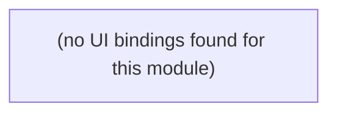

# Auth

Sign-in (Convex Auth, email magic-code/OTP) and per-project access control.

**Files:** `src/convex/auth.ts`, `src/convex/auth.config.ts`, `src/convex/authz.ts`

## Bind map

## Convex functions referenced by this module's UI

| Function | Kind | Tables touched | Triggers |
|---|---|---|---|

## UI bindings

| Page | Component | Hook | Convex function |
|---|---|---|---|

## Notes

- This module shows 0 auto-detected functions/bindings — not because it's unused, but because `auth.ts` exports `{ auth, signIn, signOut, store, isAuthenticated }` via `convexAuth({...})` (a destructured export, not the generator's `export const x = query(...)` pattern), and `src/app/page.tsx` calls it through `useAuthActions()` from `@convex-dev/auth/react`, not `useMutation(api.auth.*)`. Real binding: `src/app/page.tsx` (root component) → `useAuthActions().signIn("email-otp", { email })` / `.signOut()` → `convexAuth` in `src/convex/auth.ts` → Convex Auth's own session tables (via `authTables` spread into `schema.ts`).
- `authz.ts` (`assertProjectAccess`) is called from inside other modules' handlers (e.g. `reviewData.requestReview`), not from the UI directly — it's a shared guard, not an entry point.

## All Convex functions in this module (not just UI-called)

| Function | Kind | Tables touched | Triggers |
|---|---|---|---|
