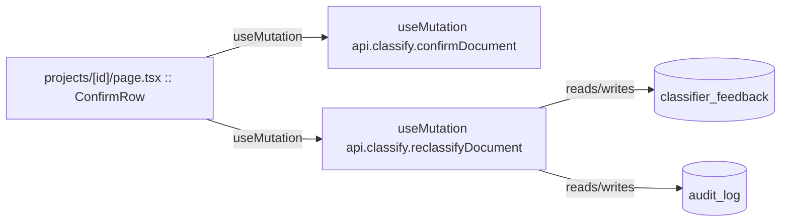

# Classification

Auto-classifying uploaded documents by discipline/type, plus the human confirm/reclassify gate.

**Files:** `src/convex/classify.ts`, `src/convex/classifyAction.ts`, `src/convex/classifyData.ts`

## Bind map

## Convex functions referenced by this module's UI

| Function | Kind | Tables touched | Triggers |
|---|---|---|---|
| `classify.confirmDocument` | mutation | — | — |
| `classify.reclassifyDocument` | mutation | `classifier_feedback`, `audit_log` | — |

## UI bindings

| Page | Component | Hook | Convex function |
|---|---|---|---|
| `projects/[id]/page.tsx` | ConfirmRow | useMutation | `api.classify.confirmDocument` |
| `projects/[id]/page.tsx` | ConfirmRow | useMutation | `api.classify.reclassifyDocument` |

## All Convex functions in this module (not just UI-called)

| Function | Kind | Tables touched | Triggers |
|---|---|---|---|
| `classify.confirmDocument` | mutation | — | — |
| `classify.reclassifyDocument` | mutation | `classifier_feedback`, `audit_log` | — |
| `classify.listForConfirmation` | query | `documents` | — |
| `classify.canStartScan` | query | `documents` | — |
| `classifyAction.classifyOneDocument` | internalAction | — | `classifyData.markClassifying`, `classifyData.loadDocument`, `mutations.appendAudit`, `classifyData.saveTextPreview`, `classifyData.saveClassification`, `classifyData.autoConfirmDocument`, `classifyData.checkAndAdvance` |
| `classifyData.loadDocument` | internalQuery | — | — |
| `classifyData.loadProjectDocuments` | internalQuery | `documents` | — |
| `classifyData.loadProject` | internalQuery | — | — |
| `classifyData.markClassifying` | internalMutation | — | — |
| `classifyData.saveTextPreview` | internalMutation | — | — |
| `classifyData.saveClassification` | internalMutation | `documents`, `audit_log` | — |
| `classifyData.autoConfirmDocument` | internalMutation | — | — |
| `classifyData.checkAndAdvance` | internalMutation | — | — |
