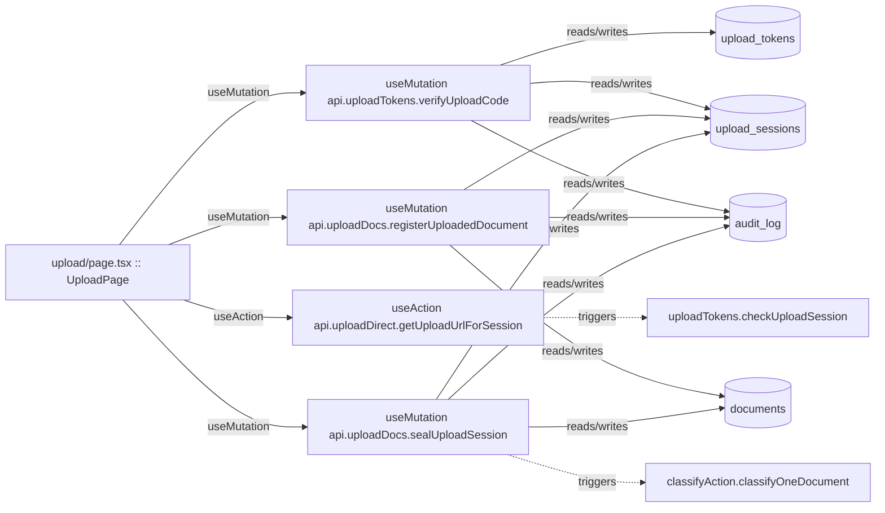

# Ingest & Upload

Magic-code upload sessions, direct-to-storage upload URLs, and document registration (R2 + Convex hybrid).

**Files:** `src/convex/uploadDirect.ts`, `src/convex/uploadDocs.ts`, `src/convex/uploadTokens.ts`

## Bind map

## Convex functions referenced by this module's UI

| Function | Kind | Tables touched | Triggers |
|---|---|---|---|
| `uploadTokens.verifyUploadCode` | mutation | `upload_tokens`, `upload_sessions`, `audit_log` | — |
| `uploadDirect.getUploadUrlForSession` | action | — | `uploadTokens.checkUploadSession` |
| `uploadDocs.registerUploadedDocument` | mutation | `upload_sessions`, `documents`, `audit_log` | — |
| `uploadDocs.sealUploadSession` | mutation | `upload_sessions`, `documents`, `audit_log` | `classifyAction.classifyOneDocument` |

## UI bindings

| Page | Component | Hook | Convex function |
|---|---|---|---|
| `upload/page.tsx` | UploadPage | useMutation | `api.uploadTokens.verifyUploadCode` |
| `upload/page.tsx` | UploadPage | useAction | `api.uploadDirect.getUploadUrlForSession` |
| `upload/page.tsx` | UploadPage | useMutation | `api.uploadDocs.registerUploadedDocument` |
| `upload/page.tsx` | UploadPage | useMutation | `api.uploadDocs.sealUploadSession` |

## All Convex functions in this module (not just UI-called)

| Function | Kind | Tables touched | Triggers |
|---|---|---|---|
| `uploadDirect.getUploadUrlForSession` | action | — | `uploadTokens.checkUploadSession` |
| `uploadDocs.registerUploadedDocument` | mutation | `upload_sessions`, `documents`, `audit_log` | — |
| `uploadDocs.sealUploadSession` | mutation | `upload_sessions`, `documents`, `audit_log` | `classifyAction.classifyOneDocument` |
| `uploadDocs.listSessionDocuments` | query | `upload_sessions`, `documents` | — |
| `uploadTokens.createIntake` | internalMutation | — | — |
| `uploadTokens.issueDevUploadCode` | mutation | — | — |
| `uploadTokens.verifyUploadCode` | mutation | `upload_tokens`, `upload_sessions`, `audit_log` | — |
| `uploadTokens.checkUploadSession` | query | `upload_sessions` | — |
| `uploadTokens.guardIntake` | internalMutation | `intake_rate` | — |
| `uploadTokens.revokeUploadToken` | internalMutation | — | — |
| `uploadTokens.submitIntake` | internalAction | — | `uploadTokens.createIntake` |
