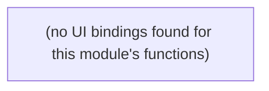

# Learning Loop

Feedback/lessons-learnt capture used to tune future classification and review runs.

**Files:** `src/convex/learningData.ts`

## Bind map

## Convex functions

| Function | Kind | Tables touched | Triggers |
|---|---|---|---|
| `learningData.recordQuestionCoverage` | internalMutation | `question_coverage` | — |
| `learningData.recordLearningEvent` | internalMutation | `learning_events` | — |
| `learningData.recordLearningEventStatus` | internalMutation | — | — |
| `learningData.getQuestionCoverage` | query | `question_coverage` | — |

## UI bindings

| Page | Component | Hook | Convex function |
|---|---|---|---|
