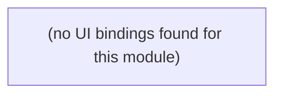

# Planning Conditions

Planning-permission condition tracking against findings.

**Files:** `src/convex/planningConditions.ts`

## Bind map

## Convex functions referenced by this module's UI

| Function | Kind | Tables touched | Triggers |
|---|---|---|---|

## UI bindings

| Page | Component | Hook | Convex function |
|---|---|---|---|

## All Convex functions in this module (not just UI-called)

| Function | Kind | Tables touched | Triggers |
|---|---|---|---|
| `planningConditions.listPlanningConditions` | query | `planning_conditions` | — |
| `planningConditions.searchPlanningConditions` | query | `planning_conditions` | — |
| `planningConditions.addPlanningCondition` | mutation | `planning_conditions`, `audit_log` | — |
| `planningConditions.updatePlanningCondition` | mutation | `audit_log` | — |
