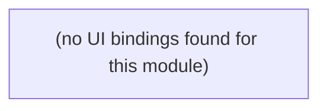

# Platform / Infra

Cross-cutting infrastructure: inference cache, scheduled crons, outbound email, and the public HTTP front door (/intake).

**Files:** `src/convex/cache.ts`, `src/convex/crons.ts`, `src/convex/email.ts`, `src/convex/http.ts`

## Bind map

## Convex functions referenced by this module's UI

| Function | Kind | Tables touched | Triggers |
|---|---|---|---|

## UI bindings

| Page | Component | Hook | Convex function |
|---|---|---|---|

## Notes

- These are not called from the app UI by design — `crons.ts` is scheduler-triggered, `email.ts` is called server-side from `auth.ts`, `http.ts` exposes `POST /intake` for the public marketing site (an external HTTP caller, not a React hook), and `cache.ts` is used internally by the review pipeline.

## All Convex functions in this module (not just UI-called)

| Function | Kind | Tables touched | Triggers |
|---|---|---|---|
| `cache.getCached` | internalQuery | `inference_cache` | — |
| `cache.putCached` | internalMutation | `inference_cache` | — |
| `cache.purgeExpired` | internalMutation | `inference_cache` | — |
