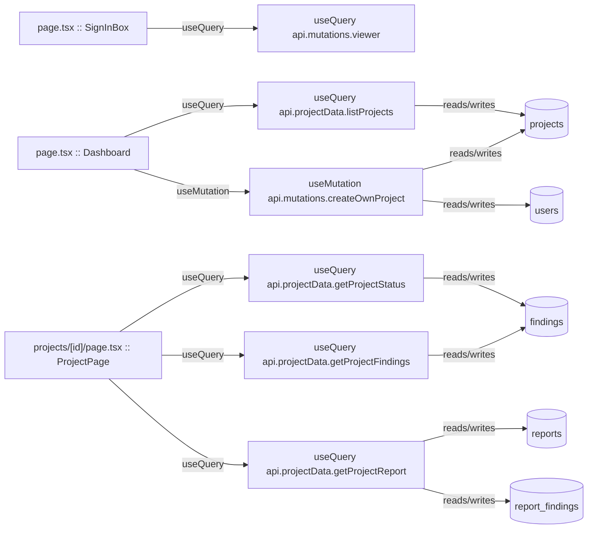

# Project & Dashboard

Project CRUD, status, findings, and report reads that back the dashboard and project page.

**Files:** `src/convex/projectData.ts`, `src/convex/mutations.ts`

## Bind map

## Convex functions

| Function | Kind | Tables touched | Triggers |
|---|---|---|---|
| `mutations.createUser` | mutation | `users` | — |
| `mutations.createOwnProject` | mutation | `users`, `projects` | — |
| `mutations.createProject` | internalMutation | `projects` | — |
| `mutations.addDocument` | internalMutation | `documents` | — |
| `mutations.insertFinding` | internalMutation | `findings` | — |
| `mutations.appendAudit` | internalMutation | `audit_log` | — |
| `mutations.viewer` | query | — | — |
| `mutations.getFindingByIssue` | internalQuery | `findings` | — |
| `mutations.listAudit` | internalQuery | `audit_log` | — |
| `projectData.getProjectStatus` | query | `findings` | — |
| `projectData.getProjectFindings` | query | `findings` | — |
| `projectData.getProjectReport` | query | `reports`, `report_findings` | — |
| `projectData.searchFindings` | query | `findings` | — |
| `projectData.searchDocuments` | query | `documents` | — |
| `projectData.listProjects` | query | `projects` | — |

## UI bindings

| Page | Component | Hook | Convex function |
|---|---|---|---|
| `page.tsx` | SignInBox | useQuery | `api.mutations.viewer` |
| `page.tsx` | Dashboard | useQuery | `api.projectData.listProjects` |
| `page.tsx` | Dashboard | useMutation | `api.mutations.createOwnProject` |
| `projects/[id]/page.tsx` | ProjectPage | useQuery | `api.projectData.getProjectStatus` |
| `projects/[id]/page.tsx` | ProjectPage | useQuery | `api.projectData.getProjectFindings` |
| `projects/[id]/page.tsx` | ProjectPage | useQuery | `api.projectData.getProjectReport` |
