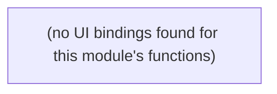

# Reporting & Export

Build Readiness Report / audit workbook data assembly and export.

**Files:** `src/convex/auditData.ts`, `src/convex/auditExport.ts`

## Bind map

## Convex functions

| Function | Kind | Tables touched | Triggers |
|---|---|---|---|
| `auditData.getAuditExportData` | query | `findings`, `reports`, `audit_log`, `question_coverage` | — |
| `auditExport.exportAuditWorkbook` | action | — | `auditData.getAuditExportData` |

## UI bindings

| Page | Component | Hook | Convex function |
|---|---|---|---|

## Notes

- 0 UI bindings found, and confirmed by direct search — no `.tsx` file under `src/app` references `api.auditData.*` or `api.auditExport.*`. Either this is dead/not-yet-wired code, or export is triggered another way (e.g. a server action, script, or planned future UI) worth confirming with the team.
