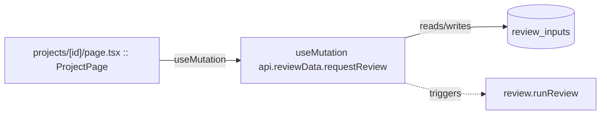

# Review Orchestration

The council review pipeline: workflow state machine, job queue, and the review-dispatch entry points the UI calls.

**Files:** `src/convex/workflow.ts`, `src/convex/jobs.ts`, `src/convex/review.ts`, `src/convex/reviewData.ts`

## Bind map

## Convex functions

| Function | Kind | Tables touched | Triggers |
|---|---|---|---|
| `jobs.enqueueJob` | internalMutation | `jobs` | — |
| `jobs.claimNextRunnable` | internalMutation | `jobs` | — |
| `jobs.completeJob` | internalMutation | — | — |
| `jobs.failJob` | internalMutation | — | — |
| `jobs.advanceScanState` | internalMutation | — | — |
| `jobs.listJobs` | internalQuery | `jobs` | — |
| `review.runReview` | internalAction | — | `reviewData.loadReviewInput`, `mutations.appendAudit`, `jobs.advanceScanState` |
| `reviewData.loadReviewInput` | internalQuery | `review_inputs` | — |
| `reviewData.requestReview` | mutation | `review_inputs` | `review.runReview` |
| `reviewData.resumeStalled` | internalMutation | `projects`, `review_inputs` | `review.runReview` |
| `workflow.loadWorkflowState` | internalQuery | `workflow_state` | — |
| `workflow.saveWorkflowState` | internalMutation | `workflow_state` | — |
| `workflow.saveFindings` | internalMutation | `findings` | — |
| `workflow.loadFindings` | internalQuery | `findings` | — |
| `workflow.saveChallenges` | internalMutation | `challenges` | — |
| `workflow.loadChallenges` | internalQuery | `challenges` | — |
| `workflow.saveAdjudications` | internalMutation | `findings`, `adjudications` | — |
| `workflow.loadAdjudicated` | internalQuery | `findings` | — |
| `workflow.saveReport` | internalMutation | `reports`, `report_findings` | — |
| `workflow.loadReport` | internalQuery | `reports`, `report_findings` | — |

## UI bindings

| Page | Component | Hook | Convex function |
|---|---|---|---|
| `projects/[id]/page.tsx` | ProjectPage | useMutation | `api.reviewData.requestReview` |
